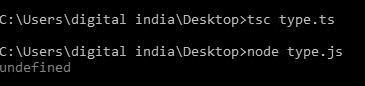
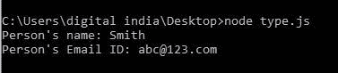

# 类型脚本 | 字符串原型属性

> 原文: [https://www.geeksforgeeks.org/typescript-string-prototype-property/](https://www.geeksforgeeks.org/typescript-string-prototype-property/)

在`类型脚本`中，`原型属性()`用于向对象添加属性和方法。

**语法:**
```
string.prototype 
```

**返回值:** 此方法不返回值。

以下示例说明了`类型脚本`中的`字符串原型属性`。

## 示例 1

```
function Person(name:string, job:string, yearOfBirth:number)
    {    
        this.name= name; 
        this.job= job; 
        this.yearOfBirth= yearOfBirth; 
    }

// Driver code
    var emp = new Person("Smith", "ABC",12214)

// This will show Person's prototype property.  
    console.log(emp.prototype);
```

**输出:**



## 示例 2

```
function Person(name:string, job:string, yearOfBirth:number)
    {    
        this.name= name; 
        this.job= job; 
        this.yearOfBirth= yearOfBirth; 
    }

// Driver code
    var emp = new Person("Smith", "ABC",12214)

// This will show Person's prototype property. 
    Person.prototype.email = "abc@123.com";

console.log("Person's name: " + emp.name); 
    console.log("Person's Email ID: " + emp.email);
```

**输出:**

