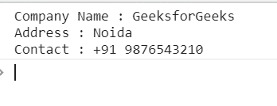
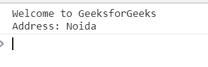

# Underscore.js _.bind() 函数

> 原文: [https://www.geeksforgeeks.org/underscore-js-_-bind-function/](https://www.geeksforgeeks.org/underscore-js-_-bind-function/)

`_.bind()` 函数用于将函数绑定到对象。当函数被调用时，它的 `this` 值将是传入的对象。

**语法:**

```javascript
_.bind(function, object, *arguments)
```

**参数:** 该函数接受三个参数，如上所述，描述如下:

*   `function`: 该参数保存需要执行的函数。
*   `object`: 该参数保存对象元素。
*   `arguments`: 这个参数需要在函数调用时添加一些参数。

**返回值:** 返回将函数绑定到对象后的新函数。

**例 1:**

```html
<!DOCTYPE html>
<html>

<head>
    <script type="text/javascript" src=
"https://cdnjs.cloudflare.com/ajax/libs/underscore.js/1.9.1/underscore-min.js">
    </script>
</head>

<body>
    <script type="text/javascript">
        var fun = function (Geeks) {
            return 'Company Name : ' + this.Company
                + '\nAddress : ' + this.Address
                + '\nContact : ' + this.Contact
        };

        fun = _.bind(fun, {
            Company: 'GeeksforGeeks',
            Address: 'Noida',
            Contact: '+91 9876543210'
        });

        console.log(fun());
    </script>
</body>

</html>
```

**输出:**


**例 2:**

```html
<!DOCTYPE html>
<html>

<head>
    <script type="text/javascript" src=
"https://cdnjs.cloudflare.com/ajax/libs/underscore.js/1.9.1/underscore-min.js">
    </script>
</head>

<body>
    <script type="text/javascript">
        var obj = {
            Name: "GeeksforGeeks",
            Address: "Noida"
        };

        var fun = function (Geeks) {
            return 'Welcome to ' + this.Name
                + '\nAddress: ' + this.Address
        };

        fun = _.bind(fun, obj);

        console.log(fun());
    </script>
</body>

</html>
```

**输出:**
