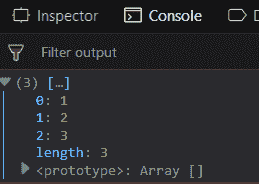
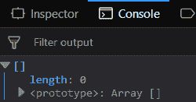
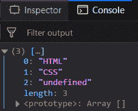
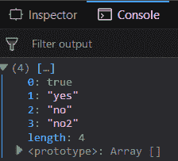

# Underscore.js _.compact() 函数

> 原文: [https://www.geeksforgeeks.org/underscore-js-_-compact-function/](https://www.geeksforgeeks.org/underscore-js-_-compact-function/)

`_.compact()` 函数是 JavaScript 的 Underscore.js 库中的一个内置函数，用于在移除所有错误值后返回一个数组。JavaScript 中的 false 值是 `NaN`、`undefined`、`false`、`0`、`null` 或空字符串 `""`。它的输出是一个包含所有真值（truthy values）的数组，比如数组的元素、数字、字母、字符、`true` 等。

**语法:**
```
_.compact( list )
```

**参数:** 该函数包含单个参数 `list`，该列表保存包含真假元素的数组。
**返回值:** 返回一个只包含真值的数组。

**将真元素和假元素的列表传递给 `_.compact()` 函数:** `_.compact()` 函数从逐个获取元素开始，然后检查它是否是假元素。如果它是 false 元素，那么它将忽略该元素。否则，它会将真元素添加到结果数组中。这里的 false 元素表示为 `false`，空字符串表示为 `""`。

**示例:**
HTML 代码：
```
<!DOCTYPE html>
<html>
    <head>
        <script src =
"https://cdnjs.cloudflare.com/ajax/libs/underscore.js/1.9.1/underscore-min.js" >
        </script>
    </head>
    <body>
        <script type="text/javascript">
            console.log(_.compact([0, 1, false, 2, '', 3]));
        </script>
    </body>
</html>
```
**输出:**


**将包含所有错误值的列表传递给 `_.compact()` 函数:** 如果传递的数组包含所有的假元素，那么 `_.compact()` 函数也将同样工作。它将检查每个元素，因为它们都是假的，所以所有的元素都将被忽略。因此，最终形成的数组将没有任何元素，其长度将为 `0`。

**示例:**
HTML 代码：
```
<!DOCTYPE html>
<html>
    <head>
        <script src =
"https://cdnjs.cloudflare.com/ajax/libs/underscore.js/1.9.1/underscore-min.js" >
        </script>
    </head>
    <body>
        <script type="text/javascript">
            console.log(_.compact([0, false, '', undefined, NaN]));
        </script>
    </body>
</html>
```
**输出:**


**在 `_.compact()` 中传递一个包含假元素的列表:** 传递一个 false 元素，例如字符串 `"undefined"`。虽然 `undefined` 是一个错误的元素，但由于它是在引号内部给出的，因此它被视为一个字符元素。因此，它不再是一个虚假的元素。其余的工作原理同上。

**示例:**
HTML 代码：
```
<!DOCTYPE html>
<html>
    <head>
        <script src =
"https://cdnjs.cloudflare.com/ajax/libs/underscore.js/1.9.1/underscore-min.js" >
        </script>
    </head>
    <body>
        <script type="text/javascript">
            console.log(_.compact([false, 'HTML', NaN,
                       'CSS', 'undefined']));
        </script>
    </body>
</html>
```
**输出:**


**将包含修改后的错误值的列表传递给 `_.compact()` 函数:** 数组包含一个作为 `true` 的元素，该元素包含在结果数组中。`"no"` 元素也包括在内，因为它是在引号内部，这使它成为一个字符。此外，如果传递 `"no2"`，它也不会被 `_.compact()` 函数过滤掉。

**示例:**
HTML 代码：
```
<!DOCTYPE html>
<html>
    <head>
        <script src =
"https://cdnjs.cloudflare.com/ajax/libs/underscore.js/1.9.1/underscore-min.js" >
        </script>
    </head>
    <body>
        <script type="text/javascript">
            console.log(_.compact([false, true, 'yes', 'no', "no2"]));
        </script>
    </body>
</html>
```
**输出:**


**注意:** 这些命令在 Google 控制台或 Firefox 中无法工作，因为需要添加这些他们没有添加的附加文件。因此，将给定的链接添加到您的 HTML 文件中，然后运行它们。
```
<script type="text/javascript" src =
"https://cdnjs.cloudflare.com/ajax/libs/underscore.js/1.9.1/underscore-min.js">
</script>
```