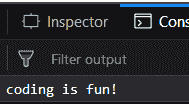
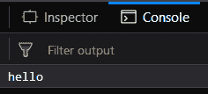
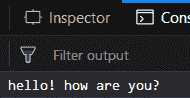
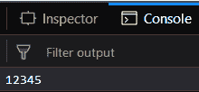

# _.delay()函数

> 原文：[https://www.geeksforgeeks.org/underscore-js-_-delay-function/](https://www.geeksforgeeks.org/underscore-js-_-delay-function/)

`_.delay()`函数在等待指定的毫秒数后执行其参数中提到的函数。它主要用于当我们想执行某项任务，但经过一定时间后。在这种情况下，我们可以定义这个函数，然后它将在等待毫秒后执行。如果我们也将参数传递给这个函数（它是可选传递的），那么这些参数将作为传递给`_.delay()`函数的函数的参数。

## 语法：
```
_.delay(function, wait, *arguments)
```

### 参数：
需要三个参数：
*   `function`：要执行的函数。
*   `wait`：函数需要执行的时间（毫秒）。
*   `*arguments`：传递给`_.delay()`函数的函数的参数（可选）。

### 返回值：
返回传递的函数的值，等待毫秒后执行。

### 示例：

#### 示例1：直接传递函数给`_.delay()`函数
`_.delay()`函数接受`wait`参数，这里为1000毫秒，然后等待1000毫秒，接着执行传递的函数，这里是`console.log()`，并打印传递给它的字符串，即“coding is fun”。因此，1000毫秒后，字符串“coding is fun”将被显示。

```html
<html>
<head>
    <!-- These lines are for Mozilla Firefox 
          developer edition to stop the web packs-->
    <meta content="text/html;charset=utf-8" http-equiv="Content-Type">
    <meta content="utf-8" http-equiv="encoding">
    <!-- You may ignore these when using in another browser -->
    <script src = 
"https://cdnjs.cloudflare.com/ajax/libs/underscore.js/1.9.1/underscore-min.js">
    </script>
</head>
<body>
    <script type="text/javascript">
        _.delay(console.log, 1000, 'coding is fun!');
    </script>
</body>
</html>
```

**输出：**


#### 示例2：在`_.delay()`函数中使用`_.bind()`函数
`_.bind()`函数用于将对象传递给函数。例如，`console.log()`函数有一个`console`对象。这个`func()`意味着任何传递给这个函数的内容都将在控制台上显示。`_.bind()`函数中没有提及等待时间。然后在`_.delay()`函数中，我们需要等待2000毫秒，之后字符串“hello”将显示在控制台上。

```html
<html>
<head>
    <!-- These lines are for Mozilla Firefox 
       developer edition to stop the web packs-->
    <meta content="text/html;charset=utf-8" http-equiv="Content-Type">
    <meta content="utf-8" http-equiv="encoding">
    <!-- You may ignore these when using in another browser -->
    <script src = 
"https://cdnjs.cloudflare.com/ajax/libs/underscore.js/1.9.1/underscore-min.js" >
    </script>
    <script src=
    "https://ajax.googleapis.com/ajax/libs/jquery/3.3.1/jquery.min.js">
    </script>
</head>
<body>
    <script type="text/javascript">
        var func = _.bind(console.log, console);
        _.delay(func, 2000, 'hello');
    </script>
</body>
</html>
```

**输出：**


#### 示例3：向传递给`_.delay()`函数的函数传递多个参数
`_.delay()`函数传递了一个`func()`，其中包含与前面示例相同的`_.bind()`函数。然后传递了3000毫秒的等待时间，这意味着输出将在3000毫秒后显示。另外传递了3个参数，它们将被视为传递的`func()`函数的参数。因此，最终输出将在3000毫秒后显示，并且是所有3个字符串的组合，即“hello! how are you?”。

```html
<html>
<head>
    <!-- These lines are for Mozilla Firefox 
       developer edition to stop the web packs-->
    <meta content="text/html;charset=utf-8" http-equiv="Content-Type">
    <meta content="utf-8" http-equiv="encoding">
    <!-- You may ignore these when using in another browser -->
    <script src = 
"https://cdnjs.cloudflare.com/ajax/libs/underscore.js/1.9.1/underscore-min.js">
    </script>
    <script src=
    "https://ajax.googleapis.com/ajax/libs/jquery/3.3.1/jquery.min.js">
    </script>
</head>
<body>
    <script type="text/javascript">
        var func = _.bind(console.log, console);
        _.delay(func, 3000, 'hello!', 'how are', 'you?');
    </script>
</body>
</html>
```

**输出：**


#### 示例4：传递数字作为参数给传递给`_.delay()`函数的函数
我们甚至可以传递数字作为参数给传递的函数。这里，我们传递‘12345’作为`func()`函数的参数。`func()`函数的声明与前面的示例相同。这个函数的输出将是“12345”，将在5000毫秒后显示。

```html
<html>
<head>
    <!-- These lines are for Mozilla Firefox 
          developer edition to stop the web packs-->
    <meta content="text/html;charset=utf-8" 
     http-equiv="Content-Type">
    <meta content="utf-8" http-equiv="encoding">
    <!-- You may ignore these when using in another browser -->
    <script src = 
"https://cdnjs.cloudflare.com/ajax/libs/underscore.js/1.9.1/underscore-min.js">
    </script>
    <script src=
    "https://ajax.googleapis.com/ajax/libs/jquery/3.3.1/jquery.min.js">
    </script>
</head>
<body>
    <script type="text/javascript">
        var func = _.bind(console.log, console);
        _.delay(func, 5000, '12345');
    </script>
</body>
</html>
```

**输出：**


## 注意：
这些命令在Google console或firefox中无法工作，因为需要添加这些他们没有添加的附加文件。
所以，添加给定的链接到你的HTML文件，然后运行它们。

链接如下：
```html
<!-- Write HTML code here -->
<script type="text/javascript" src =
"https://cdnjs.cloudflare.com/ajax/libs/underscore.js/1.9.1/underscore-min.js">
</script>
```