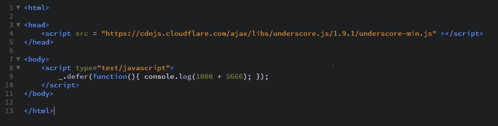

# `_.isElement()` 函数

> 原文: [https://www.geeksforgeeks.org/underscore-js-_-iselement-function/](https://www.geeksforgeeks.org/underscore-js-_-iselement-function/)

## 函数介绍

`_.isElement()` 函数用于检查一个对象是否为文档对象模型（DOM）元素。文档对象模型是 JavaScript 查看和操作页面数据的方式。级联样式表（CSS）和 JavaScript 通过与文档对象模型交互来工作。

## 语法

```javascript
_.isElement(object)
```

## 参数

只需要一个参数，即需要检查的对象元素。

## 返回值

如果是 DOM 元素则返回 `true`，否则返回 `false`。

## 示例

### 1. 将 HTML 标签传递给 `_.isElement()` 函数

`_.isElement()` 函数接收该元素并执行检查。它检查该元素是否为 DOM 元素。例如，传递给 `_.isElement()` 函数的参数是 `'html'`，由于我们知道它是一个 DOM 元素，因此输出为 `true`。

```html
<!-- Write HTML code here -->
<html>
<head>
    <script src="https://cdnjs.cloudflare.com/ajax/libs/underscore.js/1.9.1/underscore-min.js"></script>
    <script src="https://ajax.aspnetcdn.com/ajax/jQuery/jquery-3.3.1.min.js"></script>
</head>
<body>
    <script type="text/javascript">
        console.log(_.isElement(jQuery('html')[0]));
    </script>
</body>
</html>
```

**输出:** 

### 2. 将 `body` 标签传递给 `_.isElement()` 函数

在这个例子中，我们将 `'body'` 标签作为参数传递给 `_.isElement()` 函数。由于我们知道 `'body'` 标签是一个 DOM 元素，因此输出将为 `true`。

```html
<!-- Write HTML code here -->
<html>
<head>
    <script src="https://cdnjs.cloudflare.com/ajax/libs/underscore.js/1.9.1/underscore-min.js"></script>
    <script src="https://ajax.aspnetcdn.com/ajax/jQuery/jquery-3.3.1.min.js"></script>
</head>
<body>
    <script type="text/javascript">
        console.log(_.isElement(jQuery('body')[0]));
    </script>
</body>
</html>
```

**输出:** 

### 3. 将 `div` 标签传递给 `_.isElement()` 函数

在这个例子中，我们将 `'div'` 标签作为参数传递给 `_.isElement()` 函数。由于我们知道 `'div'` 标签是一个 DOM 元素，因此输出将为 `true`。

```html
<html>
<head>
    <script src="https://cdnjs.cloudflare.com/ajax/libs/underscore.js/1.9.1/underscore-min.js"></script>
    <script src="https://ajax.aspnetcdn.com/ajax/jQuery/jquery-3.3.1.min.js"></script>
</head>
<body>
    <script type="text/javascript">
        console.log(_.isElement(jQuery('div')[0]));
    </script>
</body>
</html>
```

**输出:** 

### 4. 在 `_.isElement()` 函数中使用与（`&&`）操作

我们甚至可以使用两个 `_.isElement()` 函数来获得输出，如下例所示。首先，计算两个函数的结果，然后执行“与”（AND）操作。AND 操作仅在两个结果都为 `true` 时才返回 `true`，否则返回 `false`。

```html
<!-- Write HTML code here -->
<html>
<head>
    <script src="https://cdnjs.cloudflare.com/ajax/libs/underscore.js/1.9.1/underscore-min.js"></script>
    <script src="https://ajax.aspnetcdn.com/ajax/jQuery/jquery-3.3.1.min.js"></script>
</head>
<body>
    <script type="text/javascript">
        console.log(_.isElement(jQuery('html')[0]) && _.isElement(jQuery('div')[0]));
    </script>
</body>
</html>
```

**输出:** 

## 注意事项

这些命令在 Google 控制台或 Firefox 控制台中可能无法直接工作，因为需要引入额外的脚本文件，而这些文件默认没有添加。

因此，请将给定的链接添加到您的 HTML 文件中，然后再运行示例。需要添加的脚本如下：

```html
<!-- Write HTML code here -->
<script type="text/javascript" src="https://cdnjs.cloudflare.com/ajax/libs/underscore.js/1.9.1/underscore-min.js"></script>

<!-- For jquery to work include the below script -->
<script src="https://ajax.aspnetcdn.com/ajax/jQuery/jquery-3.3.1.min.js"></script>
```

举例如下:
