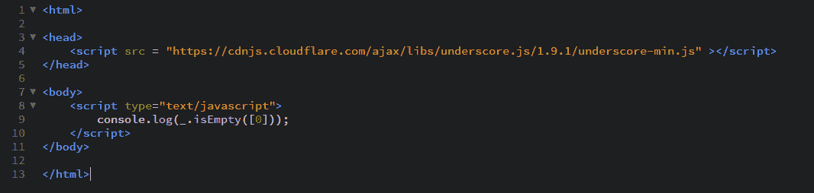

# 下划线.js `_.isEmpty()`功能

> 原文: [https://www.geeksforgeeks.org/underscore-js-_-isempty-function/](https://www.geeksforgeeks.org/underscore-js-_-isempty-function/)

## `_.isEmpty()`函数:

*   用于检查列表、数组、字符串、对象等是否为空。
*   它首先找出传递的参数的长度，然后决定。
*   如果长度为零，则输出为真，否则为假。

## 语法:

```
_.isEmpty(object)
```

## 参数:
只需要一个参数，就是对象。

## 返回值:
如果传递的参数为空，即其中没有任何元素，则返回 `true`。否则返回 `false`。

## 示例:

### 1. 向 `_.isEmpty()` 函数传递一个空元素
`_.isEmpty()` 函数从列表中逐个获取元素并开始计算数组的长度。每次遇到一个元素，它就将长度加一。然后，当数组结束时，它检查数组的长度是否为零（返回 `true`）或大于零（返回 `false`）。这里，我们有一个空数组，所以输出将是 `true`。

```
<!-- Write HTML code here -->
<html>
<head>
    <script src="https://cdnjs.cloudflare.com/ajax/libs/underscore.js/1.9.1/underscore-min.js"></script>
</head>
<body>
    <script type="text/javascript">
        console.log(_.isEmpty([]));
    </script>
</body>
</html>
```

**输出:** 

### 2. 向 `_.isEmpty()` 函数传递一个包含6个元素的数组
检查函数的流程与上面的例子相同。这里，我们的数组中有6个元素，这意味着在数组结束时，它的长度将是6。所以，长度不等于0，因此答案将是 `false`。

```
<!-- Write HTML code here -->
<html>
<head>
    <script src="https://cdnjs.cloudflare.com/ajax/libs/underscore.js/1.9.1/underscore-min.js"></script>
</head>
<body>
    <script type="text/javascript">
        console.log(_.isEmpty([1, 2, 3, 4, 5, 6]));
    </script>
</body>
</html>
```

**输出:** 

### 3. 向 `_.isEmpty()` 函数传递一个字符列表
`_.isEmpty()` 函数的工作方式与上面的例子相同。这意味着它不区分数组是包含数字、字符还是为空。它对所有数组都一视同仁，并找出它们的长度。在这个例子中，我们有一个长度为4的数组。因此，输出将是 `false`。

```
<html>
<head>
    <script src="https://cdnjs.cloudflare.com/ajax/libs/underscore.js/1.9.1/underscore-min.js"></script>
</head>
<body>
    <script type="text/javascript">
        console.log(_.isEmpty(['HTML', 'CSS', 'JS', 'AJAX']));
    </script>
</body>
</html>
```

**输出:** 

### 4. 向 `_.isEmpty()` 函数传递元素零
不要将空数组和包含零作为元素的数组混淆。因为元素是零，所以你可能会认为数组是空的。但是数组包含一个元素，并且由于 `_.isEmpty()` 计算长度，因此下面数组的长度将为1，大于零。因此输出将是 `false`。

```
<!-- Write HTML code here -->
<html>
<head>
    <script src="https://cdnjs.cloudflare.com/ajax/libs/underscore.js/1.9.1/underscore-min.js"></script>
</head>
<body>
    <script type="text/javascript">
        console.log(_.isEmpty([0]));
    </script>
</body>
</html>
```

**输出:** 

## 注意:
这些命令在 Google 控制台或 Firefox 中无法工作，因为这些额外的文件需要添加，而它们没有添加。
因此，将给定的链接添加到您的 HTML 文件中，然后运行它们。
链接如下:

```
<!-- Write HTML code here -->
<script type="text/javascript" src="https://cdnjs.cloudflare.com/ajax/libs/underscore.js/1.9.1/underscore-min.js"></script>
```

举例如下:
