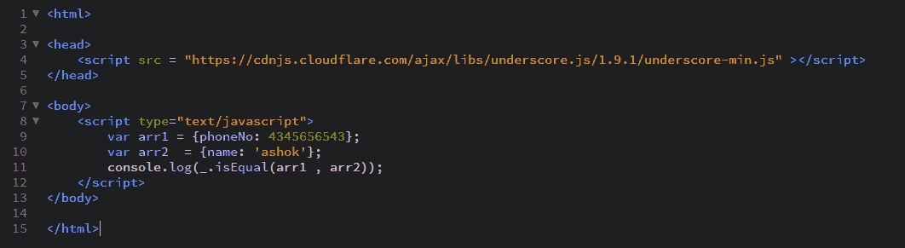

# 下划线.js _.isEqual()功能

> 原文: [https://www.geeksforgeeks.org/underscore-js-_-isequal-function/](https://www.geeksforgeeks.org/underscore-js-_-isequal-function/)

**_.isEqual()函数:** 用于查找给定的2个数组是否相同。如果两个数组具有相同数量的元素，则它们是相同的，属性和值都需要相同。在数组的元素未知并且我们想要检查它们是否相同的情况下，这可能是有益的。

## 语法

```
_.isEqual(object, other)
```

## 参数

需要两个参数:

*   `object`: 对象可以是数组。
*   `other`: 另一个对象。

## 返回值

如果传递的数组相同，则返回真，否则返回假。

## 示例

### 1. 传递两个简单数组给_.isEqual()函数

_.isEqual()函数从一个数组的列表中获取元素并在另一个数组中搜索它。如果该属性在另一个数组中以相同的值找到，那么它就继续检查其他属性，否则它就返回false。在这里，它检查属性中的字符值和数字值。

```
<!-- Write HTML code here -->
<html>
<head>
    <script src="https://cdnjs.cloudflare.com/ajax/libs/underscore.js/1.9.1/underscore-min.js"></script>
</head>
<body>
    <script type="text/javascript">
        var arr1 = {name: 'akash', numbers: [3, 7, 14]};
        var arr2 = {name: 'akash', numbers: [3, 7, 14]};
        console.log(_.isEqual(arr1, arr2));
    </script>
</body>
</html>
```

**输出:** 

### 2. 传递一个具有更多属性的数组给_.isEqual()函数

一个数组可以有任意多的属性作为此函数的参数。就像这里，两个数组都包含3个属性，类型为字符和日期。_.isEqual()函数的工作方式将与上面的示例相同。由于两个数组具有相同的属性和相同的值，因此输出将为`true`。

```
<!-- Write HTML code here -->
<html>
<head>
    <script src="https://cdnjs.cloudflare.com/ajax/libs/underscore.js/1.9.1/underscore-min.js"></script>
</head>
<body>
    <script type="text/javascript">
        var arr1 = {name: 'akash', gender: ['male'], birthDate: [03/22/99]};
        var arr2 = {name: 'akash', gender: ['male'], birthDate: [03/22/99]};
        console.log(_.isEqual(arr1, arr2));
    </script>
</body>
</html>
```

**输出:** 

### 3. 传递两个空数组给_.isEqual()函数

_.isEqual()函数将尝试检查所有数组属性及其值。由于两个数组都没有任何属性，因此没有可匹配的内容。因此，两个数组是相等的。所以，答案将是`true`。

```
<html>
<head>
    <script src="https://cdnjs.cloudflare.com/ajax/libs/underscore.js/1.9.1/underscore-min.js"></script>
</head>
<body>
    <script type="text/javascript">
        var arr1 = {};
        var arr2 = {};
        console.log(_.isEqual(arr1, arr2));
    </script>
</body>
</html>
```

**输出:** 

### 4. 传递具有不同属性的数组给_.isEqual()函数

如果我们传递包含不同属性的数组，此函数将以相同的方式工作。它将获取第一个参数数组的属性（这里是`name`）并尝试在下一个数组中找到它。但是，由于另一个数组没有此属性，因此输出将为`false`。

```
<!-- Write HTML code here -->
<html>
<head>
    <script src="https://cdnjs.cloudflare.com/ajax/libs/underscore.js/1.9.1/underscore-min.js"></script>
</head>
<body>
    <script type="text/javascript">
        var arr1 = {phoneNo: 4345656543};
        var arr2 = {name: 'ashok'};
        console.log(_.isEqual(arr1, arr2));
    </script>
</body>
</html>
```

**输出:** 

## 注意

这些命令在Google控制台或Firefox中无法工作，因为这些额外的文件需要添加，而它们没有添加。因此，将给定的链接添加到您的HTML文件中，然后运行它们。链接如下:

```
<!-- Write HTML code here -->
<script type="text/javascript" src="https://cdnjs.cloudflare.com/ajax/libs/underscore.js/1.9.1/underscore-min.js"></script>
```

举例如下:
