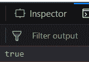
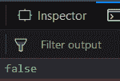
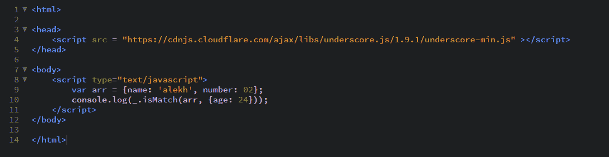

# `_.isMatch()` 函数

> 原文: [https://www.geeksforgeeks.org/underscore-js-_-ismatch-function/](https://www.geeksforgeeks.org/underscore-js-_-ismatch-function/)

`_.isMatch()` 函数用于查找参数中给定的属性在传递的数组中是否存在。此外，属性的值应该相同，以便匹配。它用于我们想要找出数组是否满足特定条件的情况。

## 语法

```javascript
_.isMatch(object, properties)
```

## 参数
需要两个参数：
*   `object`：对象/数组
*   `properties`：有价值的财产

## 返回值
如果属性及其值与传递的数组匹配，则返回 `true`，否则返回 `false`。

## 示例

### 1. 向 `_.isMatch()` 函数传递数字属性
`_.isMatch()` 函数获取第二个参数中传递的属性，然后尝试在传递的数组中查找该属性。如果属性存在于数组定义中，它会检查并匹配该属性在数组定义和第二个参数中的值。如果匹配则返回 `true`，否则返回 `false`。如果属性未在数组定义中提及，则直接返回 `false`。

```html
<!-- Write HTML code here -->
<html>
<head>
    <script src="https://cdnjs.cloudflare.com/ajax/libs/underscore.js/1.9.1/underscore-min.js"></script>
</head>
<body>
    <script type="text/javascript">
        var arr = {name: 'alekh', number: 02};
        console.log(_.isMatch(arr, {number: 2}));
    </script>
</body>
</html>
```

**输出:** 

### 2. 向 `_.isMatch()` 函数传递字符属性
它的工作方式与处理数字属性时相同。这里它会比较属性中给出的字符串。首先检查 `name` 属性，然后将第二个参数中提到的名称（即 `'alekh'`）与数组定义中的 `name` 属性（也是 `'alekh'`）进行匹配。因此，输出将为 `true`。

```html
<!-- Write HTML code here -->
<html>
<head>
    <script src="https://cdnjs.cloudflare.com/ajax/libs/underscore.js/1.9.1/underscore-min.js"></script>
</head>
<body>
    <script type="text/javascript">
        var arr = {name: 'alekh', number: 02};
        console.log(_.isMatch(arr, {name: 'alekh'}));
    </script>
</body>
</html>
```

**输出:** 

### 3. 向 `_.isMatch()` 函数传递空数组
`_.isMatch()` 函数会发现第二个参数中没有传递任何属性，因此不会继续检查，直接返回 `true`。它无需担心数组定义中提到的其他属性。

```html
<html>
<head>
    <script src="https://cdnjs.cloudflare.com/ajax/libs/underscore.js/1.9.1/underscore-min.js"></script>
</head>
<body>
    <script type="text/javascript">
        var arr = {};
        console.log(_.isMatch(arr, {}));
    </script>
</body>
</html>
```

**输出:** 

### 4. 向 `_.isMatch()` 函数传递数组定义中未提及的属性
如果我们传递的第二个参数在数组定义中未提及，则输出将为 `false`。这是因为 `_.isMatch()` 函数在定义中没有任何属性可供匹配，因此最终输出为 `false`。

```html
<!-- Write HTML code here -->
<html>
<head>
    <script src="https://cdnjs.cloudflare.com/ajax/libs/underscore.js/1.9.1/underscore-min.js"></script>
</head>
<body>
    <script type="text/javascript">
        var arr = {name: 'alekh', number: 02};
        console.log(_.isMatch(arr, {age: 24}));
    </script>
</body>
</html>
```

**输出:** 

## 注意
这些命令在 Google 控制台或 Firefox 中无法工作，因为这些额外的文件需要添加，而它们没有添加。
因此，将给定的链接添加到您的 HTML 文件中，然后运行它们。
链接如下:

```html
<!-- Write HTML code here -->
<script type="text/javascript" src="https://cdnjs.cloudflare.com/ajax/libs/underscore.js/1.9.1/underscore-min.js"></script>
```

举例如下:
