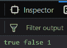

# `_.isRegExp()` 功能

> 原文: [https://www.geeksforgeeks.org/underscore-js-_-isregexp-function/](https://www.geeksforgeeks.org/underscore-js-_-isregexp-function/)

## `_.isRegExp()` 函数

*   它查找传递的对象是否是[正则表达式](https://www.geeksforgeeks.org/javascript-regular-expressions/)。
*   如果对象是正则表达式，则返回 `true`，否则返回 `false`。
*   我们甚至可以对变量进行加法等运算。`isRegExp()` 的返回值可以被存储。

## 语法

```
_.isRegExp(object)
```

## 参数

只需要一个参数，就是需要检查的对象。

## 返回值

如果传递的对象是正则表达式，则返回 `true`，否则返回 `false`。

## 示例

1.  **将正则表达式传递给 `_.isRegExp()` 函数：** `_.isRegExp()` 函数从其参数中获取元素并开始检查它是否是正则表达式。由于对象以 `/` 开头和结尾，因此它是正则表达式。所以，结果是 `true`。

    ```
    <html>
    <head>
        <script src="https://cdnjs.cloudflare.com/ajax/libs/underscore.js/1.9.1/underscore-min.js"></script>
    </head>
    <body>
        <script type="text/javascript">
            console.log(_.isRegExp(/geek/));
        </script>
    </body>
    </html>
    ```

    **输出:** 

2.  **将字符串传递给 `_.isRegExp()` 函数：** 在这里，我们将一个字符串传递给 `_.isRegExp()`，这可以通过参数被 `' '`（引号）包围来识别。由于字符串不是正则表达式，因此输出将为 `false`。

    ```
    <html>
    <head>
        <script src="https://cdnjs.cloudflare.com/ajax/libs/underscore.js/1.9.1/underscore-min.js"></script>
    </head>
    <body>
        <script type="text/javascript">
            console.log(_.isRegExp('geek'));
        </script>
    </body>
    </html>
    ```

    **输出:** 

3.  **将带有 `/` 的字符串传递给 `_.isRegExp()` 函数：** `_.isRegExp()` 函数接收的参数在本例中被 `' '` 包围，因此它是一个字符串。所以，`' '` 内的所有字母、符号都将作为字符串字符处理。因此整个对象是一个字符串。所以，输出是 `false`。

    ```
    <html>
    <head>
        <script src="https://cdnjs.cloudflare.com/ajax/libs/underscore.js/1.9.1/underscore-min.js"></script>
    </head>
    <body>
        <script type="text/javascript">
            console.log(_.isRegExp('/geek/'));
        </script>
    </body>
    </html>
    ```

    **输出:** 

4.  **对 `_.isRegExp()` 函数的输出应用加法操作：**
    在这里，我们将示例 1 和 2 的结果存储在变量 `a` 和 `b` 中。然后我们对变量 `a` 和 `b` 应用加法操作。由于 `a` 是 `true`，`b` 是 `false`，因此 `true` 和 `false` 相加的结果是 `1`，然后存储在变量 `c` 中。

    ```
    <html>
    <head>
        <script src="https://cdnjs.cloudflare.com/ajax/libs/underscore.js/1.9.1/underscore-min.js"></script>
    </head>
    <body>
        <script type="text/javascript">
            var a = _.isRegExp(/geek/);
            var b = _.isRegExp('geek');
            var c = a + b;
            console.log(a, b, c);
        </script>
    </body>
    </html>
    ```

    **输出:** 

## 注意

这些命令在 Google console 或 Firefox 中无法工作，因为需要添加这些他们没有包含的附加文件。因此，请将给定的链接添加到您的 HTML 文件中，然后运行它们。链接如下：

```
<!-- Write HTML code here -->
<script type="text/javascript" src="https://cdnjs.cloudflare.com/ajax/libs/underscore.js/1.9.1/underscore-min.js"></script>
```