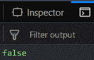
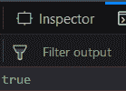

# 下划线.js | _.isUndefined() 带示例

> 原文: [https://www.geeksforgeeks.org/underscore-js-_-isundefined-with-examples/](https://www.geeksforgeeks.org/underscore-js-_-isundefined-with-examples/)

## _.isUndefined() 功能

*   它检查传递给它的参数是否未定义。
*   如果传递的参数未定义，则返回 `true`，否则返回 `false`。
*   我们甚至可以将窗口元素传递给它。

## 语法

```
_.isUndefined(value)
```

## 参数

只需要一个参数，就是需要检查的值或者变量。

## 返回值

如果传递的值或参数未定义，则返回真，否则返回假。

## 示例

### 1. 将变量传递给 _.isUndefined() 函数

`_.isUndefined()` 函数接收传递给它的参数。所以，这里它会检查传递的变量 `a`。由于 `a` 的值之前被定义为 `10`，所以它是一个已定义的变量。因此，输出将为 `false`。

```html
<!-- Write HTML code here -->
<html>
<head>
    <script src="https://cdnjs.cloudflare.com/ajax/libs/underscore.js/1.9.1/underscore-min.js"></script>
</head>
<body>
    <script type="text/javascript">
        var a = 10;
        console.log(_.isUndefined(a));
    </script>
</body>
</html>
```

**输出:** 

### 2. 将数字传递给 _.isUndefined() 函数

如果我们将一个数字传递给 `_.isUndefined()` 函数，它会检查该数字是否未定义。由于我们知道所有数字都是已定义的，因此答案将是 `false`。

```html
<!-- Write HTML code here -->
<html>
<head>
    <script src="https://cdnjs.cloudflare.com/ajax/libs/underscore.js/1.9.1/underscore-min.js"></script>
</head>
<body>
    <script type="text/javascript">
        console.log(_.isUndefined(10));
    </script>
</body>
</html>
```

**输出:** 

### 3. 将 "undefined" 传递给 _.isUndefined() 函数

`_.isUndefined()` 函数接收传递给它的元素，这里是 `"undefined"`。由于传递的参数是 `undefined`，因此输出将为 `true`。

```html
<!-- Write HTML code here -->
<html>
<head>
    <script src="https://cdnjs.cloudflare.com/ajax/libs/underscore.js/1.9.1/underscore-min.js"></script>
</head>
<body>
    <script type="text/javascript">
        console.log(_.isUndefined(undefined));
    </script>
</body>
</html>
```

**输出:** 

### 4. 将 missingVariable 传递给 _.isUndefined() 函数

这里我们将 `window.missingVariable` 作为参数传递。但是这里我们没有定义任何变量。所以 `missingVariable` 没有值，因此它是 `undefined`。输出为 `true`。

```html
<!-- Write HTML code here -->
<html>
<head>
    <script src="https://cdnjs.cloudflare.com/ajax/libs/underscore.js/1.9.1/underscore-min.js"></script>
</head>
<body>
    <script type="text/javascript">
        console.log(_.isUndefined(window.missingVariable));
    </script>
</body>
</html>
```

**输出:** 

**注意:** 这些命令在 Google console 或 Firefox 中可能无法工作，因为需要添加这些他们没有包含的附加文件。所以，请将给定的链接添加到你的 HTML 文件中，然后运行它们。链接如下:

```html
<!-- Write HTML code here -->
<script type="text/javascript" src="https://cdnjs.cloudflare.com/ajax/libs/underscore.js/1.9.1/underscore-min.js"></script>
```