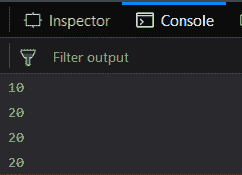
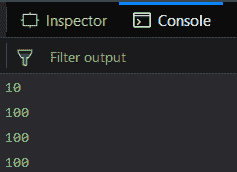
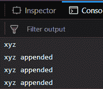
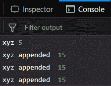

# Underscore.js _.once() Function

> 原文: [https://www.geeksforgeeks.org/underscore-js-_-once-function/](https://www.geeksforgeeks.org/underscore-js-_-once-function/)

Underscore.js 是一个 JavaScript 库，它提供了很多有用的功能，比如映射、过滤、调用等，甚至不使用任何内置对象。

`_.once()` 函数用于我们希望某个特定函数只执行一次的情况。即使我们多次执行或调用这个函数，它也不会有任何效果。原始函数的值只会在每次调用时返回。
它主要用于 `initialize()` 函数，该函数仅用于给变量分配初始值。

## 语法

```
_.once(function)
```

## 参数

只需要一个参数，即只需要调用一次的函数。

## 返回值

每次迭代或重复调用函数时，都会返回原始调用的值。

## 示例

### 1. 使用 _.once() 函数执行加法功能

传递给 `_.once()` 函数的功能是将变量 `a`（初始值为 10）加上 10。然后 `_.once()` 函数被赋值给另一个函数 `startFunc()`。第一次调用 `startFunc()` 时，`a` 的值增加了 10，变为 20。因此第一次调用的输出是 20。然后，当下一次调用 `startFunc()` 时，`a` 的值本应再次增加 10，但这并没有发生。这是因为 `startFunc()` 的定义中使用了 `_.once()` 函数，它阻止了函数被多次执行。因此，第二次和第三次调用的输出将与第一次相同，即 20。在第一行，在调用 `startFunc()` 之前打印了 `a` 的值，因此输出是 10。

**示例代码：**

```html
<html>
<head>
    <script src="https://cdnjs.cloudflare.com/ajax/libs/underscore.js/1.9.1/underscore-min.js"></script>
</head>
<body>
    <script type="text/javascript">
        var a = 10;
        function add() {
            a += 10;
        }
        var startFunc = _.once(add);
        console.log(a);
        startFunc();
        console.log(a);
        startFunc();
        console.log(a);
        startFunc();
        console.log(a);
    </script>
</body>
</html>
```

**输出：**


### 2. 使用 _.once() 函数执行乘法操作

传递给 `_.once()` 函数的功能是将变量 `a`（初始值为 10）乘以 10。然后 `_.once()` 函数被赋值给另一个函数 `startFunc()`。第一次调用 `startFunc()` 时，`a` 的值乘以 10，变为 100。因此第一次调用的输出是 100。然后，当下一次调用 `startFunc()` 时，`a` 的值本应再次乘以 10，但这并没有发生。这是因为 `startFunc()` 的定义中使用了 `_.once()` 函数，它阻止了函数被多次执行。因此，第二次和第三次调用的输出将与第一次相同，即 100。在第一行，在调用 `startFunc()` 之前打印了 `a` 的值，因此输出是 10。

```html
<html>
<head>
    <script src="https://cdnjs.cloudflare.com/ajax/libs/underscore.js/1.9.1/underscore-min.js"></script>
</head>
<body>
    <script type="text/javascript">
        var a = 10;
        function add() {
            a *= 10;
        }
        var startFunc = _.once(add);
        console.log(a);
        startFunc();
        console.log(a);
        startFunc();
        console.log(a);
        startFunc();
        console.log(a);
    </script>
</body>
</html>
```

**输出：**


### 3. 将字符串传递给 _.once() 函数

传递给 `_.once()` 函数的功能是将变量 `a` 的原始字符串与另一个字符串拼接。`_.once()` 函数被赋值给另一个函数 `startFunc()`。第一次调用 `startFunc()` 时，`a` 的值被追加了 `" appended"` 字符串，因此变为 `"xyz appended"`。因此第一次调用的输出是 `"xyz appended"`。然后，当下一次调用 `startFunc()` 时，`a` 的值本应再次被追加，但这并没有发生。这是因为 `startFunc()` 的定义中使用了 `_.once()` 函数，它阻止了函数被多次执行。因此，第二次和第三次调用的输出将与第一次相同，即 `"xyz appended"`。在第一行，在调用 `startFunc()` 之前打印了 `a` 的值，因此输出是 `"xyz"`。

```html
<html>
<head>
    <script src="https://cdnjs.cloudflare.com/ajax/libs/underscore.js/1.9.1/underscore-min.js"></script>
</head>
<body>
    <script type="text/javascript">
        var a = 'xyz';
        function add() {
            a += " appended ";
        }
        var startFunc = _.once(add);
        console.log(a);
        startFunc();
        console.log(a);
        startFunc();
        console.log(a);
        startFunc();
        console.log(a);
    </script>
</body>
</html>
```

**输出：**


### 4. 同时传递数字和字符串给 _.once() 函数

这里我们对一个函数执行 `_.once()` 功能，该函数既将字符串追加到变量 `a`（初始值为 `"xyz"`），又将变量 `b`（初始值为 5）加上 10。在第一行，将显示两个变量 `a` 和 `b` 的原始值。之后，当我们第一次调用 `startFunc()` 时，`a` 变量被追加了 `" appended"` 字符串，`b` 变量的值增加了 10。因此，`a` 变为 `"xyz appended"`，`b` 变为 15。现在每次使用 `startFunc()` 时，`a` 和 `b` 的值将保持不变，因为我们在 `startFunc()` 的定义中使用了 `_.once()` 函数。

```html
<html>
<head>
    <script src="https://cdnjs.cloudflare.com/ajax/libs/underscore.js/1.9.1/underscore-min.js"></script>
</head>
<body>
    <script type="text/javascript">
        var a = 'xyz',
            b = 5;
        function add() {
            a += " appended ";
            b += 10;
        }
        var startFunc = _.once(add);
        console.log(a, b);
        startFunc();
        console.log(a, b);
        startFunc();
        console.log(a, b);
        startFunc();
        console.log(a, b);
    </script>
</body>
</html>
```

**输出：**


## 注意

这些命令在 Google 控制台或 Firefox 中无法工作，因为这些额外的文件需要添加，而它们没有添加。
因此，将给定的链接添加到您的 HTML 文件中，然后运行它们。
链接如下：

```html
<script type="text/javascript" src="https://cdnjs.cloudflare.com/ajax/libs/underscore.js/1.9.1/underscore-min.js"></script>
```