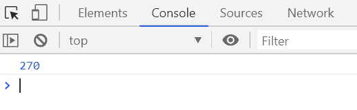
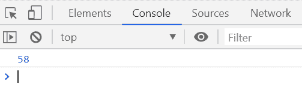

# Underscore.js _.partial() 函数

> 原文: [https://www.geeksforgeeks.org/underscore-js-_-partial-function/](https://www.geeksforgeeks.org/underscore-js-_-partial-function/)

`_.partial()` 函数用于通过填充函数的任意数量的参数来部分应用函数，而不改变其动态值。

## 语法

```
_.partial(function, *arguments)
```

## 参数

该函数接受两个参数，如上所述，如下所述:

*   `function`: 需要执行的功能。
*   `arguments`: 这个参数需要在元素之间添加一些符号。

## 返回值

该函数返回部分执行函数的结果。

下面的例子说明了 `_.partial()` 函数在 Underscore.js 中的用法:

### 示例 1

```
<!DOCTYPE html>
<html>

<head>
    <script type="text/javascript" src=
"https://cdnjs.cloudflare.com/ajax/libs/underscore.js/1.9.1/underscore-min.js">
    </script>
</head>

<body>
    <script type="text/javascript">

var product = function (num1, num2) {
            return num1 * num2;
        };

prod = _.partial(product, 15);
        console.log(prod(18));
    </script>
</body>

</html>
```

**输出:**


### 示例 2

```
<!DOCTYPE html>
<html>

<head>
    <script type="text/javascript" src=
"https://cdnjs.cloudflare.com/ajax/libs/underscore.js/1.9.1/underscore-min.js">
    </script>
</head>

<body>
    <script type="text/javascript">

var sum = function (num1, num2, num3) {
            return num1 + num2 + num3;
        };

sum = _.partial(sum, 15, 25);
        console.log(sum(18));
    </script>
</body>

</html>
```

**输出:**
