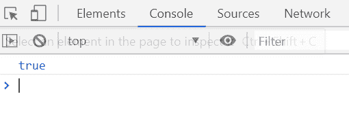
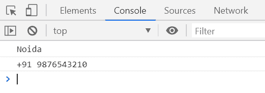

# Underscore.js _.property()函数

> 原文: [https://www.geeksforgeeks.org/underscore-js-_-property-function/](https://www.geeksforgeeks.org/underscore-js-_-property-function/)

`_.property()`函数用于返回一个函数，该函数将返回任何传入对象的指定属性。

## 语法

```javascript
_.property( path )
```

## 参数

该函数接受一个参数，如下所述：

*   `path`: 此参数保存一个简单的键或数组索引或一个对象键数组。

## 返回值

它返回一个函数，该函数将返回一个对象的指定属性。

## 示例

### 示例 1

```html
<!DOCTYPE html>
<html>

<head>
    <script type="text/javascript" src=
"https://cdnjs.cloudflare.com/ajax/libs/underscore.js/1.9.1/underscore-min.js">
    </script>
</head>

<body>
    <script type="text/javascript">

var info = {
            Company: 'GeeksforGeeks',
            Address: 'Noida',
            Contact: '+91 9876543210'
        };

console.log(_.property('Company')(info) === 'GeeksforGeeks');
    </script>
</body>

</html>
```

**输出:**


### 示例 2

```html
<!DOCTYPE html>
<html>

<head>
    <script type="text/javascript" src=
"https://cdnjs.cloudflare.com/ajax/libs/underscore.js/1.9.1/underscore-min.js">
    </script>
</head>

<body>
    <script type="text/javascript">

var info = {
            Company: { name: 'GeeksforGeeks' },
            Contact: { Address: 
                { 
                    AddressInfo: 'Noida', 
                    ContNo: '+91 9876543210' 
                } 
            }
        };

var propInfo = _.property(['Contact', 'Address', 'AddressInfo', ]);
        console.log(propInfo(info));

var propInfo = _.property(['Contact', 'Address', 'ContNo', ]);
        console.log(propInfo(info));
    </script>
</body>

</html>
```

**输出:**
