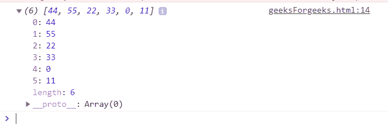
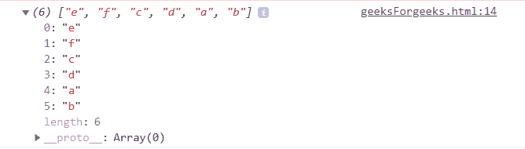
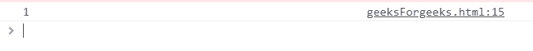
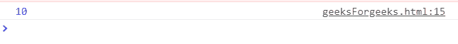

# Underscore.js _.reduceRight() 函数

> 原文: [https://www.geeksforgeeks.org/underscore-js-_-reduceright-function/](https://www.geeksforgeeks.org/underscore-js-_-reduceright-function/)

`_.reduceRight()` 函数是 Underscore.js 中的一个内置方法，用于从右开始对列表中的每个元素执行操作。当列表中的所有元素都从右向左传递给函数/迭代，并且没有更多的元素剩下时，那么 `_.reduceRight` 循环结束。

它对数组的两个值（从右到左）同时应用一个函数，以便将其减少到一个值。

## 语法

```
_.reduceRight(list, function())
```

## 参数

它接受以下指定的两个参数：

*   `list`: 是包含一些从右向左访问的元素的列表。
*   `function`: 是执行从右向左缩小列表元素形式的操作的函数。

## 返回值

从右向左返回列表形式的缩减元素。

## 显示 `_.reduceRight()` 函数工作状态的 JavaScript 代码

### 1. 向 `_.reduceRight()` 函数传递数字列表

`_.reduceRight()` 函数从列表中逐个取出元素，并在代码上执行指定的操作。这里的操作是将列表的元素连接起来形成一个新列表。连接所有元素后，`reduceRight` 函数结束。

```
<html>
<head>
    <script type="text/javascript" src="https://cdnjs.cloudflare.com/ajax/libs/underscore.js/1.9.1/underscore-min.js"></script>
    <script type="text/javascript" src="https://cdnjs.cloudflare.com/ajax/libs/underscore.js/1.9.1/underscore-min.js.map"></script>
    <script type="text/javascript" src="https://cdnjs.cloudflare.com/ajax/libs/underscore.js/1.9.1/underscore.js"></script>
</head>
<body>
    <script type="text/javascript">
        var list = [[00, 11], [22, 33], [44, 55]];
        var answer = _.reduceRight(list, function(a, b) { return a.concat(b); }, []);
        document.write(answer);
    </script>
</body>
</html>
```

**输出:**


### 2. 向 `_.reduceRight()` 函数传递字符列表

这里我们做的和第一个例子相同。区别在于，列表不是数字而是字符。因此，最终列表将包含所有字符，但顺序是原始列表的从右到左。

```
<html>
<head>
    <script type="text/javascript" src="https://cdnjs.cloudflare.com/ajax/libs/underscore.js/1.9.1/underscore-min.js"></script>
    <script type="text/javascript" src="https://cdnjs.cloudflare.com/ajax/libs/underscore.js/1.9.1/underscore-min.js.map"></script>
    <script type="text/javascript" src="https://cdnjs.cloudflare.com/ajax/libs/underscore.js/1.9.1/underscore.js"></script>
</head>
<body>
    <script type="text/javascript">
        var list = [['a', 'b'], ['c', 'd'], ['e', 'f']];
        var answer = _.reduceRight(list, function(a, b) { return a.concat(b); }, []);
        document.write(answer);
    </script>
</body>
</html>
```

**输出:**


### 3. 找出最后一次迭代的值

`num` 变量是一个存储列表元素值的变量。由于我们在函数结束时返回值，这意味着列表也结束了。并且因为列表是从右向左遍历的，所以结果将是列表最左边的元素。

```
<html>
<head>
    <script type="text/javascript" src="https://cdnjs.cloudflare.com/ajax/libs/underscore.js/1.9.1/underscore-min.js"></script>
    <script type="text/javascript" src="https://cdnjs.cloudflare.com/ajax/libs/underscore.js/1.9.1/underscore-min.js.map"></script>
    <script type="text/javascript" src="https://cdnjs.cloudflare.com/ajax/libs/underscore.js/1.9.1/underscore.js"></script>
</head>
<body>
    <script type="text/javascript">
        var number = _.reduceRight([1, 2, 3, 4, 5], function(memo, num) {
            return num;
        });
        document.write(number);
    </script>
</body>
</html>
```

**输出:**


### 4. 在 `_.reduceRight()` 函数中应用算术运算符

如果我们尝试对元素列表执行任何算术运算（如加法等），那么第一个元素将来自最右侧。

```
<html>
<head>
    <script type="text/javascript" src="https://cdnjs.cloudflare.com/ajax/libs/underscore.js/1.9.1/underscore-min.js"></script>
    <script type="text/javascript" src="https://cdnjs.cloudflare.com/ajax/libs/underscore.js/1.9.1/underscore-min.js.map"></script>
    <script type="text/javascript" src="https://cdnjs.cloudflare.com/ajax/libs/underscore.js/1.9.1/underscore.js"></script>
</head>
<body>
    <script type="text/javascript">
        var sum = [0, 1, 2, 3, 4].reduceRight(function(a, c) {
            return a + c;
        });
        document.write(sum);
    </script>
</body>
</html>
```

**输出:**
