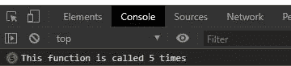
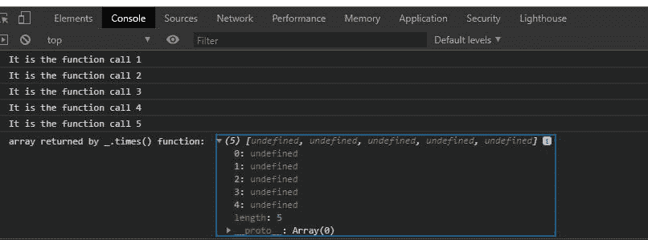

# Underscore.js _.times() 函数

> 原文: [https://www.geeksforgeeks.org/underscore-js-_-times-function/](https://www.geeksforgeeks.org/underscore-js-_-times-function/)

**Underscore.js** 是一个 JavaScript 库，使得对数组、字符串、对象的操作变得更加容易和便捷。
其中 `_.times()` 函数在 Underscore.js 中用于调用该函数特定次数，即函数 `f` 的执行 `n` 次。

**注意:** 在浏览器中使用 Underscore 功能之前，链接 Underscore CDN 是非常必要的。链接 Underscore.js CDN 链接时，`_` 作为全局变量附加到浏览器。

**语法:**

```javascript
_.times(n, iteratee)
```

**参数:** 取以下参数:

*   `n`: 它告诉一个函数需要执行多少次。
*   `iteratee`: 是一个要调用 `n` 次的函数。

**返回值:** 它产生一个返回值数组，这个数组由函数返回。

**例 1:**

## HTML 示例

```html
<!DOCTYPE html>
<html>

<head>
    <script src=
"https://cdnjs.cloudflare.com/ajax/libs/underscore.js/1.9.1/underscore-min.js">
    </script>
</head>

<body>
    <script>
        let n = 5
        let func = () => {
            console.log(`This function
                is called ${n} times \n`)
        }

        // The _.times function executes
        // the above func function n times
        _.times(n, func);
    </script>
</body>

</html>
```

**输出:**



**例 2:**

## JavaScript 示例

```html
<!DOCTYPE html>
<html>

<head>
    <script src=
"https://cdnjs.cloudflare.com/ajax/libs/underscore.js/1.9.1/underscore-min.js">
    </script>
</head>

<body>
    <script>
        let n = 5;
        let i = 1;
        let func = () => {
            for (i; i <= n; i++) {
                console.log(
        `It is the function call ${i}`)
            }
        }

        // Calling the function func n times.
        let c = _.times(n, func);
        console.log(
"array returned by times function: ", c)
    </script>
</body>

</html>
```

**输出:**

