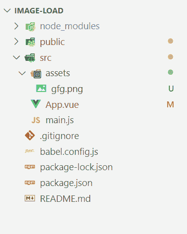

# 如何在VueJS中检查图像是否加载？

> 原文：[https://www.geeksforgeeks.org/how-to-check-an-image-is-loaded-or-not-in-vuejs/](https://www.geeksforgeeks.org/how-to-check-an-image-is-loaded-or-not-in-vuejs/)

在VueJS项目中插入映像时，由于以下原因，它可能无法加载：

*   写错图片网址。
*   由于连接不良

**方法：** 我们将使用``中的一个事件来检查VueJS中是否加载了图像，我们将使用的事件是：

*   `@load`：`@load`事件在图像被加载并执行时被触发。

## 项目设置

### 步骤1

在命令行中使用以下命令创建Vue项目：

```js
vue create image-load
```

**注：** 我们已经将“image-load”作为项目名称，您可以根据自己的选择选择任意名称。

*   将创建“image-load”文件夹。
*   在代码编辑器中打开文件夹。

**项目结构会是这样的：**



### 步骤2

创建项目后，在“assets文件夹”中添加一个图像。我们添加了一张名为`gfg.png`的图片。

## 示例

在本例中，我们将遵循以下步骤：

1.  在本例中，我们将在应用程序的索引页面上插入一个图像。
2.  在项目“image-load”中，我们创建了一个数据变量`isLoaded`，其默认值为`false`。
3.  还创建了一个`description`数据变量，它保存页面的标题，即“如何检查一个图像是否加载到VueJs中？”。
4.  给图像分配一个`@load`事件。
5.  事件的名称将是`loadImage`，如果图像被加载，其功能将是将`isLoaded`的值更改为`true`。
6.  最后，我们将在主页上打印`isLoaded`的值，并附上图片。

**现在让我们一步一步地看看实现。**

### App.vue

```js
<template>
    <div>
        <h1>{{description}}</h1>
        <br>
        
        <h2>Image Loaded : {{isLoaded}} </h2>
    </div>
</template>

<script>
    export default {
        name: 'App',
        data() {
            return {
                description: "How to check if Image "
                    + "is Loaded in Vue.js or not?",
                isLoaded: false,
            };
        },
        methods: {
            loadImage() {
                this.isLoaded = true;
            }
        }
    }
</script>

<style>
    #app {
        font-family: Avenir, Helvetica, Arial, sans-serif;
        -webkit-font-smoothing: antialiased;
        -moz-osx-font-smoothing: grayscale;
        text-align: center;
        color: #2c3e50;
        margin-top: 60px;
    }
</style>
```

## 运行应用程序

在命令行中，输入以下命令：

```js
npm run serve
```

## 输出

打开浏览器转到 `http://localhost:8080/` 会看到如下输出：


## 说明

可以看到，我们最初将`isLoaded`初始化为`false`，将`description`初始化为给定的字符串。加载图像，触发`loadImage`并为`isLoaded`分配一个`true`值，然后在输出过程中提取“Image Loaded”值并与图像一起显示。