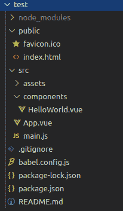
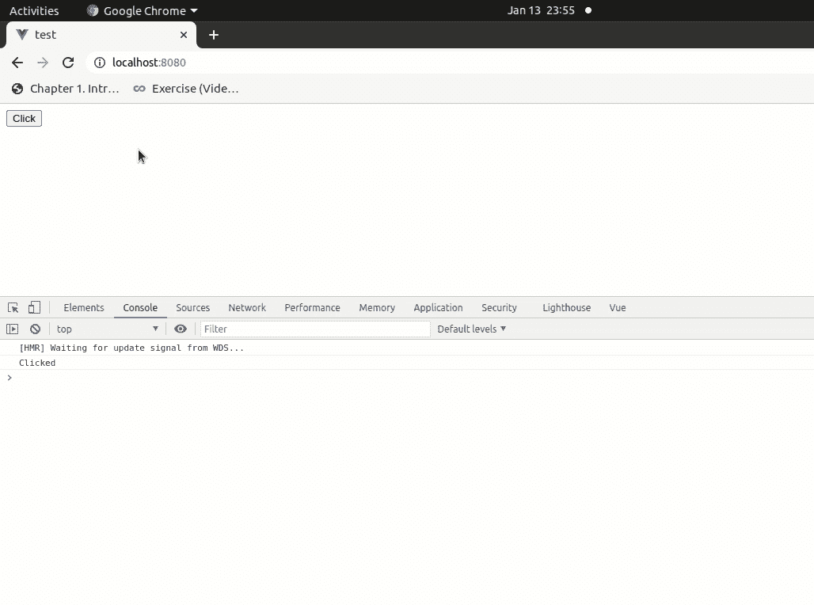

# 如何在 Vue.js 中为加载后的页面或视图设置点击事件？

> 原文：[https://www.geeksforgeeks.org/how-to-set-a-click-event-once-a-page-or-view-is-loaded-in-vue-js/](https://www.geeksforgeeks.org/how-to-set-a-click-event-once-a-page-or-view-is-loaded-in-vue-js/)

在本文中，我们将讨论一旦页面或视图在 Vue.js 中被加载，如何设置一个点击事件。`mounted`钩子通常是最常用的钩子。它们允许我们在第一次渲染之前或之后访问或修改组件的 DOM。

所以，这里我们将使用`mounted`钩子来触发页面加载时的点击事件。

## 设置环境的步骤

1.  首先，我们应该使用下面的命令安装 Vue.js：
    ```js
    sudo npm install -g @vue/cli
    ```

2.  安装 Vue.js 后，您可以使用下面的命令创建一个新项目：
    ```js
    vue create test
    ```

3.  现在，使用`cd`命令转到项目文件夹：
    ```js
    cd myapp
    ```

4.  您可以使用以下命令运行项目：
    ```js
    npm run serve
    ```

项目的文件结构如下所示：


## 语法

*   **第一步：** 给出你想要点击的按钮的引用。
    ```js
    <button ref="Btn" @click="logClicked">Click</button>
    ```

*   **第二步：** 在`mounted`钩子中触发按钮点击。
    ```js
    mounted () {
      this.$refs.Btn.click()
    }
    ```

## 示例

从测试项目的`src`文件夹中打开您的`App.vue`文件并更新代码。

```js
<script>
export default({
  methods: {
    logClicked () {
      console.log('Clicked')
    }
  },
  mounted () {
    this.$refs.Btn.click()
  }
})
</script>
<template>
<div id="app" class="container">
  <button ref="Btn" @click="logClicked">Click</button>
</div>
</template>
```

**输出：** 在浏览器中输入`localhost:8080`可以看到输出。也可以使用下面的快捷键在 Chrome 浏览器中打开控制台：
```
ctrl+shift+j
```

