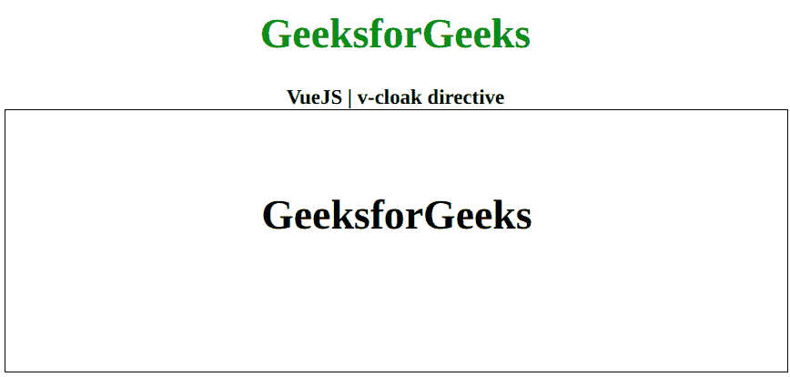

# Vue.js v-cloak 指令

> 哎哎哎:# t0]https://www . geeksforgeeks . org/view-js-v-cloak 指令/

`v-cloak`指令是一个[Vue.js](https://www.geeksforgeeks.org/vue-js-introduction-installation/)指令，它将保留在元素上，直到相关的Vue实例完成编译。结合`[v-cloak] { display: none }`等CSS规则，这个指令可以用来隐藏未编译的小胡子绑定，直到Vue实例准备好。首先，我们将创建一个id为`app`的div元素，让我们将`v-cloak`指令应用于一个元素。

## 语法

```js
<element v-cloak></element>
```

## 参数

该函数不接受任何参数。

## 示例

这个示例使用Vue.js用`v-cloak`显示数据的工作情况，这样只有在编译完成时才可见。

### HTML

```html
<!DOCTYPE html>
<html>

<head>

<!-- Load Vuejs -->
    <script src=
"https://cdn.jsdelivr.net/npm/vue/dist/vue.js">
    </script>

<style>
        [v-cloak] {
            display: none;
        }
    </style>
</head>

<body>
    <div style="text-align: center;width: 600px;">

<h1 style="color: green;">
            GeeksforGeeks
        </h1>
        <b>
            VueJS | v-cloak directive
        </b>
    </div>

<div id="canvas" style=
            "border:1px solid #000000;
            width: 600px;height: 200px;">

<div id="app" style=
            "text-align: center; 
            padding-top: 40px;">
            <h1 v-cloak>{{ data }}</h1>
        </div>
    </div>

<script>
        var app = new Vue({
            el: '#app',
            data: {
                data: 'GeeksforGeeks'
            }
        })
    </script>
</body>

</html>
```

## 输出

