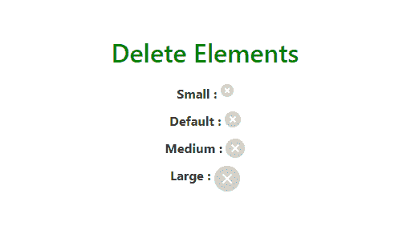
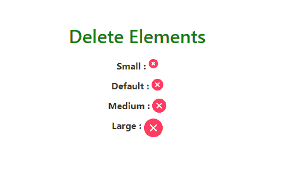
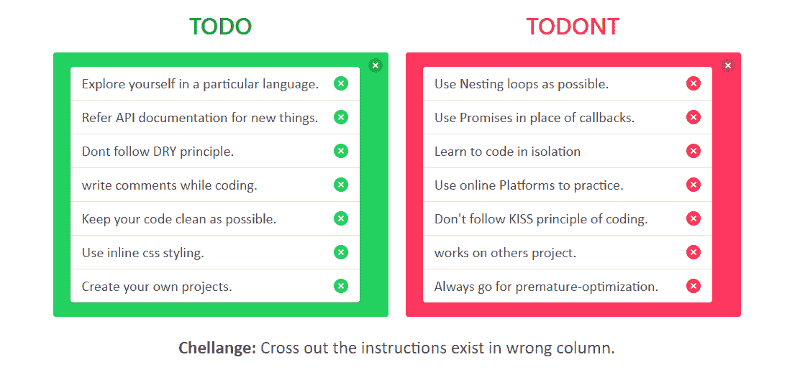

# 查找与删除

> 原文: [https://www.geeksforgeeks.org/bulma-delete/](https://www.geeksforgeeks.org/bulma-delete/)

**Bulma** 是一个基于 Flexbox 的免费开源 CSS 框架。它是组件丰富的，兼容的，并且有很好的文档记录。它本质上是高度反应的。它使用类来实现它的设计。

**删除** 是一个可以在不同上下文中使用的元素。这是一个链接或按钮，用于弹出页面、框或页面上的模型。当有人点击删除按钮时，会触发一些 JavaScript 代码，这些 JavaScript 代码会导致该模型弹出（Bulma 是一个纯 CSS 框架，它只负责设计部分）。

## 示例 1

本示例创建不同的大小来删除元素选项。

### HTML

```html
<!DOCTYPE html>
<html>

<head>
    <title>Bulma Delete</title>
    <link rel='stylesheet' href=
'https://cdnjs.cloudflare.com/ajax/libs/bulma/0.7.5/css/bulma.css'>

    <!-- custom css -->
    <style>
        div.columns {
            margin-top: 80px;
        }

        h1 {
            width: 100%;
            margin-top: 70px;
            color: green !important
        }

        div.columns {
            margin-top: 10px;
        }

        div.column {
            text-align: center;
        }

        .custom {
            margin-bottom: 10px;
        }
    </style>
</head>

<body>
    <div class='container'>
        <div>
            <h1 class='title has-text-centered'>
                Delete Elements
            </h1>
        </div>

        <div class='columns is-mobile is-centered'>
            <div class='column is-5'>
                <div class='custom'>
                    <strong>Small : </strong>
                    <a class="delete is-small"></a>
                </div>

                <div class='custom'>
                    <strong>Default : </strong>
                    <a class="delete"></a>
                </div>

                <div class='custom'>
                    <strong>Medium : </strong>
                    <a class="delete is-medium"></a>
                </div>

                <div class='custom'>
                    <strong>Large : </strong>
                    <a class="delete is-large"></a>
                </div>
            </div>
        </div>
    </div>
</body>

</html>
```

**输出:**



## 示例 2

本示例使用背景色创建删除元素。

### HTML

```html
<!DOCTYPE html>
<html>

<head>
    <title>Bulma Delete</title>
    <link rel='stylesheet' href=
'https://cdnjs.cloudflare.com/ajax/libs/bulma/0.7.5/css/bulma.css'>

    <!-- custom css -->
    <style>
        div.columns {
            margin-top: 80px;
        }

        h1 {
            width: 100%;
            margin-top: 70px;
            color: green !important
        }

        div.columns {
            margin-top: 10px;
        }

        div.column {
            text-align: center;
        }

        .custom {
            margin-bottom: 10px;
        }
    </style>
</head>

<body>
    <div class='container'>
        <div>
            <h1 class='title has-text-centered'>
                Delete Elements
            </h1>
        </div>

        <div class='columns is-mobile is-centered'>
            <div class='column is-5'>
                <div class='custom'>
                    <strong>Small : </strong>
                    <a class="delete is-small has-background-danger"></a>
                </div>

                <div class='custom'>
                    <strong>Default : </strong>
                    <a class="delete has-background-danger"></a>
                </div>

                <div class='custom'>
                    <strong>Medium : </strong>
                    <a class="delete is-medium has-background-danger"></a>
                </div>

                <div class='custom'>
                    <strong>Large : </strong>
                    <a class="delete is-large has-background-danger"></a>
                </div>
            </div>
        </div>
    </div>
</body>

</html>
```

**输出:**



## 示例 3

### HTML

```html
<html>

<head>
    <title>Bulma Delete</title>
    <link rel='stylesheet' href=
'https://cdnjs.cloudflare.com/ajax/libs/bulma/0.7.5/css/bulma.css'>

    <!-- custom css -->
    <style>
        div.columns {
            margin-top: 80px;
        }

        h1 {
            margin-top: 10px;
            margin-bottom: 20px;
        }

        div.columns {
            margin-top: 10px;
        }

        div.column {
            text-align: center;
        }
    </style>
</head>

<body>
    <div class='container'>
        <div>
            <h1 class='title has-text-centered'>
                Delete Elements
            </h1>
        </div>

        <div class='columns is-mobile is-centered'>
            <div class='column is-5'>
                <div class='custom'>
                    <strong>Small : </strong>
                    <a class="delete is-small"></a>
                </div>

                <div class='custom'>
                    <strong>Default : </strong>
                    <a class="delete"></a>
                </div>

                <div class='custom'>
                    <strong>Medium : </strong>
                    <a class="delete is-medium"></a>
                </div>

                <div class='custom'>
                    <strong>Large : </strong>
                    <a class="delete is-large"></a>
                </div>
            </div>
        </div>
    </div>
</body>

</html>
```

```html
.custom {
    margin-bottom: 10px;
}

p {
    font-size: 20px;
    font-family: calibri;
    text-align: left;
}

p button.delete {
    float: right;
    margin-top: 5px;
}

span {
    font-size: 25px;
    font-family: calibri;
}

#challenge {
    font-size: 25px;
    font-family: calibri;
}
```

# TODO

Explore yourself in a particular language.

Refer API documentation for new things.

Dont follow DRY principle.

write comments while coding.

Keep your code clean as possible.

Use inline css styling.

Create your own projects.

# TODONT

Use Nesting loops as possible.

Use Promises in place of callbacks.

Learn to code in isolation

Use online Platforms to practice.

Don't follow KISS principle of coding.

works on others project.

Always go for premature-optimization.

**Challenge:** Cross out the instructions exist in wrong column.

**输出:**



**注意:**在上面所有的例子中，我们使用了一些额外的布尔玛类，如容器、列、标题、列表等。设计好我们的内容。