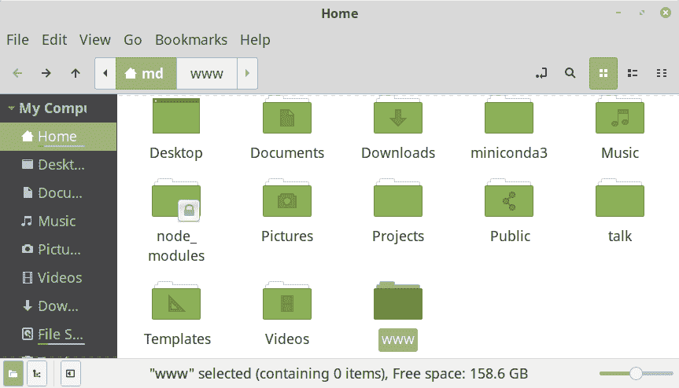
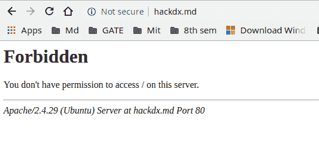
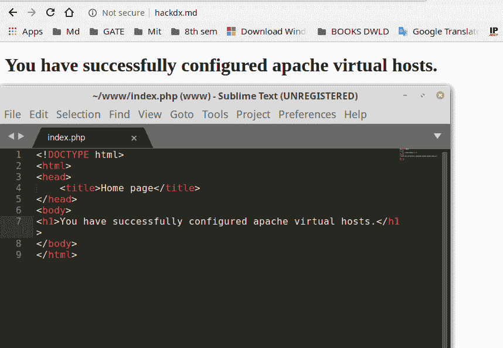

# 在 Ubuntu 中创建自定义域名而不是本地主机

> 原文：[https://www.geeksforgeeks.org/creating-custom-domain-name-instead-of-localhost-in-ubuntu/](https://www.geeksforgeeks.org/creating-custom-domain-name-instead-of-localhost-in-ubuntu/)

在 Ubuntu 中，默认情况下，本地服务器被称为 `localhost`。但是，您也可以为您的本地服务器创建一个自定义域名，而不是使用 `localhost`。本文解释了创建自己的自定义域名而不是使用本地主机的过程。这里的 `hackdx.md` 是作为我们的域创建的，可以根据需要来取。

**注：** 本文以 Linux 用户为重点进行编译，但过程与 Windows 用户类似，只是做了一些小改动。

以下是在 Ubuntu 中创建自己的自定义域名而不是使用 `localhost` 的步骤：

## 步骤 1：安装 Apache 服务器和 PHP（如果需要）

如果您是 Linux 新手，可以如下安装 Apache 服务器和 PHP，否则请跳过此步骤。Apache 用于托管 PHP 脚本。如果已经安装，也请跳过此步骤。

```bash
sudo apt-get update
sudo apt-get install apache2 php
```

您可以通过在浏览器中键入 `localhost` 来检查您的服务器。如果您得到 Apache Ubuntu 默认页面，即表示您已经成功安装了 `apache2` 服务器。


## 步骤 2：创建服务器根目录文件夹

创建一个您想用作服务器根目录的文件夹。这里我使用 `/home/md/www` 作为我的根目录。您可以将其命名为任何您喜欢的名称，命名为 `www` 不是强制性的。



## 步骤 3：在 hosts 文件中创建域名

这是重要的一步，在 `/etc/hosts` 文件中创建域名。打开您的终端并键入以下内容。

如果尚未安装，请使用：

```bash
sudo apt install net-tools
```

然后执行此命令编辑主机文件：

```bash
sudo gedit /etc/hosts
```

如图所示，在本地主机 IP 前面输入您的域名。这里我们使用的是 `hackdx.md`，所以我们写的是 `127.0.1.1 hackdx.md`。现在，您可以通过在浏览器中键入 `hackdx.md` 来查看默认的 Apache 页面。


## 步骤 4：复制默认的 Apache2 配置文件

现在为您的新域名配置复制默认的 `apache2` 配置文件。您可以为任意多个域名执行此操作。此步骤是必需的，以便您可以在 `hackdx.md` 或您自己的域名下查看您新创建的域名。您也可以添加到默认配置中，但建议创建新文件，因为您可能会弄乱原始的默认文件。

这可以通过以下命令完成：

```bash
sudo cp /etc/apache2/sites-available/000-default.conf /etc/apache2/sites-available/hackdx.md.conf
```


## 步骤 5：向配置文件添加条目

现在向我们的配置文件 `hackdx.md.conf` 添加条目，如图所示。我们正在创建 `/home/md/www` 作为根目录，并将 `hackdx.md` 作为域名或服务器名称。如果您想在其他位置创建，所有不同的域名也可以添加到此文件中。例如 `/home/md/sample` 等，在 `/etc/hosts` 文件中必须存在相应的条目。

```bash
sudo gedit /etc/apache2/sites-available/hackdx.md.conf
```


## 步骤 6：禁用默认配置并启用新配置

为新创建的域名 `hackdx.md.conf` 禁用默认配置并启用我们的新配置。

```bash
sudo a2dissite 000-default.conf
sudo a2ensite hackdx.md.conf
sudo systemctl reload apache2
```


## 步骤 7：更新 Apache2 配置文件

以防您遇到禁止访问错误，还需要更新 `apache2` 配置文件。您可能会遇到此错误，因为 `apache2` 无法识别新的根文档位置 `/home/md/www`，通过添加这些行，`apache` 就能知道根位置。



运行此命令编辑 `apache2.conf`：

```bash
sudo gedit /etc/apache2/apache2.conf
```

如图所示，将这些行添加到您的 `apache2.conf` 文件中。


## 步骤 8：重新加载 Apache2 服务

最后，重新加载 `apache2` 服务，把这个命令放到您的终端。

```bash
sudo systemctl reload apache2
```

## 步骤 9：测试您的自定义域名

您现在已经准备好，通过在浏览器中输入您的 URL 来检查。您可以通过在 `www` 文件夹中编写一个简单的 PHP 脚本来进行测试。



现在您可以把您的文件放在 `www` 目录下，享受使用 PHP 服务器了。