# 电子邮件中的自定义消息

> 原文：[https://www.geeksforgeeks.org/custom-messages-in-electronjs/](https://www.geeksforgeeks.org/custom-messages-in-electronjs/)

[electronjs](https://www.geeksforgeeks.org/introduction-to-electronjs/) 是一个开源框架，用于使用能够在 Windows、macOS 和 Linux 操作系统上运行的 HTML、CSS 和 JavaScript 等网络技术构建跨平台的本机桌面应用程序。它将 Chromium 引擎和 Node.js 结合成一个单一的运行时。

电子应用程序与用户交互的方式之一是通过消息框和警报。有时在应用程序执行过程中，会出现需要用户注意的情况，或者代码遇到错误，需要让用户意识到这一点。在这种情况下，如果没有用户干预，执行流程就无法向前推进。电子为我们提供了一种方便的技术，通过这种技术，用户可以意识到问题并采取必要的措施。电子为我们提供了一个内置的 `dialog` 模块来显示自定义消息框和警报，以便与用户交互。本教程将使用 `dialog` 模块的实例方法来演示电子邮件中的自定义消息。

我们假设您熟悉上述链接中介绍的先决条件。电子要工作，[Node.js](https://www.geeksforgeeks.org/introduction-to-nodejs/) 和 [npm](https://www.geeksforgeeks.org/node-js-npm-node-package-manager/) 需要预装在系统中。

## 电子定制消息

`dialog` 模块是主进程的一部分。为了导入和使用渲染器进程中的 `dialog` 模块，我们将使用电子 `remote` 模块。

*   **项目结构：**
    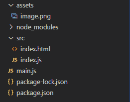

## 示例

按照给定的步骤在 electronic 中构建自定义消息框。

*   **Step 1：** 导航到一个空目录来设置项目，并运行以下命令：

```html
npm init
```

生成 `package.json` 文件。如果尚未安装，请使用 npm 安装 [electron](https://www.geeksforgeeks.org/introduction-to-electronjs/)。

```html
npm install electron --save
```

这将安装所需的 `node_modules` 依赖项。将您选择的任何图像文件复制到 `assets` 文件夹中，并将其命名为 `image.png`。在本教程中，我们将使用电子标志作为 `image.png` 文件。

**package.json：**

```html
{
  "name": "electron-message",
  "version": "1.0.0",
  "description": "Custom Messages in Electron",
  "main": "main.js",
  "scripts": {
    "start": "electron ."
  },
  "keywords": [
    "electron"
  ],
  "author": "Radhesh Khanna",
  "license": "ISC",
  "dependencies": {
    "electron": "^8.2.5"
  }
}
```

*   **Step 2：** 关于 `main.js` 文件的样板代码，请参考此[链接](https://www.electronjs.org/docs/tutorial/first-app#electron-development-in-a-nutshell)。我们已经修改了代码以适应我们的项目需求。

**main.js：**

```html
const { app, BrowserWindow } = require('electron')

function createWindow () {
  // Create the browser window.
  const win = new BrowserWindow({
    width: 800,
    height: 600,
    webPreferences: {
      nodeIntegration: true
    }
  })

  // Load the index.html of the app.
  win.loadFile('src/index.html')

  // Open the DevTools.
  win.webContents.openDevTools()
}

// This method will be called when Electron has finished
// initialization and is ready to create browser windows.
// Some APIs can only be used after this event occurs.
/* The 'dialog.showErrorBox()' method can be used before 
   this event occurs. */ 
// This method is equivalent to 'app.on('ready', function())'
app.whenReady().then(createWindow)

// Quit when all windows are closed.
app.on('window-all-closed', () => {
  // On macOS it is common for applications and their menu bar
  // To stay active until the user quits explicitly with Cmd + Q
  if (process.platform !== 'darwin') {
    app.quit()
  }
})

app.on('activate', () => {
  // On macOS it's common to re-create a window in the 
  // app when the dock icon is clicked and there are no 
  // other windows open.
  if (BrowserWindow.getAllWindows().length === 0) {
    createWindow()
  }
})

// In this file, you can include the rest of your 
// app's specific main process code. You can also 
// Put them in separate files and require them here.
```

*   **Step 3：** 在 `src` 目录中创建 `index.html` 文件和 `index.js` 文件。我们还将从上述链接复制 `index.html` 文件的样板代码。我们已经修改了代码以适应我们的项目需求。

**index.html：**

```html
<!DOCTYPE html>
<html>
  <head>
    <meta charset="UTF-8">
    <title>Hello World!</title>
    <!-- https://electronjs.org/docs/tutorial/security#csp-meta-tag -->
    <meta http-equiv="Content-Security-Policy" 
          content="script-src 'self' 'unsafe-inline';" />
  </head>
  <body>
    <h1>Hello World!</h1>
    We are using node 
    <script>
        document.write(process.versions.node)
    </script>, Chrome 
    <script>
        document.write(process.versions.chrome)
    </script>, and Electron 
    <script>
        document.write(process.versions.electron)
    </script>.

    <h3>Custom Messages in Electron</h3>
    <button id="show">Show Custom Message Box</button>
    <br><br>
    <button id="error">Show Error Message Box</button>
    <!-- Adding Individual Renderer Process JS File -->
    <script src="index.js"></script>
  </body>
</html>
```

**输出：** 此时，我们的应用程序已经设置好了，我们可以启动应用程序来检查 GUI 输出。要启动电子应用程序，请运行命令。

```html
npm start
```

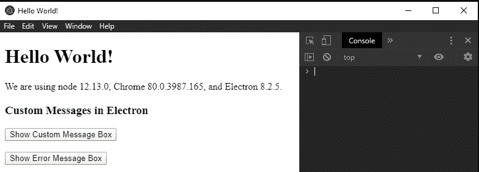

*   **Step 4：** `Show Custom Message Box` 按钮目前还没有任何关联的功能。要改变这一点，请在 `index.js` 文件中添加以下代码。

`dialog.showMessageBox(browserWindow, options)` 用于 `options` 对象的所有默认值/基本值。使用此实例方法会显示消息框，并将阻止应用程序执行，直到消息框通过用户的适当操作成功关闭。它接受以下参数。

*   **`browserWindow`：`BrowserWindow`（可选）** `BrowserWindow` 实例。该参数允许 `dialog` 将其自身附加到父窗口，使其成为模态。模态窗口是禁用父窗口的子窗口。如果 `browserWindow` 未显示，对话框将不会附加到其上。在这种情况下，它将显示为独立窗口。在上面的代码中，`BrowserWindow` 实例没有被传递到对话框，因此单击 `Show Custom Message Box` 按钮，对话框作为独立窗口打开。
    *   **`options`：`Object`** 它接受以下参数：
        *   **`type`：`String`（可选）** 它可以包含以下值。
            *   `"none"`
            *   `"info"`
            *   `"error"`
            *   `"question"`
            *   `"warning"`

这些值中的每一个都表示您想要向用户显示的消息框的类型。默认值为 `"none"`。在 Windows 上，`"question"` 显示与 `"info"` 相同的图标，除非明确设置了 `icon` 属性。在 macOS 上，`"warning"` 和 `"error"` 显示相同的警告图标。除了默认值之外，这些值都有一个与之关联的默认系统操作系统声音。

*   **`buttons`：`String[]`（可选）** 它代表您希望在自定义消息框中显示的按钮标签的数组。空数组将显示一个按钮，标记为 `"OK"`。
        *   **`defaultId`：`Integer`（可选）** 打开自定义消息框时，默认选择的 `buttons` 数组中按钮的索引。该属性依赖于 `noLink` 属性。这将在以下步骤中演示。
        *   **`title`：`String`（可选）** 消息框中显示的标题。某些操作系统平台及其各自的版本不支持此属性。
        *   **`message`：`String`** 消息框的主要内容。
        *   **`detail`：`String`（可选）** 附加信息将显示在 `message` 属性下方的消息框中。
        *   **`checkboxLabel`：`String`（可选）** 复选框的标签。此属性自动在自定义消息框中包含带有给定标签的复选框。
        *   **`checkboxChecked`：`Boolean`（可选）** 该属性表示复选框的初始状态。该属性的默认值为 `false`。
        *   **`icon`：`NativeImage`（可选）** 消息框上显示的图标。如果定义了该属性，它将覆盖 `type` 属性的默认系统图标，而不管其值如何。该属性接受一个 `NativeImage` 实例或图像的文件路径。在本教程中，我们将使用 `path` 模块传递位于 `assets` 文件夹中的 `image.png` 文件的文件路径。
        *   **`cancelId`：`Integer`（可选）** 通过 Esc 键取消对话时返回的按钮索引。默认情况下，这被分配给第一个按钮，并且 `cancel` 或 `no` 作为 `buttons` 数组属性中的标签。如果不存在这样的标记按钮，并且没有设置该选项，将使用 `0` 作为返回值。这将在以下步骤中演示。
        *   **`noLink`：`Boolean`（可选）** 该属性仅在 Windows 上受支持。设置该属性后，电子将自动尝试找出其中哪个按钮是常用按钮标签，如 `cancel`、`yes`、`no`、`ok` 等，并将其他按钮标签显示为对话框中的命令链接。此属性用于使对话框窗口以现代 Windows 操作系统应用程序和主题的样式出现。默认情况下，该属性设置为 `false`。如果使用所有通用按钮标签，此属性将不起作用。此属性将在以下步骤中演示。
        *   **`normalizeAccessKeys`：`Boolean`（可选）** 跨平台规范化键盘访问键。默认值为 `false`。启用此属性假设按钮标签中使用了 `&` 通配符。这些标签将被转换，以便它们在每个平台上相应地工作。`&` 字符在 macOS 上全部删除，在 Linux 上转换为 `_`，在 Windows 上不做任何动作。

`dialog.showMessageBox(browserWindow, options)` 返回 `Promise`。它解析为包含以下参数的 `Object`，

*   **`response`：`Integer`** 点击按钮的索引，如 `buttons` 数组属性中所定义。
*   **`checkboxChecked`：`Boolean`** 如果设置了 `checkboxLabel` 属性，复选框的选中状态。默认情况下，将返回 `false`。

**index.js：**

```html
const electron = require('electron');
const path = require('path');

// Importing dialog module using remote
const dialog = electron.remote.dialog;

var showBox = document.getElementById('show');
```

## 步骤 5

我们现在应该可以通过点击“显示自定义消息框”按钮成功触发一个基本的自定义消息框。
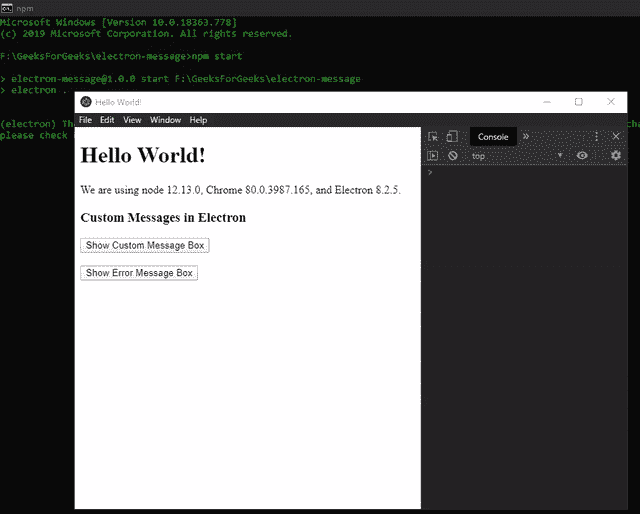

**注意：** 如果用户在未成功关闭自定义消息框的情况下尝试继续执行应用程序，控制台上会显示以下消息：

```html
Attempting to call a function in a renderer window that 
has been closed or released. Function provided here: undefined
```

我们现在将修改自定义消息框的 `options` 对象，以查看不同的输出。

*   `type`: 字符串，定义不同类型的消息框。
    *   `type: 'info'`
        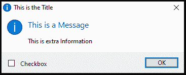
    *   `type: 'warning'`
        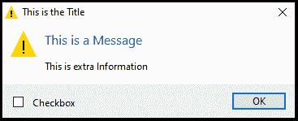
    *   `type: 'error'`
        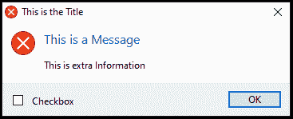

*   `buttons`: 字符串数组，我们将为 `buttons` 数组属性定义自定义标签，并通过更改 `noLink` 属性查看各自的输出。
    *   `buttons: ['Cancel', 'OK', 'Button-1', 'Button-2']`, `noLink: false`, `defaultId: 0`
        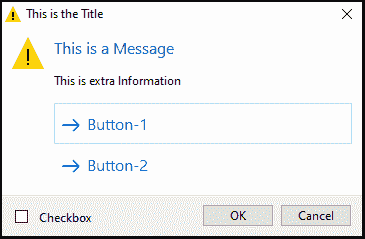

**注意：** 在这种情况下，`default` 属性应该突出显示“取消”按钮，但是选择了“按钮-1”标签。这是由于 `noLink` 属性定义的行为。

    *   `buttons: ['Cancel', 'OK', 'Button-1', 'Button-2']`, `noLink: true`, `defaultId: 0`
        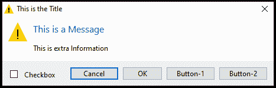

**注意：** 根据预期行为，默认选择“取消”按钮。

*   `cancelId`: 整数，评估 `cancel` 属性的行为。按下键盘上的 `Esc` 键可激活该行为。
    *   `buttons: ['Cancel', 'OK', 'Button-1', 'Button-2']`, `cancelId: 100`, `noLink: true`
        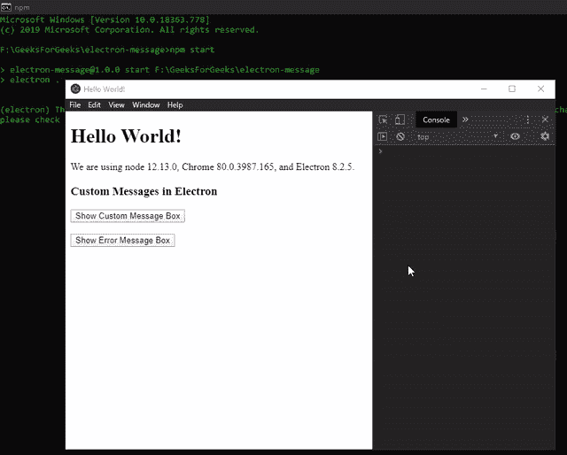

**注意：** 返回的值是在 `cancel` 属性中设置的 100。

    *   `buttons: ['Cancel', 'OK', 'Button-1', 'Button-2']`, `cancelId: 100`, `noLink: false`
        

**注意：** 尽管将 `cancel` 属性值设置为 100，但返回值为 0。

*   `icon`: NativeImage，我们将传递位于 `assets` 文件夹中的 `image.png` 文件的路径。
    *   `buttons: ['Cancel', 'OK', 'Button-1', 'Button-2']`, `icon: path.join(__dirname, '../assets/image.png')`, `noLink: true`
        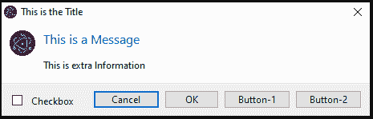
    *   `buttons: ['Cancel', 'OK', 'Button-1', 'Button-2']`, `icon: path.join(__dirname, '../assets/image.png')`, `noLink: false`
        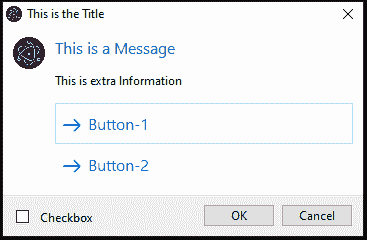

**注意：** 使用 `icon` 属性会禁用 `type` 属性的默认系统操作系统声音，无论其值如何。

我们还可以通过简单地将 `buttons` 数组属性的索引值与 `Promise` 返回的 `response` 参数进行比较，为消息框中的每个按钮分配不同的行为。

**index.js:**

```javascript
.then(box => {
    console.log('Button Clicked Index - ', box.response);
    console.log('Checkbox Checked - ', box.checkboxChecked);

    if (box.response === 0) {
        console.log('Cancel Button was clicked');
    } else if (box.response === 2) {
        console.log('Button-1 was clicked');
    }
}).catch(err => {
    console.log(err)
});
```

**输出：**
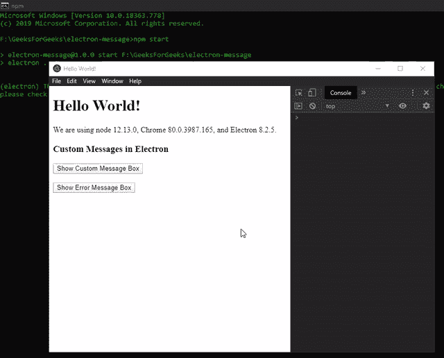

## 步骤 6

Electron 还为我们提供了一个专门用于错误消息的实例方法。在上面的代码中，“显示错误消息框”按钮没有任何关联的功能。要更改此设置，请在 `index.js` 文件中添加以下代码。

`dialog.showErrorBox(title, content)` 接受以下参数。它没有任何返回值。该方法不像 `dialog.showMessageBox()` 方法那样是可定制的，但是可以在 `app` 模块的 `ready` 事件发出之前安全地调用该方法。参考 `main.js` 文件中高亮显示的代码。它通常用于显示应用程序启动阶段的错误。如果在 `Linux` 上 `app` 模块的 `ready` 事件之前调用，消息会被发送到 `stderr`，不会出现 GUI 对话框。

*   `title`: 字符串，错误框的标题。
*   `content`: 字符串，显示在 `title` 属性下方的错误框中的文本信息。

**index.js:**

```javascript
var error = document.getElementById('error');

error.addEventListener('click', (event) => {
    dialog.showErrorBox('This is the Title', 'This is the Content');
});
```

**输出：**
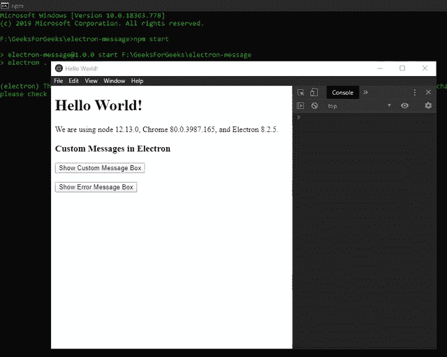