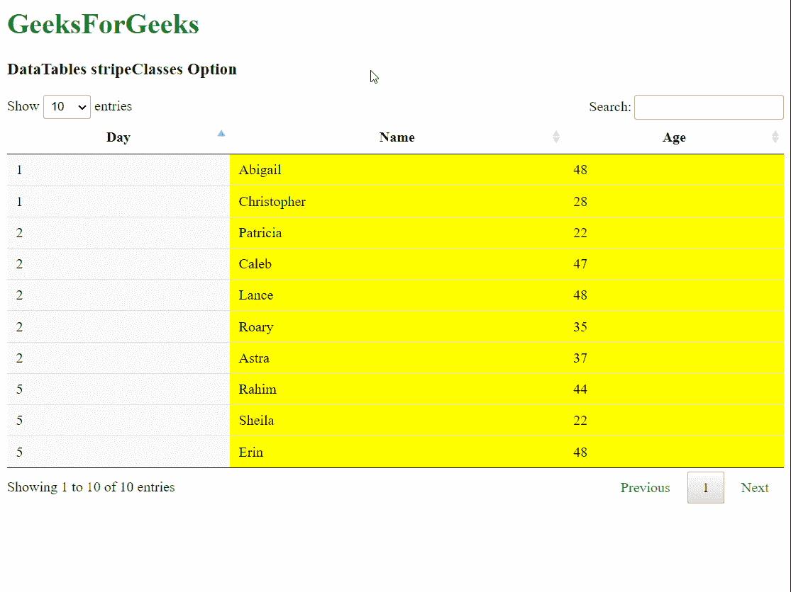
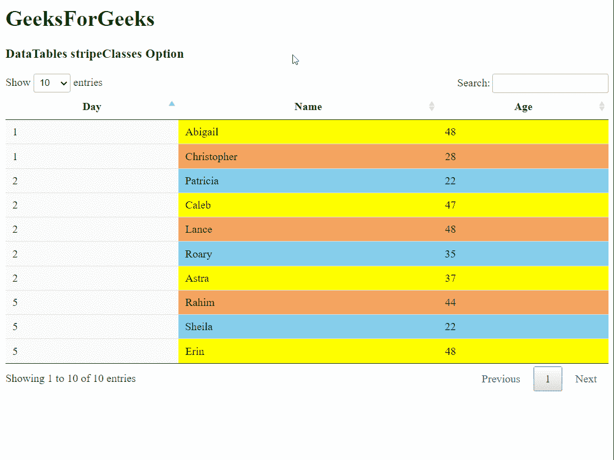

# DataTables 的 `stripeClasses` 选项

DataTables 是一个 jQuery 插件，可用于为网页中的 HTML 表格添加交互式和高级控件。它允许用户根据需要搜索、排序和过滤表中的数据。DataTables 还提供了一个强大的 API，可用于进一步修改数据的显示方式。

`stripeClasses` 选项用于指定一个数组，该数组定义了将应用于表格行的 CSS 类。数组可以是任意长度，DataTables 将按数组中给定的顺序循环应用这些类。这可以与在 CSS 中自定义的类结合使用，以便为表格行应用特定的样式。

## 语法

```javascript
stripeClasses( array )
```

## 参数

该选项接受一个参数，描述如下：

*   `array`: 一个字符串数组，用于指定将循环应用于表格行的 CSS 类名。

以下示例说明了该选项的使用方法。

## 示例 1

在本例中，我们使用数组中的单个类为所有行指定同一种背景色。

### HTML 代码

```html
<!DOCTYPE html>
<html>

<head>
  <!-- jQuery -->
  <script type="text/javascript" 
          src="https://code.jquery.com/jquery-3.5.1.js">
  </script>

<!-- DataTables CSS -->
  <link rel="stylesheet"
        href="https://cdn.datatables.net/1.10.23/css/jquery.dataTables.min.css">

<!-- DataTables JS -->
  <script src="https://cdn.datatables.net/1.10.23/js/jquery.dataTables.min.js">
  </script>

<style>
/* Define the classes to be used in the table */    
    .stripe-color {
      background-color: yellow !important;
    }
  </style>
</head>

<body>
  <h1 style="color: green;">
    GeeksForGeeks
  </h1>
  <h3>DataTables stripeClasses Option</h3>

<!-- HTML table with random data -->
  <table id="tableID" class="display nowrap">
    <thead>
      <tr>
        <th>Day</th>
        <th>Name</th>
        <th>Age</th>
      </tr>
    </thead>
    <tbody>
      <tr>
        <td>2</td>
        <td>Patricia</td>
        <td>22</td>
      </tr>
      <tr>
        <td>2</td>
        <td>Caleb</td>
        <td>47</td>
      </tr>
      <tr>
        <td>1</td>
        <td>Abigail</td>
        <td>48</td>
      </tr>
      <tr>
        <td>5</td>
        <td>Rahim</td>
        <td>44</td>
      </tr>
      <tr>
        <td>5</td>
        <td>Sheila</td>
        <td>22</td>
      </tr>
      <tr>
        <td>2</td>
        <td>Lance</td>
        <td>48</td>
      </tr>
      <tr>
        <td>5</td>
        <td>Erin</td>
        <td>48</td>
      </tr>
      <tr>
        <td>1</td>
        <td>Christopher</td>
        <td>28</td>
      </tr>
      <tr>
        <td>2</td>
        <td>Roary</td>
        <td>35</td>
      </tr>
      <tr>
        <td>2</td>
        <td>Astra</td>
        <td>37</td>
      </tr>
    </tbody>
  </table>

<script>
// Initialize the DataTable
    $(document).ready(function () {
      $('#tableID').DataTable({
// Specify a single class in the array
        stripeClasses: ['stripe-color']
      });
    }); 
  </script>
</body>

</html>
```

**输出:**



## 示例 2

在本例中，我们使用数组中的三个类来对行进行循环着色。

### HTML 代码

```html
<!DOCTYPE html>
<html>

<head>
  <!-- jQuery -->
  <script type="text/javascript" 
          src="https://code.jquery.com/jquery-3.5.1.js">
  </script>

<!-- DataTables CSS -->
  <link rel="stylesheet"
        href="https://cdn.datatables.net/1.10.23/css/jquery.dataTables.min.css">

<!-- DataTables JS -->
  <script src="https://cdn.datatables.net/1.10.23/js/jquery.dataTables.min.js">
  </script>

<style>
/* Define the classes to be used in the table */
    .stripe-1 {
      background-color: yellow !important;
    }

.stripe-2 {
      background-color: sandybrown !important;
    }

.stripe-3 {
      background-color: skyblue !important;
    }
  </style>
</head>

<body>
  <h1 style="color: green;">
    GeeksForGeeks
  </h1>
  <h3>DataTables stripeClasses Option</h3>

<!-- HTML table with random data -->
  <table id="tableID" class="display nowrap">
    <thead>
      <tr>
        <th>Day</th>
        <th>Name</th>
        <th>Age</th>
      </tr>
    </thead>
    <tbody>
      <tr>
        <td>2</td>
        <td>Patricia</td>
        <td>22</td>
      </tr>
      <tr>
        <td>2</td>
        <td>Caleb</td>
        <td>47</td>
      </tr>
      <tr>
        <td>1</td>
        <td>Abigail</td>
        <td>48</td>
      </tr>
      <tr>
        <td>5</td>
        <td>Rahim</td>
        <td>44</td>
      </tr>
      <tr>
        <td>5</td>
        <td>Sheila</td>
        <td>22</td>
      </tr>
      <tr>
        <td>2</td>
        <td>Lance</td>
        <td>48</td>
      </tr>
      <tr>
        <td>5</td>
        <td>Erin</td>
        <td>48</td>
      </tr>
      <tr>
        <td>1</td>
        <td>Christopher</td>
        <td>28</td>
      </tr>
      <tr>
        <td>2</td>
        <td>Roary</td>
        <td>35</td>
      </tr>
      <tr>
        <td>2</td>
        <td>Astra</td>
        <td>37</td>
      </tr>
    </tbody>
  </table>

<script>
// Initialize the DataTable
    $(document).ready(function () {
      $('#tableID').DataTable({
// Specify multiple classes to be used
        stripeClasses: ['stripe-1',
                        'stripe-2',
                        'stripe-3']
      });
    }); 
  </script>
</body>

</html>
```

**输出:**

