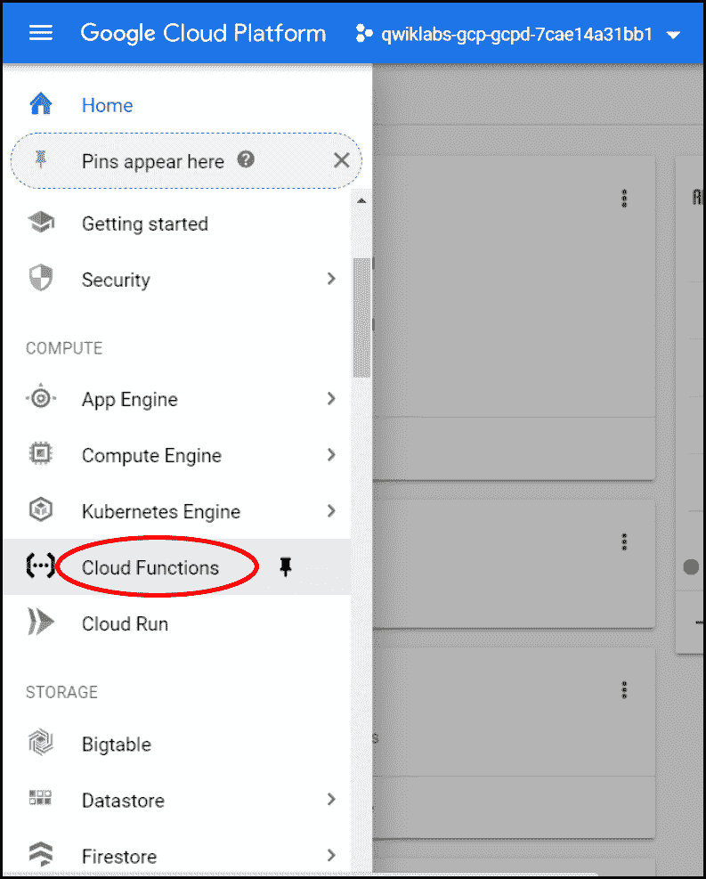
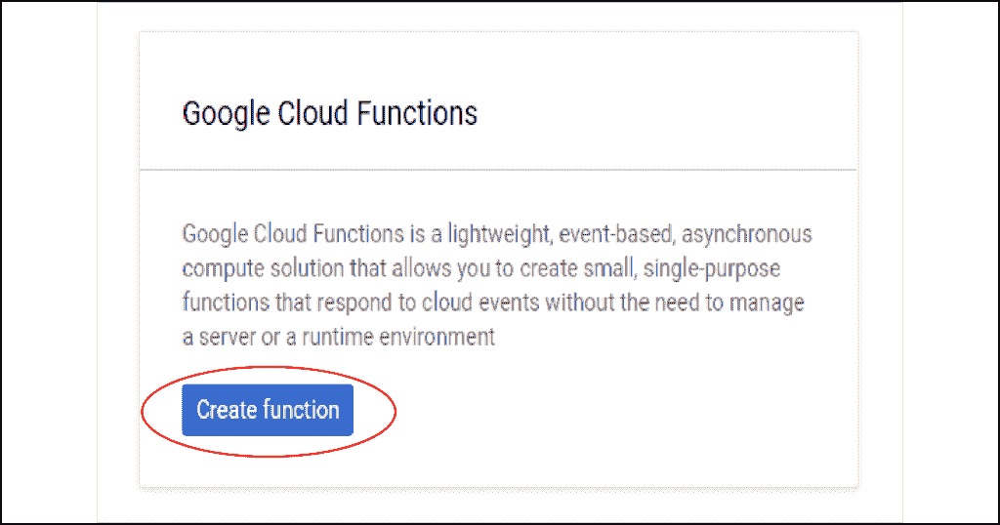
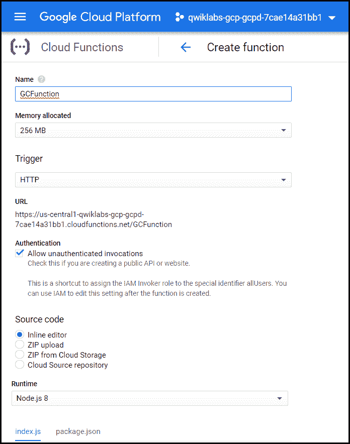
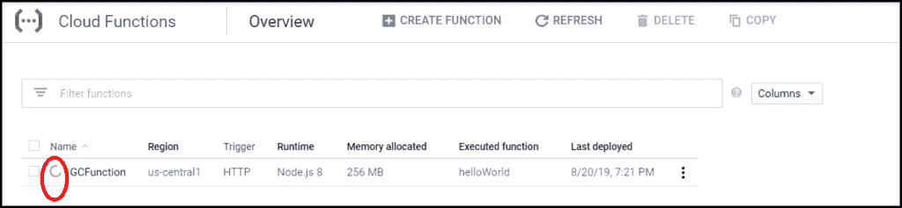
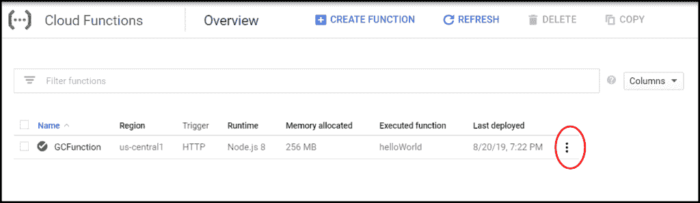
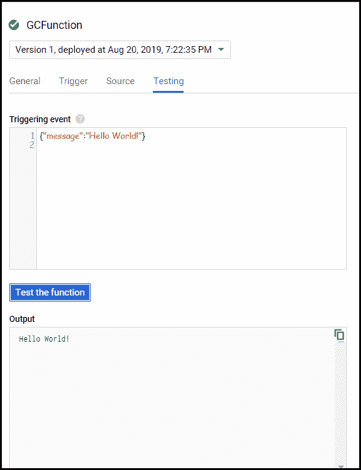
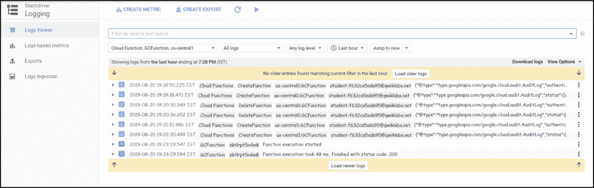

# 在谷歌云平台上部署云功能

> 原文：[https://www.geeksforgeeks.org/deploy-cloud-function-on-google-cloud-platform/](https://www.geeksforgeeks.org/deploy-cloud-function-on-google-cloud-platform/)

## 云功能

谷歌云功能是一个用于构建和连接云服务的无服务器执行环境。通过`无服务器`，意味着云功能消除了管理服务器、配置或更新软件以及修补操作系统的负担。软件和基础设施完全由谷歌管理。你只需要添加代码。

**云功能的主要特征是：**

*   没有服务器管理
*   自动缩放
*   只在代码运行时支付
*   运行代码以响应事件
*   开放而熟悉
*   连接和扩展云服务

## 它们是如何工作的？

云服务（`Stackdriver`、`云数据存储`等）发出所需的事件（直接 `HTTP` 调用等），云函数通过调用其他服务（如 `API`）来响应这些事件。调用其他服务后，云功能写回云服务。

**云功能的少数用例：**

1.  与第三方服务和应用编程接口集成
2.  无服务器移动后端
3.  无服务器物联网后端

谷歌云函数让你可以用传统的编程语言进行编码，包括 `Python` 和 `JavaScript`。这有助于精通 `Java` 或 `Python` 的开发人员快速轻松地上传函数。

因此，在本文中，我们将创建一个函数，将其部署在谷歌云上，测试该函数并检查日志。

## 创建函数

创建一个函数非常容易。在这里，我们将使用云控制台创建一个函数。

1.  在`Navigation Menu`中，悬停在`Cloud Functions`上。

    

2.  如果您之前没有创建任何函数，系统会询问您是否要创建新函数。点击`Create Function`。

    

3.  现在，您将看到一个包含不同规格的复杂表单，您需要选择这些规格才能创建函数。为了便于理解，让我们按如下方式填写：
    *   **名称：** `GCFunction`
    *   **分配的内存：** 默认
    *   **触发器：** `HTTP` 触发器（避免直接通过 `HTTPS` 端点调用。）
    *   **源代码：** 内联编辑器
    *   **要执行的功能：** `helloWorld`

    

4.  点击`创建`。

## 部署功能

点击`创建`，进入`云功能概述`页面，可以看到自己创建的所有功能、区域、触发器、分配的内存、执行的功能、上次部署的日期和时间。

页面加载后，您可以在函数名称旁边看到一个小微调图标。这表示您的功能正在部署中。



一旦部署，微调图标会变成绿色的勾号，表示您的功能已成功部署。



## 测试功能

1.  在`云功能概述`页面中，在`最后部署的`列旁边，您可能会发现 3 个点，显示您的功能菜单。点击`测试功能`。
2.  现在，将打开一个`Function details`页面。在`Triggering event`框中，添加

    ```html
    {"message":"Hello World!"}
    ```

    。在这个测试表单中，我们提供了一个 `JSON` 格式的消息。接下来，点击`测试功能`。这调用了我们的函数，out 函数的输出将在输出框中显示给我们，您可以看到您的函数被执行了。
    **输出：**

    ```html
    Hello World!
    ```

3.  在输出框下方，`Logs field`中，您可能会看到`finished with status code:200`。状态码`200`表示您的函数已成功执行。

    日志包含一些元数据，显示我们的函数执行所花费的时间，以及它返回的状态代码。此外，它还会有我们的函数抛出的消息或错误（如果有的话）。



## 查看日志

您可以从`云功能概述`页面的显示菜单中查看日志。回到`云功能概述`页面，找到三个点，点击`查看日志`。日志页面将如下所示：



云功能非常容易创建、使用和管理。很少有云功能的时尚和智能应用：

*   虚拟助手和聊天机器人
*   视频和图像分析
*   情感分析