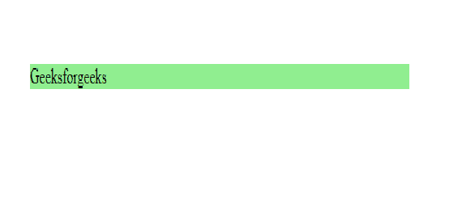
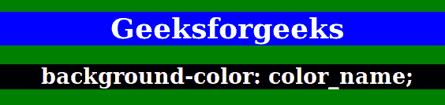

# 背景和背景色的区别

> 原文: [https://www.geeksforgeeks.org/difference-between-background-and-background-color/](https://www.geeksforgeeks.org/difference-between-background-and-background-color/)

## 1. `Background` 属性

`background` 属性在 CSS 中非常常用，并包含许多变体。`background` 属性由以下所有属性组成：
*   `background-color`
*   `background-image`
*   `background-position`
*   `background-size`
*   `background-repeat`
*   `background-origin`
*   `background-clip`
*   `background-attachment`

### `background-color`

**语法:**

```html
body {
   background-color: color name;
}
```

颜色名称也可以给出为：`"green"`，HEX 值为 `"#5570F0"`，RGB 值为 `"RGB(25,255,2)"`。

**示例:**

```html
<style>
    h1 {
        background-color: blue;
    }
</style>

<body>
    <h1>
        Geeksforgeeks
    </h1>
</body>
```

**输出:**


### `background-image`

该属性指定用作元素背景的图像。默认情况下，图像是重复的，因此它覆盖了整个元素。

**语法:**

```html
body {
   background-image: link;
}
```

**示例:**

```html
<style>
    body {
        background-image: url(gfgpolaroidimagefunction.png);
    }
</style>

<body>
    <h1>
        Geeksforgeeks
    </h1>
</body>
```

**输出:**


## 2. `background-color` 属性

CSS 中的 `background-color` 属性用于指定元素的背景颜色。另一方面，如果你**只使用 `background:` 属性**，你可以将其值指定为图像 URL 或颜色代码，或者按以下给定顺序指定每个背景属性的值。

**语法:**

```html
element {
    background-color: property;
}
```

**示例:**

```html
<!DOCTYPE html>
<html>
    <head>
        <title>background-color property</title>
        <style>
            body {
                text-align: center;
                background-color: green;
            }
            h1 {
                color: white;
                background-color: blue;
            }
            h2 {
                color: white;
                background-color: black;
            }
        </style>
    </head>
    <body>
        <h1>Geeksforgeeks</h1>
        <h2>background-color: color_name;</h2>
    </body>
</html>
```

**输出:**
