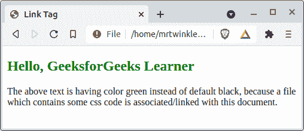
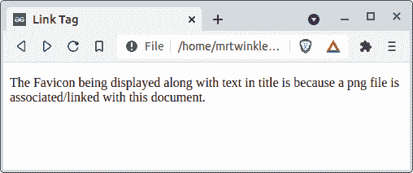
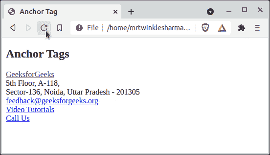

# 链接标签和锚标签的区别

> 原文：[https://www.geeksforgeeks.org/difference-between-link-and-anchor-tags/](https://www.geeksforgeeks.org/difference-between-link-and-anchor-tags/)

[HTML](https://www.geeksforgeeks.org/html-tutorials/) 语言是 web 开发最基本的组件。如果你是网络开发的初学者，学习 HTML，那么你一定发现了“链接”和“一个”标签。这两个实体 `<link>` 和 `<a>`，用于某种链接，所以如果你对它们之间的混淆或者想了解它们之间的实际区别，那么你就来对地方了。在本文中，我们将区分它们，然后是实际的定义以及两者的示例。

## `<link>` 标签

该标签用于在当前文档和与网页相关联的一些外部资源之间建立连接/关系。该资源可以是一个 CSS 文件、网站中使用的图标、清单等。

它具有某些属性，下面是一些常用属性。

| 属性名 = “值” | 示例 | 描述 |
| --- | --- | --- |
| `href = "URL"` | `href = "./externalStyle.css"` | 它指定资源的位置。 |
| `media = "media_query/media_type"` | `media = "screen (minimum-width: 700px)"` | 链接的文档将在什么设备上显示。 |
| `rel = "relation_with_resource"` | `rel = "stylesheet"`<br>`rel = "license"`<br>`rel = "icon"` | 它指定哪个资源与此标签相关联。 |
| `size = "HeightxWidth"` | `size = "32x32"` | 主要用于指定尺寸的图标链接资源。 |
| `type = "MIME_TYPE"` | `type = "image/png"`<br>`type = "text/html"` | 此属性用于定义链接内容的 MIME 类型。 |

### 示例 1

在我们的文档中创建到某个外部 CSS 样式表的链接。给 `h2` 标签的 `id` 只包含一个样式 `color: green` 在那个外部 CSS 文件里面。

```html
<!DOCTYPE html>
<html>

<head>
    <title>Link Tag</title>
    <link rel="stylesheet" href="./externalResource.css" />
</head>

<body>
    <h2 id="hello">
        Hello, GeeksforGeeks Learner
    </h2>
    <p>
        The above text is having color green instead of default black,
        because a file which contains some css code is associated/linked
        with this document.
    </p>
</body>

</html>
```

**输出：**



### 示例 2

为网站添加一些外部收藏夹图标。

```html
<!DOCTYPE html>
<html>

<head>
    <title>Link Tag</title>
    <!-- Add png image source here -->
    <link rel="icon" href="./gfgIcon.png" />
</head>

<body>
    <p>
        The Favicon being displayed along with text in title is
        because a png file is associated/linked with this document.
    </p>
</body>

</html>
```

**输出：**



## `<a>` 标签

这个锚点标签建立了一个到外部或内部 HTML 文档的超链接，一个像电子邮件或电话这样的地址，以及某种外部网址。

- **一些常用的属性是：**

| 属性名 = “值” | 示例 | 描述 |
| --- | --- | --- |
| `href = "url"` | `href = "https://www.geeksforgeeks.org"`<br>`href = "../FilePath.ext"`<br>`href = "#someIncided"` | 它指定超链接的位置。 |
| `target = "some_browsing_context"` | `target = "_blank"`<br>`target = "_self"` | 指定显示链接网址的位置。 |
| `download = "filename.ext"` | `download = "linkedImage.png"` | 这是用来下载超链接的内容而不仅仅是访问。 |
| `ping = "url"` | `ping = "https://someurl/postrequest"` | 它将帖子请求发送到所提供的网址，主要用于追踪。 |

**注意：** 链接标签中描述的 `rel` 和 `type` 属性也可以与锚点标签一起使用。

### 示例 1

我们将绘制一个基本克隆的 *geeksforgeeks.org* 的页脚来说明锚标签的用例，您一定已经看过很多次了，所以对于一个实际示例来说，这可能是一个更好的选择。

**说明：**

- 第一个锚点标签引用了 GFG 的官方网站，还有另一个属性 `target`，设置为 value `_blank` 表示这个超链接将在另一个选项卡中打开。
- 下一个锚标签是传递一个超级链接到 GFG 的邮件。它的语法是 `mailto:any_mail_id_will_appear_here`，当用户点击这个标签时浏览器会去打开一些默认的应用程序发送邮件。
- 后来有一个链接到 GFG 的 YouTube 频道，注意第一个和这个之间的区别，它没有 `target` 属性，所以默认情况下它会在同一个选项卡中打开。
- 最后，有一个超链接来打电话，它接受一个冒号后带有国家代码的号码，即 `tel:any_phone_number`，类似于邮件超链接，浏览器也将决定使用哪个应用程序来打电话。

```html
<!DOCTYPE html>
<html>

<body>
    <h2>Anchor Tags</h2>
    <a href="https://www.geeksforgeeks.org" target="_blank">
        GeeksforGeeks
    </a><br>
    <div>
        <span>
            5th Floor, A-118,<br>Sector-136,
            Noida, Uttar Pradesh - 201305
        </span>
    </div>
    <a href="mailto:feedback@geeksforgeeks.org">
        feedback@geeksforgeeks.org
    </a><br>
    <a href="https://www.youtube.com/geeksforgeeksvideos/">
        Video Tutorials
    </a><br>
    <a href="tel:00000000">Call Us</a>
</body>

</html>
```

**输出：**



## `<link>` 标记 和 `<a>` 标记的区别

| 序号 | `<link>` 标记 | `<a>` 标记 |
| --- | --- | --- |
| 1. | 此标签在 `head` 内使用。 | 此标签在 `body` 内使用。 |
| 2. | 不显示在前端，仅供内部使用。 | 锚标签中写的内容显示在前端。 |
| 3. | 它在两个实体之间建立关系/连接。 | 它建立从当前文档到其他地方的路径。 |
| 4. | 因为它不直接对用户可见，所以不能被点击。 | 用户可以点击此标签中的内容访问超链接。 |
| 5. | 是一个空元素，不能有嵌套元素。 | 它不是一个空元素。其中可以有一些嵌套元素。 |
| 6. | 它与 HTML 元素的块级或内联属性无关。 | 是一个内嵌 HTML 元素。 |
| 7. | 此标签的基本结构是 `<link some_attributes_with_value />` | 这个标签的基本结构是 `<a some_attributes_with_value> some_nested_content </a>` |