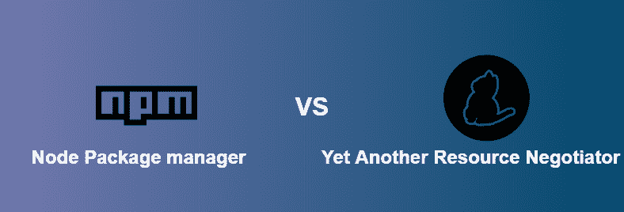

# NPM 与 Yarn 的区别

> 原文: [https://www.geeksforgeeks.org/difference-between-npm-and-yarn/](https://www.geeksforgeeks.org/difference-between-npm-and-yarn/)



`NPM`和`Yarn`是帮助管理项目依赖关系的包管理器。听起来，依赖是项目所依赖的东西，是使项目正常工作所需的一段代码。我们需要它们，因为管理项目的依赖关系是一项困难的任务，并且它很快变得乏味，并且当项目增长时会失控。通过管理依赖关系，我们意味着包含、不包含和更新它们。

`npm`：它是一个针对 JavaScript 编程语言的包管理器。它是 JavaScript 运行时环境 Node.js 的默认包管理器，由一个命令行客户端（也称为`npm`）和一个名为 npm 注册表的公共和付费私有包的在线数据库组成。

`Yarn`：它代表**又一个资源谈判者**，它是一个包装经理，就像`npm`一样。它是由脸书开发的，现在是开源的。开发`yarn`（当时）的目的是解决`npm`的性能和安全问题。

**NPM 和 Yarn 的区别解释如下：**

## 安装程序

*   **npm:** `npm`随 Node 自动安装。
*   **Yarn:** 安装`yarn`必须安装`npm`。

```html
npm install yarn --global
```

## 锁定文件

*   **npm:** `NPM`生成一个`package-lock.json`文件。由于决定论和简单性之间的权衡，`package-lock.json`文件稍微复杂一点。由于这种复杂性，包锁将为不同的`npm`版本生成相同的`node_modules`文件夹。在包锁文件中，每个依赖项都有一个与之关联的确切版本号。
*   **Yarn:** `yarn`生成一个`yarn.lock`文件。`yarn.lock`文件有助于轻松合并。由于锁定文件的设计，合并也是可预测的。

## 输出日志

*   **安装:** `npm`创建`NPM`命令的海量输出日志。它本质上是`npm`正在做什么的堆栈跟踪的转储。
*   **添加:** `yarn`输出圆木干净，视觉上可区分，简洁。为了便于理解，它们也以树形形式排列。

## 安装全局依赖关系

*   **npm:** 要安装全局包，`npm`的命令模板是：

```html
npm install -g package_name@version_number
```

*   **Yarn:** 要安装全局包，`yarn`的命令模板为：

```html
yarn global add package_name@version_number
```

## “为什么”命令

*   **npm:** `npm`还没有内置“为什么”功能。
*   **Yarn:** `yarn`带有一个“为什么”命令，告诉为什么项目中存在依赖关系。例如，它是依赖项、本机模块或项目依赖项。

## 许可证检查器

*   **npm:** 由于安装的依赖关系，`npm`没有一个许可证检查器可以方便地描述项目绑定的所有许可证。
*   **Yarn:** `Yarn`有一个整洁的许可证检查器。要查看它们，请运行：

```html
yarn licenses list
```


## 取包

*   **npm:** 在每个`npm install`命令期间，`npm`都会从 npm 注册表中获取依赖项。
*   **Yarn:** `yarn`在本地存储依赖关系，并在`yarn add`命令期间从磁盘获取（假设依赖关系（具有特定版本）在本地存在）。

## NPM 与 Yarn 中的命令变化

| 命令 | NPM | Yarn |
| :--- | :--- | :--- |
| 安装依赖项 | `npm install` | `yarn install` |
| 安装软件包 | `npm install package_name`<br>`npm install package_name@version_number` | `yarn add package_name`<br>`yarn add package_name@version_number` |
| 卸载软件包 | `npm uninstall package_name` | `yarn remove package_name` |
| 安装开发包 | `npm install package_name --save-dev` | `yarn add package_name --dev` |
| 更新开发包 | `npm update package_name`<br>`npm update package_name@version_number` | `yarn upgrade package_name`<br>`yarn upgrade package_name@version_number` |
| 查看包 | `npm view package_name` | `yarn info package_name` |
| 全局安装包 | `npm install package_name` | `yarn global add package_name` |

## 对 npm 和 yarn 的命令相同

| NPM | Yarn |
| :--- | :--- |
| `npm init` | `yarn init` |
| `npm run [script]` | `yarn run [script]` |
| `npm list` | `yarn list` |
| `npm test` | `yarn test` |
| `npm link` | `yarn link` |
| `npm login` 或 `logout` | `yarn login` 或 `logout` |
| `npm publish` | `yarn publish` |