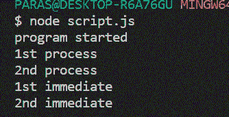

# process.nextTick()和setImmediate()方法的区别

> 原文：[https://www.geeksforgeeks.org/difference-between-process-nexttick-and-setimmediate-methods/](https://www.geeksforgeeks.org/difference-between-process-nexttick-and-setimmediate-methods/)

要理解`process.nextTick()`和`setImmediate()`方法的区别，首先需要了解Node.js **事件循环**的工作原理。

## 什么是 Node.js 事件循环？

由于JavaScript是单线程的，即一次只执行一个进程，所以是事件循环允许Node.js执行非阻塞I/O操作。

## 事件循环的工作？

在一个JavaScript程序的开始，一个事件循环被初始化。有几个操作在事件循环中执行。下面是它们在事件循环的单次迭代中执行的顺序。这些操作在队列中处理。

> `计时器` -> `等待回调` -> `空闲、准备` -> `连接(轮询、数据等)` -> `检查` -> `关闭回调`

## process.nextTick()方法

理解`process.nextTick()`方法：每当一个新的操作队列被初始化时，我们可以把它看作一个新的**tick**。`process.nextTick()`方法将回调函数添加到下一个事件队列的开头。需要注意的是，在程序进程开始时，在事件循环被处理之前，第一次调用`nextTick()`方法。

**语法：**

```javascript
process.nextTick(callback);
```

## setImmediate()方法

理解`setImmediate()`方法：每当我们调用`setImmediate()`方法时，它的回调函数都被放在下一个事件队列的**检查**阶段。这里需要注意一点细节，`setImmediate()`方法在**轮询**阶段调用，它的回调函数在**检查**阶段调用。

**语法：**

```javascript
setImmediate(callback);
```

## 示例

```javascript
setImmediate(function A() {
    console.log("1st immediate");
});

setImmediate(function B() {
    console.log("2nd immediate");
});

process.nextTick(function C() {
    console.log("1st process");
});

process.nextTick(function D() {
    console.log("2nd process");
});

// First event queue ends here
console.log("program started");
```

对于上述程序，事件队列以下列方式初始化：

1.  在**第一个**事件队列中，只打印`program started`。
2.  然后**第二个**事件队列启动，函数`C`即`process.nextTick()`方法的回调放在事件队列的开始。`C`被执行，队列结束。
3.  然后前一个事件队列结束，**第三个**事件队列被初始化，包含回调`D`。然后`setImmediate()`方法的回调函数`A`被放置在后面，接着是`B`。
    现在，第三个事件队列看起来像这样：

    ```
    D A B
    ```

现在，函数`D`、`A`、`B`按照它们在队列中出现的顺序执行。

**输出：**

