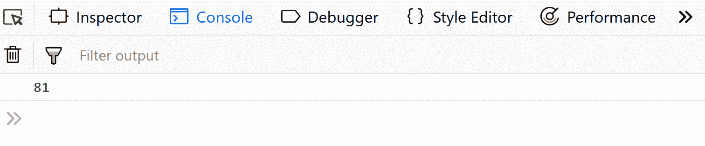
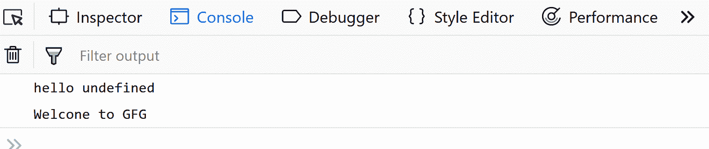
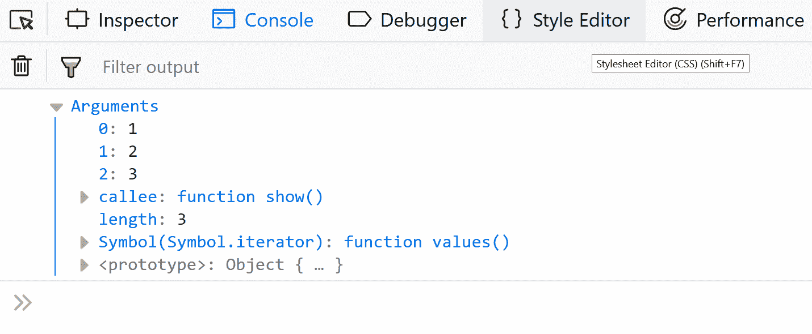
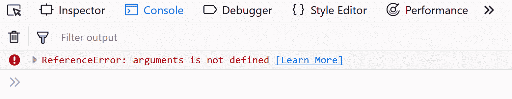
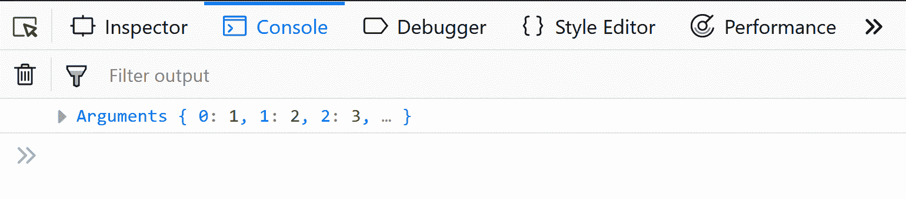
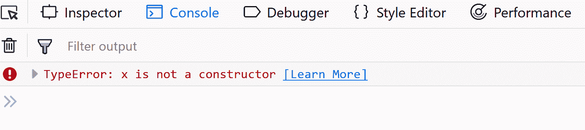

# 常规函数和箭头函数的区别

> 原文：[https://www.geeksforgeeks.org/difference-between-regular-functions-and-arrow-functions/](https://www.geeksforgeeks.org/difference-between-regular-functions-and-arrow-functions/)

本文讨论了正则函数和箭头函数之间的主要区别。

箭头函数是 ES6 中引入的新功能——支持用 JavaScript 编写简洁的函数。虽然常规函数和箭头函数的工作方式相似，但它们之间有一些有趣的区别，如下所述。

## 句法

### 常规函数的语法

```html
let x = function function_name(parameters){
   // body of the function
};
```

### 常规函数示例

```html
let square = function(x){
  return (x*x);
};
console.log(square(9));
```

**输出：**


### 箭头函数的语法

```html
let x = (parameters) => {
    // body of the function
};
```

### 箭头函数示例

```html
var square = (x) => {
    return (x*x);
};
console.log(square(9));
```

**输出：**


## 使用 `this` 关键字

与常规函数不同，箭头函数没有自己的 `this`。

例如：

```html
let user = {
    name: "GFG",
    gfg1:() => {
        console.log("hello " + this.name); // no 'this' binding here
    },
    gfg2(){       
        console.log("Welcome to " + this.name); // 'this' binding works here
    }  
 };
user.gfg1();
user.gfg2();
```

**输出：**


## `arguments` 对象的可用性

`arguments` 对象在箭头函数中不可用，但在常规函数中可用。

### 使用常规函数

```html
let user = {      
    show(){
        console.log(arguments);
    }
};
user.show(1, 2, 3);
```

**输出：**


### 使用箭头函数

```html
let user = {     
        show_ar : () => {
        console.log(...arguments);
    }
};
user.show_ar(1, 2, 3);
```

**输出：**


## 使用 `new` 关键字

使用函数声明或表达式创建的正则函数是“可构造的”和“可调用的”。因为正则函数是可构造的，所以可以使用 `new` 关键字来调用它们。但是，箭头函数只能“调用”，不能构造。因此，在尝试使用 `new` 关键字构造不可构造的箭头函数时，我们会得到一个运行时错误。

### 使用常规函数的示例

```html
let x = function(){
    console.log(arguments);
};
new x(1,2,3);
```

**输出：**


### 使用箭头函数的示例

```html
let x = ()=> {
    console.log(arguments);
};
new x(1,2,3);
```

**输出：**


关于箭头函数的更多信息，请参考本[链接](https://www.geeksforgeeks.org/arrow-functions-in-javascript/)。