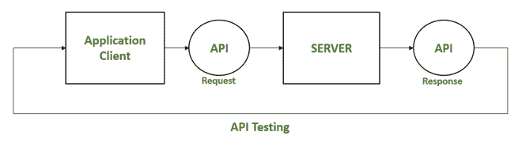
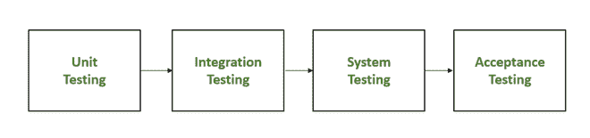

# API 测试和单元测试的区别

> 原文: [https://www.geeksforgeeks.org/differences-between-api-testing-and-unit-testing/](https://www.geeksforgeeks.org/differences-between-api-testing-and-unit-testing/)

## API 测试

应用编程接口（`API`）是一种编程接口。`API` 可以被认为是两个软件系统之间的桥梁，允许它们进行通信。应用编程接口测试需要独立评估应用编程接口，并将其作为集成测试的一部分，以查看它们是否满足功能、可靠性、性能和安全性要求。

*   `API` 测试仅在构建完成时运行。
*   作为最终用户将与之交互的用户界面，应用编程接口测试必须代表整个系统。
*   `API` 测试是一种黑盒测试，只关注测试最终输出下的系统。

## API 测试方法

*   安全测试
*   自动化测试
*   发现测试
*   可用性测试

## API 测试中使用的工具

*   `Postman`
*   `Katalon Studio`
*   `Ping API`
*   `邮递员`（`Postman` 的中文别名）
*   `SoapUI`
*   `JMeter`

## 单元测试

其目标是在每个单独的模块可用时对其进行测试，并验证模块是否执行强制功能。单元测试可以手动或自动进行。

*   确保代码正确。
*   帮助开发人员理解代码库，并允许他们快速进行更改。
*   通过在开发周期的早期修复 `bug` 来省钱。
*   单元测试有两种类型:
    *   手动测试
    *   自动化测试

## 单元测试中使用的工具

*   `NUnit`
*   `JUnit`
*   `PyTest`
*   `Jtest`
*   `JUnit`

## `API` 测试与单元测试的区别

| **`API` 测试** | **单元测试** |
| :--- | :--- |
| 接触最终用户。 | 使用系统的主要功能来测试每个单元是否按预期执行。 |
| 由 `QA` 团队实施。 | 由开发人员完成。 |
| 从头到尾测试功能。 | 功能测试。 |
| 大多数时候是黑盒测试。 | 这是白盒测试。 |
| 仅测试 `API` 功能。 | `UI` 测试也是过程的一部分。 |
| 所有功能问题都经过彻底检查。 | 仅测试最基本的功能。 |
| 范围更广。 | 范围有限。 |
| 在构建完成后运行。 | 通常在签入之前。 |