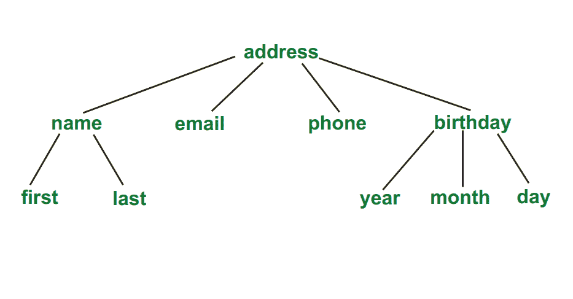
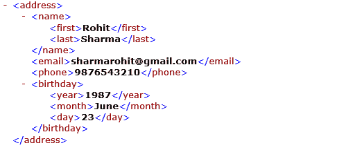

# 文件类型定义–DTD

> 原文:[https://www.geeksforgeeks.org/document-type-definition-dtd/](https://www.geeksforgeeks.org/document-type-definition-dtd/)

A 文档类型定义 (`DTD`) 描述文档的树形结构及其数据的一些情况。它是一组标记声明，实际上为 SGML 家族定义了一种文档类型，像 GML、SGML、HTML、XML。

`DTD` 可以在 XML 文档中声明为内联或外部推荐。`DTD` 决定了一个节点应该出现多少次，以及它们的子节点是如何排序的。

有两种数据类型，`PCDATA` 和 `CDATA`

*   `PCDATA` 是经过解析的字符数据。
*   `CDATA` 是字符数据，通常不会被解析。

**语法:**

```
<!DOCTYPE element DTD identifier
[
   first declaration
   second declaration
   .
   .
   nth declaration
]>
```

**示例:**



上述树的 `DTD` 为:

**带有内部 `DTD` 的 XML 文档:**

## 可扩展标记语言

```
<?xml version="1.0"?>
<!DOCTYPE address [
<!ELEMENT address (name, email, phone, birthday)>
<!ELEMENT name (first, last)>
<!ELEMENT first (#PCDATA)>
<!ELEMENT last (#PCDATA)>
<!ELEMENT email (#PCDATA)>
<!ELEMENT phone (#PCDATA)>
<!ELEMENT birthday (year, month, day)>
<!ELEMENT year (#PCDATA)>
<!ELEMENT month (#PCDATA)>
<!ELEMENT day (#PCDATA)>
]>

<address>
    <name>
        <first>Rohit</first>
        <last>Sharma</last>
    </name>
    <email>sharmarohit@gmail.com</email>
    <phone>9876543210</phone>
    <birthday>
        <year>1987</year>
        <month>June</month>
        <day>23</day>
    </birthday>
</address>
```

**上面的 `DTD` 是这样解释的:**

*   `!DOCTYPE address` 定义了这个文档的根元素是 `address`。
*   `!ELEMENT address` 定义了 `address` 元素必须包含四个元素:“姓名、电子邮件、电话、生日”。
*   `!ELEMENT name` 定义了 `name` 元素必须包含两个元素:“第一个，最后一个”。
    *   `!ELEMENT first` 将 `first` 元素定义为“`#PCDATA`”类型。
    *   `!ELEMENT last` 将 `last` 元素定义为“`#PCDATA`”类型。
*   `!ELEMENT email` 将 `email` 元素定义为“`#PCDATA`”类型。
*   `!ELEMENT phone` 将 `phone` 元素定义为“`#PCDATA`”类型。
*   `!ELEMENT birthday` 定义 `birthday` 元素必须包含三个元素“年、月、日”。
    *   `!ELEMENT year` 将 `year` 元素定义为“`#PCDATA`”类型。
    *   `!ELEMENT month` 将 `month` 元素定义为“`#PCDATA`”类型。
    *   `!ELEMENT day` 将 `day` 元素定义为“`#PCDATA`”类型。

**带有外部 `DTD` 的 XML 文档:**

## 可扩展标记语言

```
<?xml version="1.0"?>
<!DOCTYPE address SYSTEM "address.dtd">
<address>
    <name>
        <first>Rohit</first>
        <last>Sharma</last>
    </name>
    <email>sharmarohit@gmail.com</email>
    <phone>9876543210</phone>
    <birthday>
        <year>1987</year>
        <month>June</month>
        <day>23</day>
    </birthday>
</address>
```

**`address.dtd`:**

**输出:**

