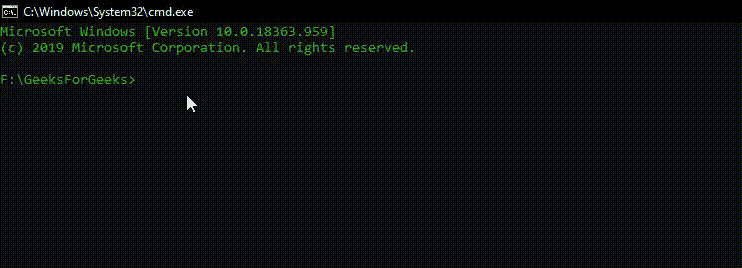

# 电子表格中的环境变量

> 原文: [https://www.geeksforgeeks.org/environment-variables-in-electronjs/](https://www.geeksforgeeks.org/environment-variables-in-electronjs/)

[**ElectronJS**](https://www.geeksforgeeks.org/introduction-to-electronjs/) 是一个开源框架，用于使用能够在 Windows、macOS 和 Linux 操作系统上运行的 HTML、CSS 和 JavaScript 等网络技术构建跨平台的本机桌面应用程序。它将 Chromium 引擎和 [**Node.js**](https://www.geeksforgeeks.org/introduction-to-nodejs/) 结合成一个单一的运行时。

我们已经在 Electron 文档中讨论了 [**命令行参数**](https://www.geeksforgeeks.org/command-line-arguments-in-electronjs/)。命令行参数很重要，因为它们可以用来控制应用程序的行为。我们可以在启动时从应用程序外部将命令行参数传递给 Electron，或者我们可以简单地在应用程序中硬编码这些值。**Electron 中的环境变量**也控制应用程序的配置和行为，而不改变代码。Electron 中的一些特定行为是由环境变量而不是命令行参数控制的，因为它们比命令行标志和应用程序的主函数代码更早初始化。在本教程中，我们将了解 Electron 使用的不同环境变量及其各自的分类。

我们假设您熟悉上述链接中介绍的先决条件。Electron 要工作， [**Node.js**](https://www.geeksforgeeks.org/introduction-to-nodejs/) 和 [**npm**](https://www.geeksforgeeks.org/node-js-npm-node-package-manager/) 需要预装在系统中。

如上所述，如果我们在应用程序中硬编码命令行标志，我们需要导入 `application` 模块的 `commandLine` 属性，但是我们不需要任何额外的代码更改来设置 Electron 中的环境变量。然而，由于 Electron 也支持全局 `process` 对象，我们也可以通过代码设置环境变量。例如:

```html
process.env.GOOGLE_API_KEY = 'YOUR_KEY_HERE'
```

关于 `process` 对象的更多细节，请关注 [**Process 对象中的**](https://www.geeksforgeeks.org/process-object-in-electronjs/) 。Electron 提供两种主要的环境变量:

*   **开发变量**
*   **生产变量**

## 开发环境变量

**开发环境变量**顾名思义，主要用于应用程序中的开发和调试目的。

### ELECTRON_ENABLE_LOGGING

此环境变量设置为 `true` ，将 Chromium 的内部日志打印到应用程序的控制台。

### ELECTRON_LOG_ASAR_READS

当 Electron 从 ASAR 文件读取时，如果该环境变量设置为 `true` ，则将读取的偏移量和文件路径记录到系统 `tmpdir` 。生成的文件可以提供给 ASAR 模块，以优化文件排序，从而提高 Electron 应用程序的性能，并减少系统资源的负载。一个 **ASAR** 档案是一个简单的 tar 状格式，将文件连接成一个单一的文件。Electron 可以从其中读取任意文件，而无需打开整个文件。这个环境变量是在 Electron 的后期版本中引入的。

### ELECTRON_ENABLE_STACK_DUMPING

此环境变量设置为 `true` ，然后在 Electron 应用程序崩溃时将错误堆栈跟踪打印到控制台。如果启动 `crashReporter` ，该环境变量将不起作用。Electron 中的 `crashReporter` 模块负责向远程服务器提交崩溃报告。有关 `crashReporter` 模块的更多详细信息。

### ELECTRON_DEFAULT_ERROR_MODE

此环境变量仅在 *Windows* 操作系统中受支持。该环境变量设置为 `true` ，当 Electron 应用程序崩溃时，显示窗口的操作系统崩溃对话框。就像 `ELECTRON_ENABLE_STACK_DUMPING` 一样，如果 `crashReporter` 启动，这个环境变量将不起作用。

### ELECTRON_OVERRIDE_DIST_PATH

在开发环境中从打包文件运行应用程序时，此环境变量告诉 Electron 使用指定版本的 Electron，而不是由 `npm install` 下载的版本。这个环境变量接受一个字符串文件路径，其中 Electron 的特定版本存储在本地系统上。当我们对原始下载的 Electron 包的源代码进行了自己的更改时，这尤其有用。

## 生产环境变量

**生产环境变量**顾名思义，主要用于打包的 Electron 应用程序的运行时。当将打包的 Electron 应用程序部署到生产环境中的不同服务器时，这些环境变量特别有用。

### NODE_OPTIONS

由于 Electron 将 NodeJS 和 Chromium 合并到了一个单一的运行时中，因此 Electron 包括了对 NodeJS 子集 [**NODE_OPTIONS**](https://nodejs.org/api/cli.html#cli_node_options_options) 环境变量的支持。除了与 Chromium 使用 **BoringSSL** 相冲突的选项之外，Electron 支持所提供的大多数选项。 **BoringSSL** 是 **OpenSSL** 的一个分叉，是为了满足谷歌的需求而设计的。 **OpenSSL** 是一个健壮的、商业级的、功能齐全的工具包，用于 HTTP 中的传输层安全性(TLS)和安全套接字层(SSL)协议。它也是一个通用的密码库。

我们可以为 `NODE_OPTIONS` 环境变量提供多个选项。不支持的选项有:
*   `--use-bundled-ca`
*   `--force-fips`
*   `--enable-fips`
*   `--openssl-config`
*   `--use-openssl-ca`
*   `--max-http-header-size`
*   `--http-parser`

### GOOGLE_API_KEY

许多 Google 服务需要为特定用户的特定项目生成一个 `API_KEY` ，以便从应用程序中访问服务。例如，Electron 中的地理定位支持需要使用谷歌云平台的地理定位网络服务。要启用此功能，我们需要获取一个 Google API 密钥。该密钥通常被硬编码在 Electron 应用程序中，并且由于该 API 密钥包含在每个有效会话的每个 Electron 版本中，所以它经常超过其使用配额。为了防止这种情况，我们需要添加 API 密钥作为环境的一部分。我们可以这样做，在打开任何会发出谷歌服务请求的应用程序窗口或功能之前，将以下代码放在主进程文件中:

```html
process.env.GOOGLE_API_KEY = 'YOUR_KEY_HERE'
```

我们还可以从应用程序外部设置这个环境变量，以便它对每个新的谷歌服务请求会话有效，直到它过期。

### ELECTRON_RUN_AS_NODE

该环境变量设置为 `true` ，启动 Electron 进程作为正常的 `NodeJS` 进程。

### ELECTRON_NO_ASAR

此环境变量设置为 `true` ，禁用 ASAR 对 Electron 应用程序的支持。该变量仅在 `forked` 的子进程和 `spawned` 的子进程中受支持，这些子进程也设置了 `ELECTRON_RUN_AS_NODE` 环境变量。

### ELECTRON_NO_ATTACH_CONSOLE

此环境变量仅在 Windows 操作系统中受支持。该环境变量设置为 `true` ，不将控制台日志附加到当前控制台会话。因此，不会在应用程序中打印日志。

### ELECTRON_FORCE_WINDOW_MENU_BAR

此环境变量仅在 Linux 操作系统中受支持。该环境变量设置为 `true` ，不使用 Electron 应用的 Linux 平台上的全局菜单栏。

### ELECTRON_TRASH

这个环境变量只在 Linux 操作系统中支持。这个环境变量设置了 Linux 平台上的垃圾桶实现。该环境变量的默认值为 `gio` 。它可以保存以下值:
*   `gvfs-trash`
*   `trash-cli`
*   `kioclient5`
*   `kioclient`

## Electron 自身设置的环境变量

除了 **生产** 和 **开发** 环境变量外，还有一些变量是运行时在原生系统环境中由 Electron 自己设置的。

### ORIGINAL_XDG_CURRENT_DESKTOP

该变量被设置为应用程序最初启动时使用的 `XDG_CURRENT_DESKTOP` 的值。Electron 有时会修改 `XDG_CURRENT_DESKTOP` 的值，以影响 Chromium 内的其他逻辑。因此，如果我们想要访问原始值，我们应该查找这个环境变量。`XDG_CURRENT_DESKTOP` 环境变量通知您当前正在使用的桌面环境。此变量因不同的操作系统和不同的平台而异。除了 Electron 之外，其他过程和应用程序也使用这个变量，它是一个系统环境变量。

## 在系统中设置 Electron 环境变量的用法示例

*   **Windows 控制台**:

```html
~$ set ELECTRON_ENABLE_LOGGING=true
```

*   **POSIX Shell**:

```html
~$ export ELECTRON_ENABLE_LOGGING=true
```

**输出:**

[](https://media.geeksforgeeks.org/wp-content/uploads/20200720231803/Output-1-GIF16.gif)

**注意:** 这些环境变量都是重置的，需要我们每次重启电脑时重新设置。如果我们想避免这样做，我们需要将这些环境变量及其各自的值添加到 `.bashrc` 文件中。`.bashrc` 是一个 shell 脚本， `Bash` 无论何时交互启动都会运行。它初始化一个交互式 shell 会话。我们可以将任何可以在命令提示符下键入的命令放入该文件中，它们不会被重置，例如在这种情况下，Electron 的环境变量。