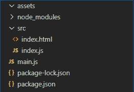

# 在 Electron JS 中生成 PDF

> 原文: [https://www.geeksforgeeks.org/generate-pdf-in-electronjs/](https://www.geeksforgeeks.org/generate-pdf-in-electronjs/)

`ElectronJS` 是一个开源框架，用于使用能够在 Windows、macOS 和 Linux 操作系统上运行的 HTML、CSS 和 JavaScript 等网络技术构建跨平台的本机桌面应用程序。它将 Chromium 引擎和 [Node.js](https://www.geeksforgeeks.org/introduction-to-nodejs/) 结合成一个单一的运行时。

在某些桌面应用程序中，开发人员希望提供一个功能，用户可以下载页面内容并将其保存为 PDF 文件到他们的系统中。例如，在银行应用程序中，用户希望下载显示在屏幕上的他/她的账户对账单，并将其保存为 PDF 文件。Electron 提供了一种方法，通过这种方法，我们可以使用 `BrowserWindow` 对象和 `webContents` 属性来实现这一功能。`webContents` 属性为我们提供了某些实例事件和方法，通过这些事件和方法，我们可以将正在显示的 `BrowserWindow` 的内容转换为 PDF 文件，或者将远程网址的内容保存为 PDF 文件。本教程将演示如何在 Electron 中生成 PDF 文件。

我们假设您熟悉上述链接中介绍的先决条件。Electron 工作需要在系统中预装 [Node.js](https://www.geeksforgeeks.org/introduction-to-nodejs/) 和 [npm](https://www.geeksforgeeks.org/node-js-npm-node-package-manager/)。

## 项目结构



## 示例

我们将按照给定的步骤开始构建基本的 Electron 应用程序。

### 步骤 1

导航到空目录设置项目，运行以下命令：

```bash
npm init
```

生成 `package.json` 文件。安装 [Electron](https://www.geeksforgeeks.org/introduction-to-electronjs/)（如果没有安装），使用 npm。

```bash
npm install electron --save
```

此命令还将创建 `package-lock.json` 文件并安装所需的 `node_modules` 依赖项。根据项目结构创建 `assets` 文件夹。我们将把生成的 PDF 文件保存到此文件夹。

**package.json:**

```json
{
  "name": "electron-pdf",
  "version": "1.0.0",
  "description": "Generate PDF in Electron",
  "main": "main.js",
  "scripts": {
    "start": "electron ."
  },
  "keywords": [
    "electron"
  ],
  "author": "Radhesh Khanna",
  "license": "ISC",
  "dependencies": {
    "electron": "^8.2.5"
  }
}
```

### 步骤 2

根据项目结构创建 `main.js` 文件。此文件是 **Main Process**，充当应用程序的入口点。复制 `main.js` 文件的样板代码，如以下[链接](https://www.electronjs.org/docs/tutorial/first-app#electron-development-in-a-nutshell)所示。我们已经修改了代码以适应我们的项目需求。

**main.js:**

```javascript
const { app, BrowserWindow } = require('electron')

function createWindow () {
  // Create the browser window.
  const win = new BrowserWindow({
    width: 800,
    height: 600,
    webPreferences: {
      nodeIntegration: true,
      //allows remote module
      enableRemoteModule: true
    }
  })

// Load the index.html of the app.
  win.loadFile('src/index.html')

// Open the DevTools.
  win.webContents.openDevTools()
}

// This method will be called when Electron has finished
// initialization and is ready to create browser windows.
// Some APIs can only be used after this event occurs.
// This method is equivalent to 'app.on('ready', function())'
app.whenReady().then(createWindow)

// Quit when all windows are closed.
app.on('window-all-closed', () => {
  // On macOS it is common for applications and their menu bar
  // to stay active until the user quits explicitly with Cmd + Q
  if (process.platform !== 'darwin') {
    app.quit()
  }
})

app.on('activate', () => {
    // On macOS it's common to re-create a window in the
    // app when the dock icon is clicked and there are no
    // other windows open.
  if (BrowserWindow.getAllWindows().length === 0) {
    createWindow()
  }
})

// In this file, you can include the rest of your
// app's specific main process code. You can also
// put them in separate files and require them here.
```

### 步骤 3

在 `src` 目录下创建 `index.html` 文件和 `index.js` 文件。我们还将从上述链接中复制 `index.html` 文件的样板代码。我们已经修改了代码以适应我们的项目需求。

**index.html:**

```html
<!DOCTYPE html>
<html>
  <head>
    <meta charset="UTF-8">
    <title>Hello World!</title>
    <!-- https://electronjs.org/docs/tutorial
                           security#csp-meta-tag -->
    <meta http-equiv="Content-Security-Policy"
          content="script-src 'self' 'unsafe-inline';" />
  </head>
  <body>
    <h1>Hello World!</h1>
    We are using node
    <script>
        document.write(process.versions.node)
    </script>, Chrome
    <script>
        document.write(process.versions.chrome)
    </script>, and Electron
    <script>
        document.write(process.versions.electron)
    </script>.

<!-- Adding Individual Renderer Process JS File -->
    <script src="index.js"></script>
  </body>
</html>
```

### 输出

此时，我们的基本 Electron 应用程序设置完毕。要启动 Electron 应用程序，请运行命令：

```bash
npm start
```


## Electron 生成 PDF

`BrowserWindow` 实例和 `webContents` 属性是 **Main Process** 的一部分。要在 **Renderer Process** 中导入和使用 `BrowserWindow`，我们将使用 Electron `remote` 模块。

### 方法 1

转换当前活动的 `BrowserWindow` 实例的内容，并将其保存为 PDF 文件。

**index.html**: 在该文件中添加以下片段。

```html
<br><br>
   <button id="pdf">
     Convert Current BrowserWindow to PDF
   </button>
```

**index.js**: 在该文件中添加以下代码片段。

```javascript
const electron = require('electron');
const path = require('path');
const fs = require('fs');

// Importing BrowserWindow from Main
const BrowserWindow = electron.remote.BrowserWindow;

var pdf = document.getElementById('pdf');
var filepath1 = path.join(__dirname, '../assets/print1.pdf');

var options = {
    marginsType: 0,
    pageSize: 'A4',
    printBackground: true,
    printSelectionOnly: false,
    landscape: false
}

pdf.addEventListener('click', (event) => {

// let win = BrowserWindow.getAllWindows()[0];
    let win = BrowserWindow.getFocusedWindow();

win.webContents.printToPDF(options).then(data => {
        fs.writeFile(filepath1, data, function (err) {
            if (err) {
                console.log(err);
            } else {
                console.log('PDF Generated Successfully');
            }
        });
    }).catch(error => {
        console.log(error)
    });
});
```

`printToPDF` 方法将 `BrowserWindow` 的内容打印为 PDF。该方法返回一个 `Promise`，并解析到一个包含要写入 PDF 文件的数据的 `Buffer`。它接受以下参数。有关该方法的更多详细信息，请参考此[链接](https://www.electronjs.org/docs/api/web-contents#contentsprinttopdfoptions)。

*   **options**: `Object` - 我们可以传递一个空的 `options` 对象，在这种情况下，它将采用所有各自的默认值。它接受以下参数：
    *   **marginsType**: `Integer` (可选) - 指定要在 PDF 文件中使用的边距类型。它可以保存以下值：
        *   `0` – 默认边距
        *   `1` – 无边距
        *   `2` – 最小边距
    *   **pageSize**: `Object` | `String` (可选) - 指定生成的 PDF 文件的页面大小。数值可以是 `A3`、`A4`、`A5`、`Legal`、`Letter`、`Tabloid`。它还可以容纳一个包含 `height` 属性和 `width` 属性的对象，这些属性在 `microns` 中定义。
    *   **printBackground**: `Boolean` (可选) - 是否在 PDF 文件中包含 CSS 背景（如 `background-color`）。默认值为 `false`。
    *   **printSelectionOnly**: `Boolean` (可选) - 是否仅在 PDF 文件中打印选择或高亮显示。默认值为 `false`。
    *   **landscape**: `Boolean` (可选) - 指定 PDF 文件的模式。对于 `Landscape` 模式，值设置为 `true`。对于 `Portrait` 模式，该值设置为 `false`。默认值为 `false`。
*   **BrowserWindow.getAllWindows()**: 此方法返回一个活动/打开的 `BrowserWindow` 实例的数组。在这个应用程序中，我们只有一个活动的 `BrowserWindow` 实例，它可以直接从数组中引用，如代码所示。
*   **BrowserWindow.getFocusedWindow()**: 此方法返回在应用程序中聚焦的 `BrowserWindow` 实例。如果没有找到当前的 `BrowserWindow` 实例，则返回 `null`。在这个应用程序中，我们只有一个活动的 `BrowserWindow` 实例，可以使用这个方法直接引用它，如代码所示。

### 方法 2

转换远程 URL 的内容，保存为 PDF 文件。

**index.html**: 在该文件中添加以下片段。

```html
<br><br>
    <button id="convert">Convert Google.com to PDF</button>
```

**index.js**: 在该文件中添加以下代码片段。

```javascript
const electron = require('electron');
const path = require('path');
const fs = require('fs');
// Importing BrowserWindow from Main
const BrowserWindow = electron.remote.BrowserWindow;

var convert = document.getElementById('convert');
var filepath2 = path.join(__dirname, '../assets/print2.pdf');

var options2 = {
    marginsType: 1,
    pageSize: 'A4',
    printBackground: true,
    printSelectionOnly: false,
    landscape: false
}

convert.addEventListener('click', (event) => {
    let win = new BrowserWindow({
        show: false,
        webPreferences: {
          nodeIntegration: true
        }
      });

win.loadURL('https://www.google.com/');
```

```javascript
win.webContents.on('did-finish-load', () => {
    win.webContents.printToPDF(options2).then(data => {
        fs.writeFile(filepath2, data, function (err) {
            if (err) {
                console.log(err);
            } else {
                console.log('PDF Generated Successfully');
            }
        });
    }).catch(error => {
        console.log(error)
    });
});
```

在这种情况下，我们已经创建了一个新的浏览器窗口实例，并将`显示`属性设置为`假`。因此，新创建的窗口将永远不会显示。我们使用`win.loadURL(路径)`方法在`浏览器窗口`中加载外部网址的内容。`url`路径可以是`http://`协议指定的远程地址，也可以是使用`文件://`协议指定的本地系统中文件的路径。该方法返回一个`承诺`，当页面加载完毕，并且`网页内容`属性的`完成加载`事件被发出时，该承诺被解决。更多详细信息，请参考[链接](https://www.electronjs.org/docs/api/browser-window#winloadurlurl-options)。

完成加载实例事件属于`网络内容`属性。当导航完成并且页面完全加载时，它就会发出。当页面的微调器停止旋转，并且`onload`事件已经调度时，就会发生这种情况。如果不使用该事件发射器，调用`webcontents . printopdf()`方法，生成的PDF将是一个空白文档，因为内容没有在`浏览器窗口`中加载完毕。因此`承诺`中返回的数据为空。更多详细信息，请参考[链接](https://www.electronjs.org/docs/api/web-contents#event-did-finish-load)。

**输出:**

[https://media.geeksforgeeks.org/wp-content/uploads/20200514003719/Output-26.mp4](https://media.geeksforgeeks.org/wp-content/uploads/20200514003719/Output-26.mp4)