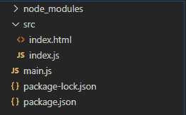
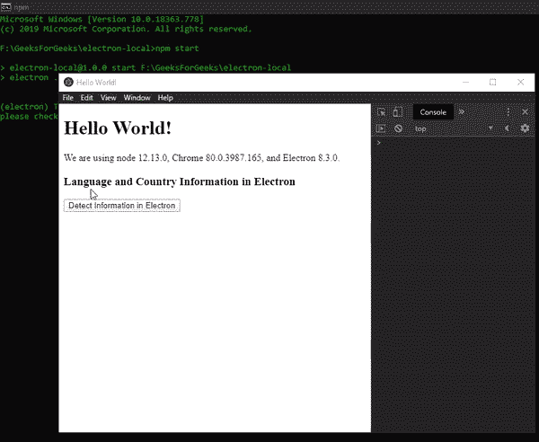

# 电子地图中的地理信息

> 原文: [https://www.geeksforgeeks.org/geo-information-in-electronjs/](https://www.geeksforgeeks.org/geo-information-in-electronjs/)

[`electronijs`](https://www.geeksforgeeks.org/introduction-to-electronjs/) 是一个开源框架，用于使用能够在 Windows、macOS 和 Linux 操作系统上运行的 HTML、CSS 和 JavaScript 等网络技术构建跨平台的本机桌面应用程序。它将 Chromium 引擎和 [`Node.js`](https://www.geeksforgeeks.org/introduction-to-nodejs/) 结合成一个单一的运行时。

Electron 为我们提供了一种方法，通过该方法，我们可以使用内置的 `app` 模块的实例方法来获取本地系统的国家代码和语言代码。Electron 获取的国家代码遵循某些国际标准组织标准。因此，我们可以进一步使用这些代码，使用第三方 REST APIs 获取更多关于国家和用户语言的信息，并以人类可读的格式呈现给用户。该特性对于检测语言、添加 `i18n` 国际化以及获取特定于国家的信息（如 `货币`）非常有用。本教程将演示如何获取 Electron 的国家和语言信息。

我们假设您熟悉上述链接中介绍的先决条件。Electron 要工作，[`Node.js`](https://www.geeksforgeeks.org/introduction-to-nodejs/) 和 [`npm`](https://www.geeksforgeeks.org/node-js-npm-node-package-manager/) 需要预装在系统中。

## 项目结构



## 电子地理信息

`app` 模块是主流程的一部分。要导入和使用渲染器流程中的 `app` 模块，我们将使用 Electron `remote` 模块。有关远程模块的更多详细信息。

## 示例

按照给出的步骤在 Electron 中获取国家和语言信息。

### 第一步

按照[动态样式](https://www.geeksforgeeks.org/dynamic-styling-in-electronjs/)中给出的步骤进行设置中的基本 Electron 应用。复制文章中提供的 `main.js` 文件和 `index.html` 文件的样板代码。我们将继续使用相同的代码库构建我们的应用程序。另外，使用 `npm` 安装 `axios` 包。这个包是一个基于 Promise 的 HTTP 客户端。它用于对 REST APIs 进行 HTTP 调用。我们将使用这个包为用户获取地理信息。有关 `axios` 的更多信息。

```bash
npm install axios --save
```

还要对 `package.json` 文件进行必要的更改，以启动 Electron 应用程序。

```json
{
  "name": "electron-local",
  "version": "1.0.0",
  "description": "Locales in Electron",
  "main": "main.js",
  "scripts": {
    "start": "electron ."
  },
  "keywords": [
    "electron"
  ],
  "author": "Radhesh Khanna",
  "license": "ISC",
  "dependencies": {
    "axios": "^0.19.2",
    "electron": "^8.3.0"
  }
}
```

**输出:** 此时，我们的基本 Electron 应用程序设置完毕。启动应用程序后，我们应该会看到以下结果。

[](https://media.geeksforgeeks.org/wp-content/uploads/20200512225834/Output-1105.png)

### 步骤 2

在 `index.html` 和 `index.js` 文件中添加以下代码片段，用于获取 Electron 中的语言和国家信息。

**index.html:** 在该文件中添加以下代码片段。“检测电子信息”按钮还没有任何相关功能。要更改这一点，请在 `index.js` 文件中添加以下代码片段。

```html
<h3>
  Language and Country Information in Electron
</h3>
  <button id="detect">
    Detect Information in Electron
  </button>
```

**index.js:** 在该文件中添加以下代码片段。

```javascript
const electron = require("electron");
const axios = require("axios");

// Importing app Module using Electron remote
const app = electron.remote.app;

var detect = document.getElementById("detect");
detect.addEventListener("click", () => {
    var locale = app.getLocale();
    var country = app.getLocaleCountryCode();

    console.log("Locale Detected - ", locale);
    console.log("Country Detected - ", country);

    // Making an HTTP GET REST API call
    axios.get("https://restcountries.eu/rest/v2/alpha/"
              + country).then((res) => {
        console.log(res);
        console.log("Country - ", res.data.name);
    });
});
```

下面给出了代码中使用的 `app` 模块的所有实例方法的详细说明。有关 `app` 模块的更多详细信息。

*   **`app.getLocale()`** 此方法用于返回当前应用的 Locale（语言代码）。它使用 Chromium 的 `l10n_util` 库从本地系统获取区域设置。对于此方法返回的所有可能值。该方法不接受任何参数，并返回带有当前检测到的区域设置的 `string` 值。在窗口上，该方法只能在 `app` 模块的 `ready` 事件发出后使用。所有操作系统环境都支持这种方法。

    **注意:** 我们也可以使用 Electron 中的命令行开关来设置自定义区域设置。我们可以在应用程序启动时简单地传递命令行开关，方法是使用 `app` 模块的 [`commandLine`](https://www.electronjs.org/docs/api/command-line) 属性，或者在启动 Electron 应用程序时更改 `package.json` 的 `start` 脚本。我们可以使用 `--lang` 命令行开关来设置自定义区域设置。

    **package.json:** 在该文件中进行以下更改。

    ```json
    "scripts": {
      "start": "electron --lang=hi . "
    },
    ```

    如果我们现在使用 `app.getLocale()` 方法，它将返回自定义区域设置的值。有关该方法的更多详细信息。

*   **`app.getLocaleCountryCode()`** 此方法用于返回用户操作系统的区域设置双字母 `ISO 3166` 国家代码。该值是从本机操作系统应用程序接口获取的。该方法返回带有检测到的国家代码的 `string` 值。当此方法无法使用本机操作系统应用编程接口检测到国家代码时，它将返回一个空的 `string`。此方法不接受任何参数。有关该方法的更多详细信息。在我们的代码中，我们使用了这个国家代码值来使用第三方 REST APIs 获取地理信息。所有操作系统环境都支持这种方法。

**输出:**

[](https://media.geeksforgeeks.org/wp-content/uploads/20200606205510/Output-1-GIF3.gif)