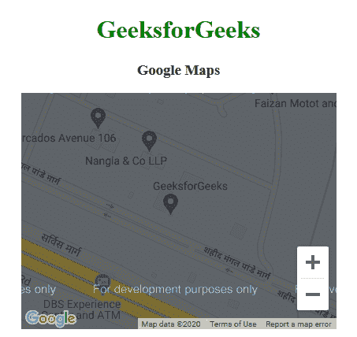

# 谷歌地图简介

> 原文：[https://www.geeksforgeeks.org/google-maps-introduction/](https://www.geeksforgeeks.org/google-maps-introduction/)

谷歌地图是一项由谷歌免费提供的网络地图服务。这项服务提供各种类型的地理信息。借助谷歌地图，可以搜索地点和方向。此外，我们可以获得特定区域的交通信息或查看城市的街道级图像。

谷歌地图有一个 JavaScript 应用编程接口。该应用编程接口用于定制显示信息的地图。

## 示例

```html
<!DOCTYPE html>
<html>

<head>
    <title>
        Google Maps | Introduction
    </title>

    <!-- Add Google map API source -->
    <script src="https://maps.googleapis.com/maps/api/js"></script>

    <script>
        function GFG() {
            var CustomOp = {
                center: new google.maps.LatLng(28.502212, 77.405603),
                zoom: 17,
                mapTypeId: google.maps.MapTypeId.ROADMAP
            };

            // Map object
            var map = new google.maps.Map(
                document.getElementById("DivID"),
                CustomOp
            );
        }
    </script>
</head>

<!-- Function that execute when page load -->
<body onload="GFG()">
    <center>
        <h1 style="color:green">
            GeeksforGeeks
        </h1>

        <h3>Google Maps</h3>

        <!-- Basic Container -->
        <div id="DivID" style="width:400px; height:300px;"></div>
    </center>
</body>

</html>
```

## 输出



## 解释

在上面的例子中，我们将使用 Google API 来加载谷歌地图。

```html
<script src="https://maps.googleapis.com/maps/api/js"></script>
```

### 获取 API 密钥所需的步骤如下

*   **前往下述链接**
    [https://console.developers.google.com/flows/enableapi?apiid=maps_backend,geocoding_backend,directions_backend,distance_matrix_backend,elevation_backend,places_backend&reusekey=true](https://console.developers.google.com/flows/enableapi?apiid=maps_backend,geocoding_backend,directions_backend,distance_matrix_backend,elevation_backend,places_backend&reusekey=true)
    *   创建新项目或从现有项目中进行选择。
    *   单击继续启用应用编程接口。
    *   在“凭据”页面上，获取一个应用编程接口密钥（并设置应用编程接口密钥限制）。
    *   用您自己的 API 密钥替换 URL 中的密钥参数值。
*   要自定义地图：

```javascript
var CustomOp = {
    center: new google.maps.LatLng(28.502212, 77.405603),
    zoom: 17,
    mapTypeId: google.maps.MapTypeId.ROADMAP
};
```

在这种情况下，`CustomOp` 是一个包含 3 个选项的对象：`center`、`zoom` 和 `mapTypeId`。

*   `center`：该属性用于设置地图中的特定点。
*   `zoom`：此属性用于指定特定点上的缩放级别。
*   `mapTypeId`：该属性用于指定地图的类型（路线图、卫星、混合、地形）。

要创建地图对象，我们将使用以下代码：

```javascript
var map = new google.maps.Map(document.getElementById("DivID"), CustomOp);
```