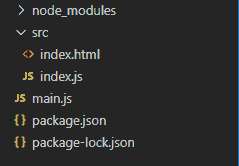
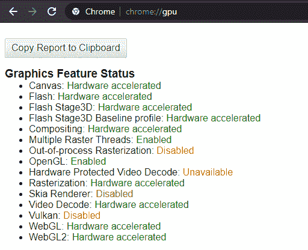
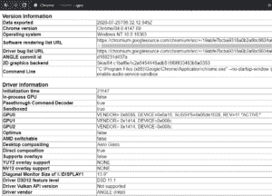
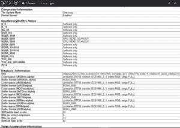
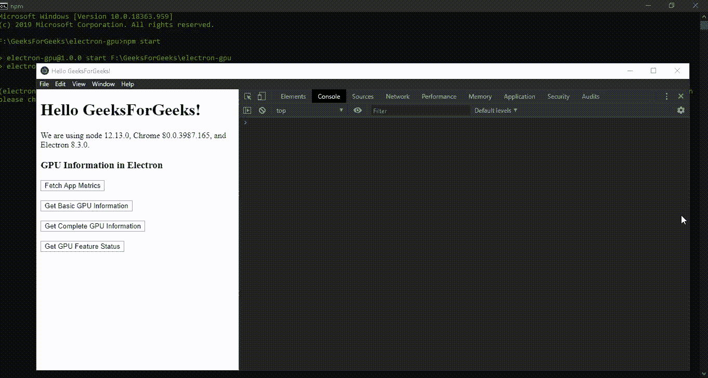

# 电子中的GPU信息

> 原文: [https://www.geeksforgeeks.org/gpu-information-in-electronjs/](https://www.geeksforgeeks.org/gpu-information-in-electronjs/)

[`electronijs`](https://www.geeksforgeeks.org/introduction-to-electronjs/) 是一个开源框架，用于使用能够在 Windows、macOS 和 Linux 操作系统上运行的 HTML、CSS 和 JavaScript 等网络技术构建跨平台的本机桌面应用程序。它将 Chromium 引擎和 [`Node.js`](https://www.geeksforgeeks.org/introduction-to-nodejs/) 结合成一个单一的运行时。

`GPU`（图形处理单元）是一种专用的可编程处理器，用于在计算机屏幕上渲染所有图形内容，如图像。它旨在快速操作和更改内存，以加速在帧缓冲区中创建图像，用于在显示设备上输出。所有现代计算机系统都带有内置的图形处理器组件，即它们可以是主板电路的一部分，也可以是从外部连接到主板的另一个组件。`Chromium` 在显示 GPU 加速内容时广泛使用该 GPU 组件。Chromium 使用图形处理器来加速网页渲染、HTML、CSS 和浏览器中的其他图形元素。最新版本的 Chromium 也使用图形处理器组件进行视频渲染和处理。图形处理器比中央处理器消耗更少的功率，这降低了功耗，并产生更少的热量。GPU 还通过资源共享帮助平衡中央处理器的负载，因此，允许中央处理器执行更快的任务并承担更重的计算任务。Chromium 浏览器有一个专用的 GPU 选项卡，用于监控和显示系统中所有与 GPU 相关的信息。可以访问浏览器中的 [`chrome://gpu/`](chrome://gpu/) 页面。Electron 也可以通过使用 `app` 模块的实例事件和方法来访问和使用该应用程序的图形处理器相关信息。本教程将演示如何获取、显示和控制 Electron 图形处理器相关的信息。

我们假设您熟悉上述链接中介绍的先决条件。Electron 要工作，[`Node.js`](https://www.geeksforgeeks.org/introduction-to-nodejs/) 和 [`npm`](https://www.geeksforgeeks.org/node-js-npm-node-package-manager/) 需要预装在系统中。

## 项目结构



## 示例

按照 [**在 Electron 中打印**](https://www.geeksforgeeks.org/printing-in-electronjs/) 中的步骤，以设置基本的 Electron 应用程序。复制文章中提供的 `main.js` 文件和 `index.html` 文件的样板代码。此外，对 `package.json` 进行必要的更改，以启动 Electron 应用程序。我们将继续使用相同的代码库构建我们的应用程序。设置电子应用程序所需的基本步骤保持不变。

### package.json

```json
{
  "name": "electron-gpu",
  "version": "1.0.0",
  "description": "GPU Information in Electron",
  "main": "main.js",
  "scripts": {
    "start": "electron ."
  },
  "keywords": [
    "electron"
  ],
  "author": "Radhesh Khanna",
  "license": "ISC",
  "dependencies": {
    "electron": "^8.3.0"
  }
}
```

### 输出

[](https://media.geeksforgeeks.org/wp-content/uploads/20200512225834/Output-1105.png)

## 电子中的 GPU 信息

`app` 模块用于控制应用的事件生命周期。该模块是 `main` 进程的一部分。要在 `renderer` 进程中导入和使用 `app` 模块，我们将使用 Electron `remote` 模块。

### index.html

在该文件中添加以下片段。

```html
<h3>GPU Information in Electron</h3>
  <button id="metrics">
    Fetch App Metrics
  </button>
  <br><br>
  <button id="basic">
    Get Basic GPU Information
  </button>
  <br><br>
  <button id="complete">
    Get Complete GPU Information
  </button>
  <br><br>
  <button id="features">
    Get GPU Feature Status
  </button>
```

### index.js

在 `index.html` 中创建的所有按钮将用于显示与图形处理器和应用程序相关的不同信息。这些按钮还没有任何相关的功能。要进行更改，请在 `index.js` 文件中添加以下代码。

```javascript
const electron = require('electron')
// Importing the app module using Electron remote
const app = electron.remote.app;

app.on('gpu-info-update', () => {
    console.log('GPU Information has been Updated');
});

app.on('gpu-process-crashed', (event, killed) => {
    console.log('GPU Process has crashed');
    console.log(event);
    console.log('Whether GPU Process was killed - ', killed);
});

var metrics = document.getElementById('metrics');
metrics.addEventListener('click', () => {
    console.dir(app.getAppMetrics());
});

var basic = document.getElementById('basic');
basic.addEventListener('click', () => {
    app.getGPUInfo('basic').then(basicObj => {
        console.dir(basicObj);
    });
});

var complete = document.getElementById('complete');
complete.addEventListener('click', () => {
    app.getGPUInfo('complete').then(completeObj => {
        console.dir(completeObj);
    });
});

var features = document.getElementById('features');
features.addEventListener('click', () => {
    console.dir(app.getGPUFeatureStatus());
});
```

## app.getAppMetrics()

`app` 模块的 `app.getAppMetrics()` 实例方法用于返回一组 `ProcessMetric` 对象，这些对象对应于与应用程序相关联的所有进程的内存和 CPU 使用统计数据。`ProcessMetric` 对象由以下参数组成。

### pid: Integer

进程的 `PID`（进程标识）。应用程序中运行的每个进程都由数组中单独的 `ProcessMetric` 对象表示。该参数很重要，因为 [`web-frame`](https://www.electronjs.org/docs/api/web-frame) 模块的几个实例方法使用 `PID` 作为输入参数。此参数对于调试和检查与应用程序相关联的本机系统操作系统中各种正在进行的进程的系统指标也很重要。

### type: String

此参数表示应用程序中运行的进程的类型。此参数可以包含以下任何一个值：
- `browser`
- `tab`
- `utility`
- `zygote`
- `sandbox-helper`
- `GPU`
- `pepper-plugin`
- `pepper-plugin-broker`
- `unknown`

### cpu: Object

该参数返回一个 `cpuUsage` 对象，代表进程的 CPU 使用情况。该对象也可以从全局 `process` 对象的 `process.getCPUUsage()` 实例方法中获得，并且行为完全相同。有关 `cpuUsage` 对象及其行为的更多详细信息，请参考文章: [**Electron 中的 Process 对象**](https://www.geeksforgeeks.org/process-object-in-electronjs/)。

### creationTime: Integer

该参数代表进程的创建时间。时间表示为自纪元以来的毫秒数。该参数也可以从全局 `process` 对象的 `process.getCreationTime()` 实例方法中获得，并且行为完全相同。有关 `creationTime` 参数及其行为的更多详细信息，请参考文章: [**Electron 中的 Process 对象**](https://www.geeksforgeeks.org/process-object-in-electronjs/)。

> **注意:** 由于 `PID` 可以在进程死亡后被操作系统再次重用，因此同时使用 `pid` 参数和 `creationTime` 参数来唯一识别和区分一个进程是很有用的。

### memory: Object

该参数返回一个 `memoryInfo` 对象，代表进程的内存信息。该对象由进程在实际物理 `memory` 上使用的内存的详细信息组成。它由以下参数组成。
- **workingSetSize: Integer** 该参数表示进程当前固定到实际物理 `memory` 的内存量。
- **peakWorkingSetSize: Integer** 该参数表示进程固定到实际物理 `memory` 的最大内存量。
- **privateBytes: Integer (Optional)** 此参数仅在 *Windows* 操作系统中支持。此参数表示不被其他进程共享的内存量，如 [**V8 引擎内存堆**](https://www.geeksforgeeks.org/create-a-v8-heap-snapshot-in-electronjs/) 或 HTML 内容。

### sandbox: Boolean (Optional)

此参数仅在 Windows 和 macOS 中受支持。此参数表示进程是否在操作系统级别上被 `sandboxed`。

### integrityLevel: String (Optional)

此参数仅在 Windows OS 中受支持。此参数可以包含以下任何一个值：
- `untrusted`
- `low`
- `medium`
- `high`
- `unknown`

## app.getGPUFeatureStatus()

`app` 模块的 `app.getGPUFeatureStatus()` 实例方法返回一个 `GPUFeatureStatus` 对象。该对象表示 Chrome 浏览器中 `chrome://gpu` 页面中 GPU 的 `graphics feature status`。

[](https://media.geeksforgeeks.org/wp-content/uploads/20200725103643/Output-1110.png)

> **注意:** `GPUFeatureStatus` 对象由与上图所示完全相同的参数组成。为 `graphics feature status` 对象的参数显示的值是缩写格式，可能与图像中显示的不同。这些参数可以用它们各自的颜色代码保存以下任何一个值：
> - **disabled_software: Yellow** 仅限软件。硬件加速被禁用。
> - **disabled_off: Red**
> - **disabled_off_normal: Yellow**
> - **unavailable_software: Yellow** 仅软件，硬件加速不可用。
> - **unavailable_off: Red**
> - **unavailable_off_normal: Yellow**
> - **enabled_readback: Yellow** 硬件加速但性能降低。
> - **enabled_force: Green** 所有页面硬件加速。
> - **enabled: Green** 硬件加速。
> - **enabled_on: Green**
> - **enabled_force_on: Green** 强制启用。

## app.disableHardwareAcceleration()

`app` 模块的 `app.disableHardwareAcceleration()` 实例方法禁用整个应用程序的硬件加速。此实例方法只能在 `app` 模块的 `ready` 事件发出之前使用。因此，这个方法需要在 `main.js` 文件（Main Process）中调用。

```javascript
const { app, BrowserWindow } = require('electron')
app.disableHardwareAcceleration();
```

## app.disableDomainBlockingFor3DAPIs()

在 Electron 应用程序中，如果 `GPU` 进程崩溃过于频繁，Chromium 会禁用 3D 应用程序接口（例如 WebGL），直到按域重新启动应用程序。这是 Chromium 的默认行为。可能有多种原因导致 GPU 进程频繁崩溃，包括系统硬件问题或系统资源的过度使用。`app` 模块的 `app.disableDomainBlockingFor3DAPIs()` 实例方法禁用 Chromium 的这个默认行为。该实例方法只能在 `app` 模块的 `ready` 事件发出之前使用。因此，这个方法需要在 `main.js` 文件（Main Process）中调用。

## java 描述语言

```htmlhtml
const { app, BrowserWindow } = require('electron')
app.disableHardwareAcceleration();
app.disableDomainBlockingFor3DAPIs();
```

`app.getGPUInfo(info)` 实例方法从与电子应用程序相关的 Chromium 获取并返回 GPU 信息。该实例方法返回一个承诺，并根据提供的 `info` 字符串参数解析为一个包含相关信息的对象。为了更好地理解，请参考输出。`info` 参数可以保存以下任何一个值:

*   `complete`: 返回的承诺通过一个对象实现，该对象包含官方 Chromium 的 [GPUInfo](https://chromium.googlesource.com/chromium/src/+/4178e190e9da409b055e5dff469911ec6f6b716f/gpu/config/gpu_info.cc) 对象文档中提到的所有 GPU 信息。这包括铬浏览器的 `chrome://gpu` 页面上显示的版本和驱动程序信息。当 `info` 为 `complete` 时，实例方法的执行时间比 `info` 为 `basic` 要长得多。请参考输出以获得更好的理解。



图形处理器驱动程序和版本信息–1



图形处理器驱动程序和版本信息–2

*   `basic`: 返回的承诺通过一个对象实现，该对象仅包含比请求 `complete` 时返回的对象更少且更重要的参数。如果只需要 `vendorId` 参数或 `driverId` 参数等基本信息，则应使用该值。返回的样本参数显示如下:

```htmlhtml
{ auxAttributes:
   { amdSwitchable: true,
     canSupportThreadedTextureMailbox: false,
     directComposition: false,
     directRendering: true,
     glResetNotificationStrategy: 0,
     inProcessGpu: true,
     initializationTime: 0,
     jpegDecodeAcceleratorSupported: false,
     optimus: false,
     passthroughCmdDecoder: false,
     sandboxed: false,
     softwareRendering: false,
     supportsOverlays: false,
     videoDecodeAcceleratorFlags: 0 },
gpuDevice:
   [ { active: true, deviceId: 26657, vendorId: 4098 },
     { active: false, deviceId: 3366, vendorId: 32902 } ],
machineModelName: 'MacBookPro',
machineModelVersion: '11.5' }
```

`app` 模块发出以下与 GPU 相关的实例事件。

*   `gpu-info-update` 事件: 每当应用程序中不同进程的任何 GPU 相关信息发生变化时，都会发出此实例事件。根据应用程序中活动进程的使用、功能和数量，可以多次发出此实例事件。
*   `gpu-process-crashed` 事件: 每当 gpu 进程崩溃或被本机操作系统杀死时，都会发出此实例事件。如果不处理，这可能会导致应用程序挂起，因此我们可以使用这个实例事件来采取必要的操作，并使应用程序干净地退出。此事件返回以下参数。
    *   `event` 全局事件对象。
    *   `killed` 布尔型，该参数表示进程是否被杀。

此时，一旦启动电子应用程序，我们应该能够在 `console` 输出中获取并显示所有与 GPU 相关的信息。

**输出:**

[](https://media.geeksforgeeks.org/wp-content/uploads/20200725123950/Output-4-GIF.gif)

**注意** – 我们已经使用了 `console.dir()` JavaScript 方法在 Chrome DevTools 的 console 窗口中输出并显示了一个对象。要显示对象，此方法优于 `console.log()` 方法。

更多详细信息。参考文章: [console.dir 和 console.log 的区别](https://www.geeksforgeeks.org/difference-between-console-dir-and-console-log-2/) 。