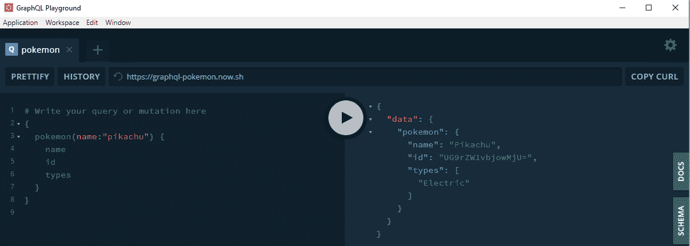
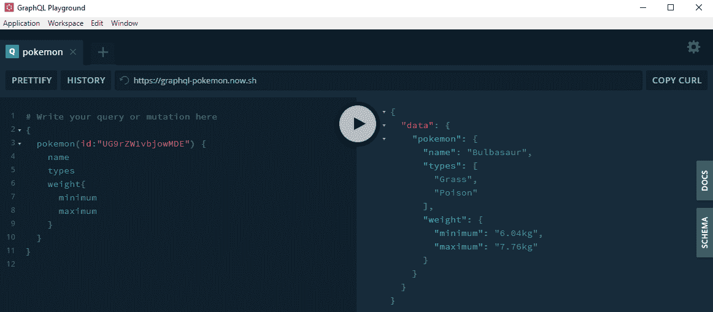
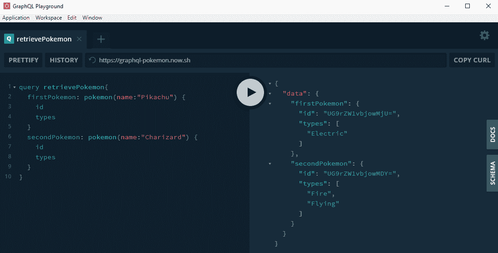
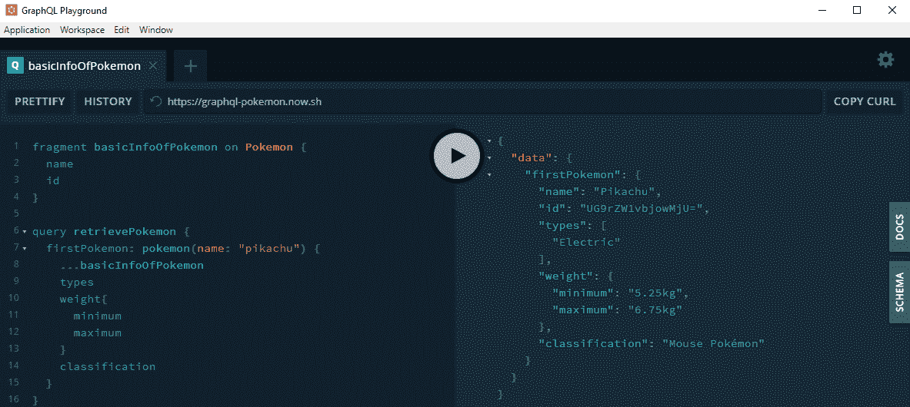
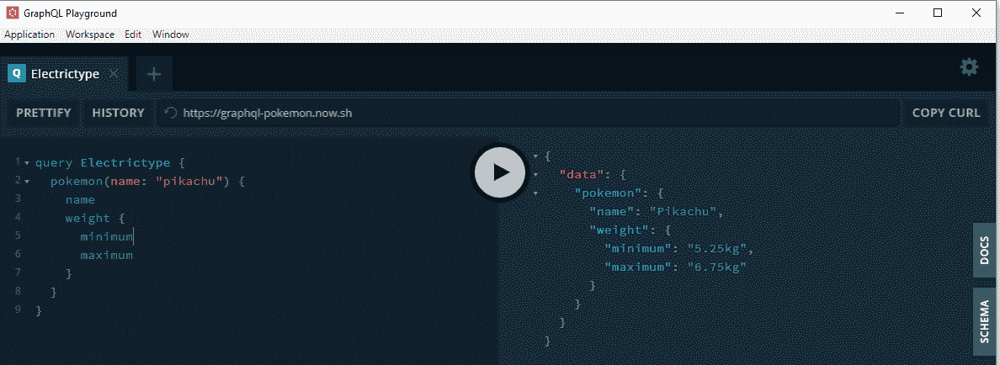
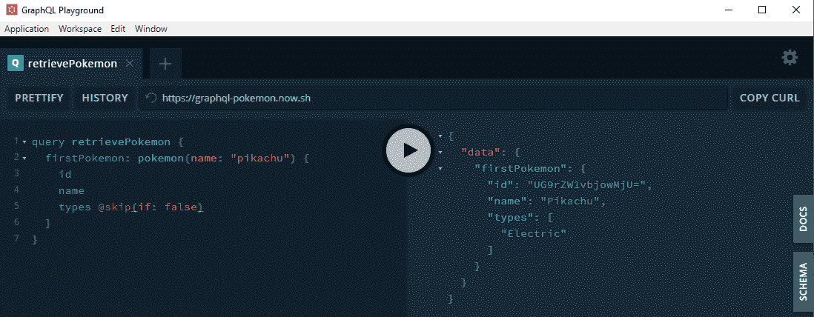
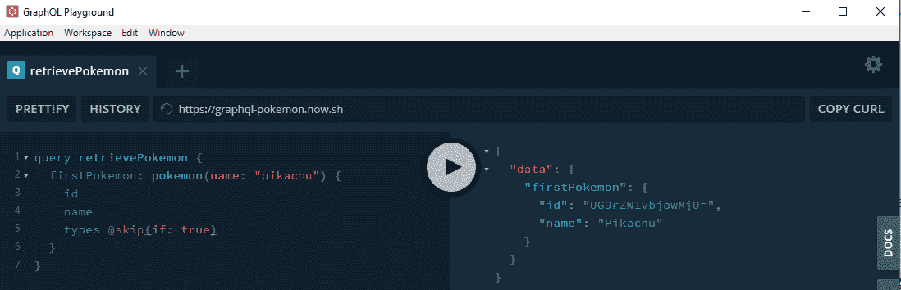
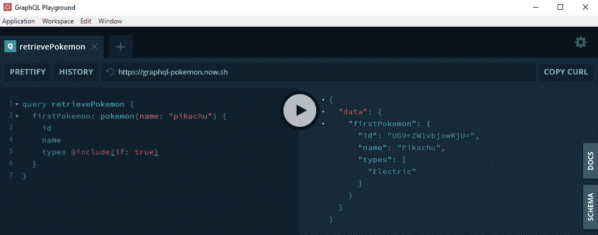
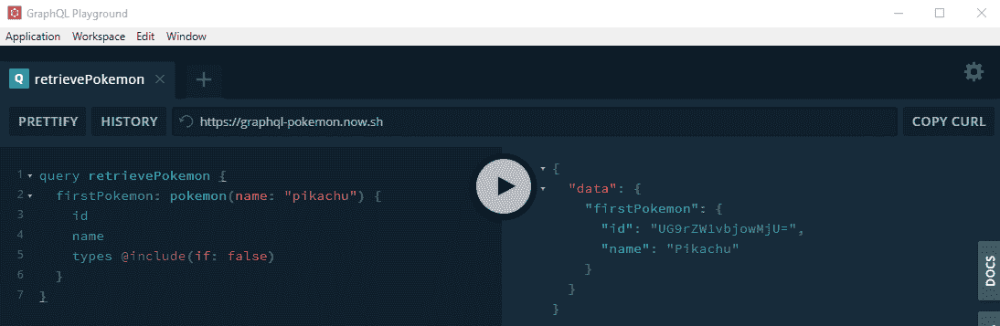

# GraphQL 查询

> 原文: [https://www.geeksforgeeks.org/graphql-query/](https://www.geeksforgeeks.org/graphql-query/)

我们将使用 GraphQL API 进行演示。GraphQL 是一种用于 API 的开源数据查询和操作语言，也是用现有数据实现查询的运行时。它既不是架构模式，也不是 web 服务。GraphQL 由脸书在 2012 年内部开发，2015 年公开发布。

## 术语

我们先来定义基本术语。作为参考，考虑以下示例操作。

## GraphQL 操作

作为一个基本定义，任何命中服务器的东西都称为‘查询’。但是形式上，`操作`、`查询`只是其中一种，另外两种是`突变`、`订阅`。字符串是用 GraphQL 语言编写的，它定义了一个或多个操作和片段。我们将在本文中使用口袋妖怪模式的现成例子，您也可以创建自己的模式。

## GraphQL 查询

GraphQL 查询用于**读取或获取**值。它被交给 GraphQL 服务器执行，并返回一个结果。

### 字段

将作为查询响应的一部分返回的数据单元被称为字段，即使它们是嵌套的。查询结构和查询结构的结果将与下图所示相同。

查询:

```html
{
  pokemon(name:"pikachu") {
    name
    id
    types
  }
}
```

输出:


### 参数

参数帮助在服务器端以特定方式`解析`查询。它是与字段一起提供的`键:值`对。它可以是字面量，也可以是变量。在字段示例中，我们已经通过提供特定名称在 `pokemon` 上使用了参数。

查询:

```html
{
  pokemon(id:"UG9rZW1vbjowMDE") {
    name
    types
  }
}
```

输出:


### 别名

如果需要对同一字段进行两次独立的查询，我们可以使用‘别名’来区分这两个查询。这些别名像前缀一样添加到查询中。例如，如果我们想检索两个宝可梦并分别命名为`firstPokemon`和`secondPokemon`。

查询:

```html
query retrievePokemon{
  firstPokemon: pokemon(name:"Pikachu") {
    id
    types
  }
  secondPokemon: pokemon(name:"Charizard") {
    id
    types
  }
}
```

输出:


### 片段

GraphQL 提供了创建查询字段子类型的能力，该子类型可以使用附加的标识符重复使用。它被称为`片段`，并以`...片段名`的形式提供。用于获取多个对象，每个对象可能具有不同的字段。

语法:

```html
fragment basicInfoOfPokemon on Pokemon {
  name
  id
}

query retrievePokemon {
  firstPokemon: pokemon(name: "pikachu") {
    ...basicInfoOfPokemon
    types
    weight{
      minimum
      maximum
    }
    classification
  }
}
```

输出:


### 操作名称

到目前为止，我们一直在使用简写语法，我们也可以省略 `query` 关键字和名称。在这个例子中，我们添加了 `query` 关键字作为操作类型，以及 `Electrictype` 作为操作名称。

语法:

```html
query Electrictype {
  pokemon(name: "pikachu") {
    name
    weight {
      minimum
      maximum
    }
  }
}
```

输出:


### 指令

‘指令’会影响返回的结果。常见的是`skip`和`include`，它们与`if`条件结合使用。

**@skip:**
如果你想在特定的`if`条件下`skip`特定的字段，你可以使用它。

语法:

```html
fieldName @skip (if: booleanCondition) {
  name
}
# The @skip acts like a default inclusion of 
# The field, unless the 'if' is valid.
```

输出:



**@include:**
如果要在特定的`if`条件下`包含`特定的字段，可以使用它。

语法:

```html
fieldName @include (if: booleanCondition) {
  name
}
# The @include acts like a default exclusion of 
# The field, unless the 'if' is valid.
```

输出:

