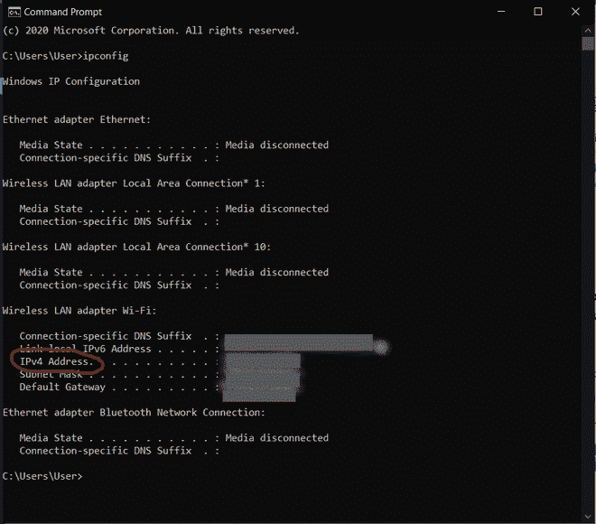

# 如何在移动浏览器上访问 Localhost？

> 原文：[https://www.geeksforgeeks.org/how-to-access-localhost-on-mobile-browsers/](https://www.geeksforgeeks.org/how-to-access-localhost-on-mobile-browsers/)

如果你正在做一些项目、网站或网络应用程序，并想在手机上查看效果，那么请完整阅读这篇文章，这将对你的开发有很大帮助。如果你想在移动浏览器中运行你的应用程序而没有太多麻烦，请阅读到最后。

是的，当然，你可以使用 Chrome 的 Inspect 工具。你可以在 Chrome 浏览器上点击右键，然后选择“设备切换工具栏”。为了更好地了解 Chrome 开发工具，可以从这里学习：[Chrome 检查元素工具 & 快捷方式](https://www.geeksforgeeks.org/chrome-inspect-element-tool-shortcut/)。

在这篇文章中，我们将学习如何在移动设备上查看您的应用程序，这非常简单且有帮助。

## 第 1 步：在本地机器上启动应用程序

在开始之前，您必须通过机器中的 `localhost` 在浏览器中启动应用程序。完成这些操作后，查看网址，记下端口号（显示在本地主机名后面的数字）。

## 第 2 步：找到你本地的 IPv4 地址

打开你的终端或命令提示符，输入 `ipconfig`，按回车键即可。你会看到这样的：

只要看看你的 IPv4 地址，把它记下来。

## 第 3 步：在其他设备上查看你的应用

一旦你有了你的端口号和 IPv4 地址，只需在你的手机或设备浏览器中输入 `IPv4地址:端口号`。例如 `555.55.55.555:1234`。

格式完全相同。一旦你在浏览器中运行，你会看到你的应用程序。