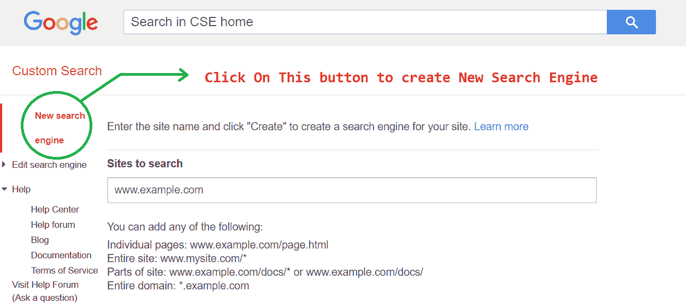
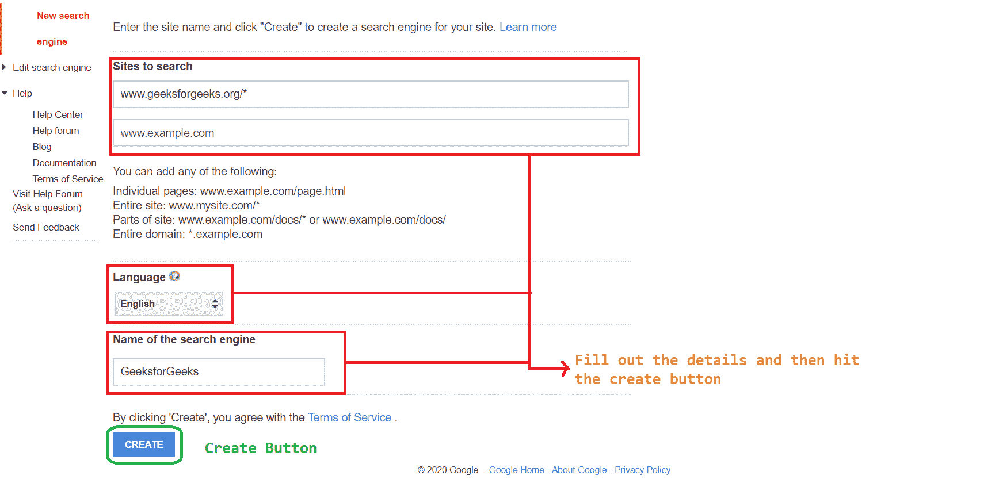
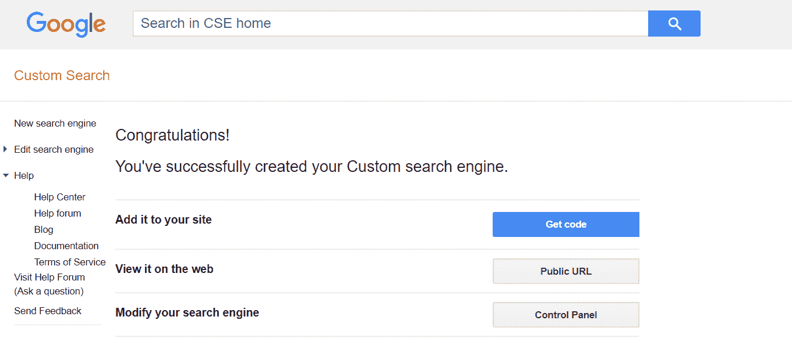

# 如何在网页中添加自定义谷歌搜索栏？

> 原文：[https://www.geeksforgeeks.org/how-to-add-custom-google-search-bar-inside-your-web-page/](https://www.geeksforgeeks.org/how-to-add-custom-google-search-bar-inside-your-web-page/)

一个好的网站需要一个搜索栏。从头开始创建自己的搜索引擎可能是一项困难的任务，但在谷歌的帮助下，这项任务可以跳过。谷歌已经创建了一个网站来创建一个自定义的搜索栏，来创建你自己的检查下面的链接。

*   `https://programmablesearchengine.google.com/about/`

## 创建自定义搜索栏

在这个网站上，任何人只需选择想要搜索的网站，就可以轻松地对其搜索栏进行编程。遵循下面解释的步骤。

*   **第一步：** 前往以下[站点](https://programmablesearchengine.google.com/about/)，点击`开始`按钮。
    
*   **第二步：** 选择`新建搜索引擎`按钮新建搜索引擎。
    
*   **步骤 3：** 按照页面上的指示填写`详细信息`，然后单击创建按钮。
    
*   **第四步：** 点击创建后，点击屏幕上的`获取代码`按钮，您将获得您的`代码`。
    

**注意：** 可以从控制面板修改关于搜索网站、搜索图片、安全搜索的设置，也可以设置在搜索栏搜索时显示广告。

## 在网页上嵌入搜索栏

获取代码后，只需将其粘贴到网页内即可看到工作的搜索栏。

*   **示例：** 您可以看到输出屏幕有一个搜索栏，其中包含一个搜索选项，该选项显示您在创建此搜索栏时选择的站点或域的结果。此外，当您从控制面板更改站点时，此搜索选项将自动更改。目前，搜索结果以默认方式显示。除此之外，您可以按照以下链接中的说明操作结果显示方式等更多内容。

    `https://developers.google.com/custom-search/docs/element`

## HTML 代码

```html
<!DOCTYPE html>
<html>
    <head>
        <title>Custom Search-Bar</title>
        <style>
            body {
                background-image: linear-gradient(to left, white, green);
                color: lawngreen;
            }
        </style>
    </head>
    <body>
        <h1 style="text-align: center;">GeeksforGeeks</h1>
        <script async src=
"https://cse.google.com/cse.js?cx=007019498718139788174:amtiepdpgeg">
        </script>
        <div class="gcse-search"></div>
    </body>
</html>
```

*   **输出：**
    