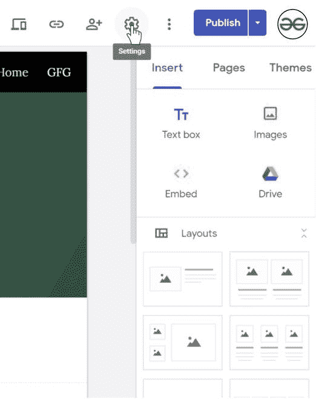
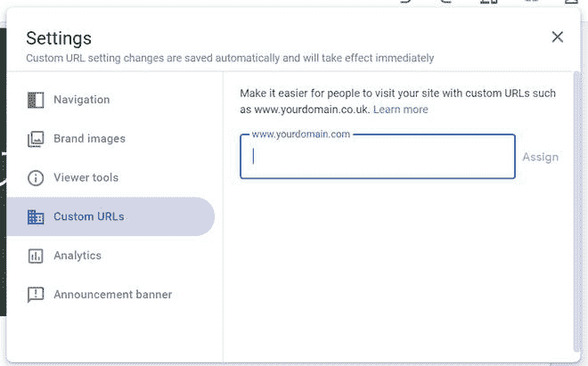
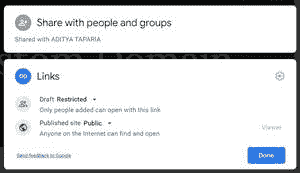

# 如何在新谷歌网站中分配自定义 URL 域网址？

> 原文：[https://www.geeksforgeeks.org/how-to-assign-custom-url-domain-web-address-in-new-google-sites/](https://www.geeksforgeeks.org/how-to-assign-custom-url-domain-web-address-in-new-google-sites/)

你可能认为你不能托管你在你的域名上创建的谷歌网站，但是你会惊讶于你可以。一个人可以在一个自定义域上托管他的网站。在你的自定义域名上托管网站。

## 先决条件

您必须有一个自定义域网址来托管该网站。

## 操作步骤

1.  转到`设置`。
    

2.  然后进入`自定义网址`部分，输入你的域名。示例域名可以像`example.com`或`example.org`一样。记得先核实你的域名地址。
    

## 发布设置

如果您在网站对用户可见性方面遇到任何问题，请检查`网站发布者设置`，并将网站设置为`公共的`，这将使网站公开。
