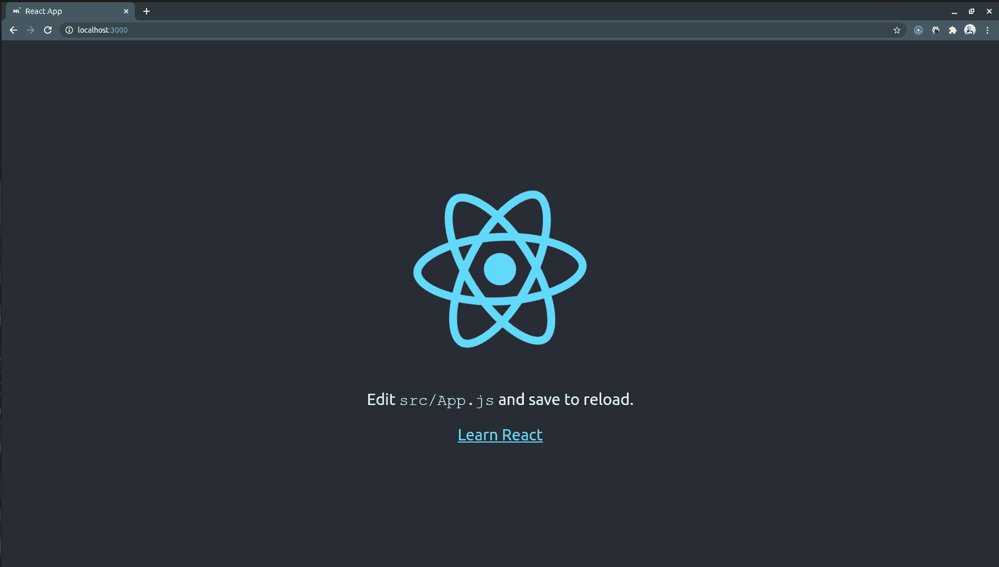
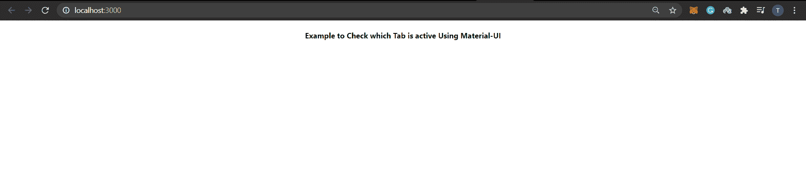
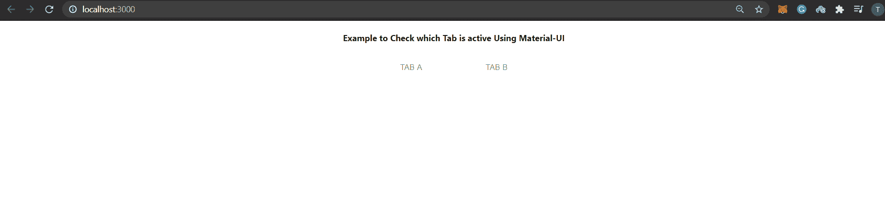
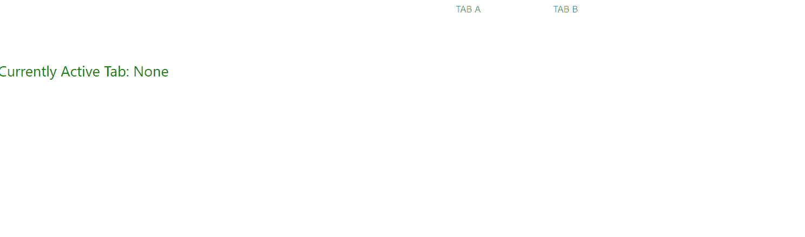

# 如何使用 Material UI 检查哪个页签是活动的？

> 原文：[https://www.geeksforgeeks.org/how-to-check-which-tab-is-active-using-material-ui/](https://www.geeksforgeeks.org/how-to-check-which-tab-is-active-using-material-ui/)

Material UI 是最流行的 React UI 库之一。Material-UI 组件独立工作。他们是独立的，只会注入他们需要展示的风格。他们不依赖任何全局样式表，比如 [normalize.css](https://necolas.github.io/normalize.css/)。Material-UI 组件的一些例子是对话框、标签、文本字段、菜单、芯片、卡片、步进器、纸张。要在 React 中使用 Material-UI，我们需要在项目中手动安装它。

## 先决条件

*   React 的基本知识
*   任何代码编辑器（Sublime Text，VS Code，等等。）

## 解决方案路线图

*   创建示例项目
*   将 Material-UI 安装到项目中
*   实现选项卡示例
*   应用最终解决方案

## 进场

### A) 创建一个示例项目

*   通过在您的终端中运行以下命令创建一个样本 React 项目：

```html
npx create-react-app react-material-ui
```

*   上面的命令将在命令运行的路径中创建一个 React 应用程序样板，并确保您始终使用生成器或构建工具的最新版本，而不必在每次使用时都进行升级。
*   通过键入以下命令进入项目文件夹：

```html
cd react-material-ui/
```

*   使用命令运行项目：

```html
npm start
```

*   您应该能够在浏览器中看到以下内容：



### B) 将 Material-UI 安装到项目中

*   在你的终端中使用下面的命令安装 Material-UI。你也可以使用 VS Code 的终端。

```html
npm install @material-ui/core
```

*   现在在你项目的 `src` 文件夹中寻找 `App.js`。如果我们走在正确的道路上，删除所有不必要的代码并添加一些代码。

#### JavaScript

```html
import './App.css';
import TabsExample from './TabsExample';

function App() {
  return (
    <div className="App">
      <h4>
        Example to Check which Tab is active Using Material-UI
      </h4>
    </div>
  );
}

export default App;
```

*   保存更改后，您会发现浏览器正在更新。现在一切都准备好写我们的例子了。



### C) 实现选项卡示例

*   是时候让你的代码编辑器了。在您的 `src` 文件夹中创建一个名为 `TabsExample.js` 的文件，并将以下代码粘贴到其中。

#### JavaScript

```html
import React from 'react';
import Tabs from '@material-ui/core/Tabs';
import Tab from '@material-ui/core/Tab';

export default class TabsExample extends React.Component {
  constructor(props) {
    super(props);
    this.state = {
      value: 'None',
    };
  }

  render() {
    return (
      <div>
        <Tabs
          value={this.state.value}
          indicatorColor="primary"
          textColor="primary"
          centered="true">
          <Tab label="Tab A" value="Tab A" />
          <Tab label="Tab B" value="Tab B" />
        </Tabs>
      </div>
    );
  }
}
```

*   将您新创建的上述组件导入到您的 `App.js` 文件中。您的 `App.js` 文件应该是这样的：

#### JavaScript

```html
import './App.css';
import TabsExample from './TabsExample';

function App() {
  return (
    <div className="App">
      <h4>
        Example to Check which Tab is active Using Material-UI
      </h4>
      <TabsExample/>
    </div>
  );
}

export default App;
```

*   屏幕会是这样的：



现在是该做实际事情的时候了。让我们看看解决方案的方法。

### D) 应用最终解决方案

*   这个想法是使用 `onChange` 回调，当 `Tab` 值改变时它会自动触发。

#### 语法

```html
function(event: object, value: any) => void
```

其中：

```html
event: The event source of the callback
value: The index of the child (number)
```

*   现在用下面的代码更新 `App.js` 文件：

#### JavaScript

```html
import React from 'react';
import Tabs from '@material-ui/core/Tabs';
import Tab from '@material-ui/core/Tab';

const styles = {
  headline: {
    fontSize: 24,
    paddingTop: 16,
    marginBottom: 12,
    fontWeight: 400,
    color: 'green',
  },
};

export default class TabsExample extends React.Component {
  constructor(props) {
    super(props);
    this.state = {
      value: 'None',
    };
  }

  handleChange = (_, value) => {
    this.setState({
      value,
    });
  };

  render() {
    return (
      <div>
        <Tabs
          value={this.state.value}
          onChange={this.handleChange}
          indicatorColor="primary"
          textColor="primary"
          centered="true">
          <Tab label="Tab A" value="Tab A" />
          <Tab label="Tab B" value="Tab B" />
        </Tabs>
        <br></br>
        <p style={styles.headline}>
          Currently Active Tab: {this.state.value}
        </p>
      </div>
    );
  }
}
```

**输出：**

