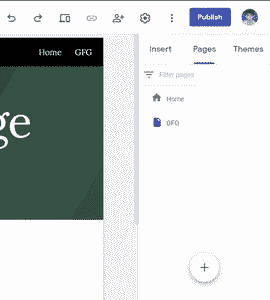
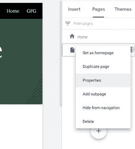
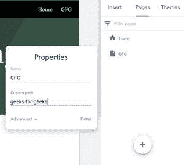

# 如何在新谷歌网站中自定义页面路径？

> 原文：`https://www.geeksforgeeks.org/how-to-customize-page-path-in-new-google-sites/`

有时，我们想建立自己的网站页面路径，如果你在自己的平台上工作，这并不是什么大不了的事情，但如果你不是。谷歌网站为你提供了这样做的手段。要在新的谷歌网站中自定义页面路径，请执行以下步骤：

## 操作步骤

1.  转到编辑器右侧的`页面`面板。
    

2.  将鼠标悬停在页面标题上可查看三点操作菜单。单击它，然后转到`属性`选项。
    

3.  选择`高级`选项以查看自定义页面路径选项。输入页面路径并保存。
    

## 注意事项

1.  路径中不能有空格，只能有字母数字字符和连字符(`-`)，否则会显示错误。
2.  您可以有一个以连字符(`-`)开头的名称。
3.  您不能用此方法设置域。