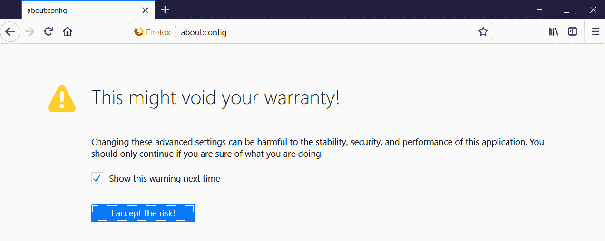
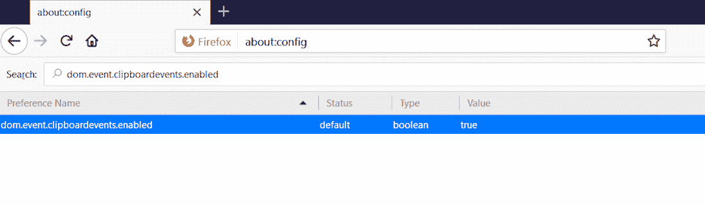
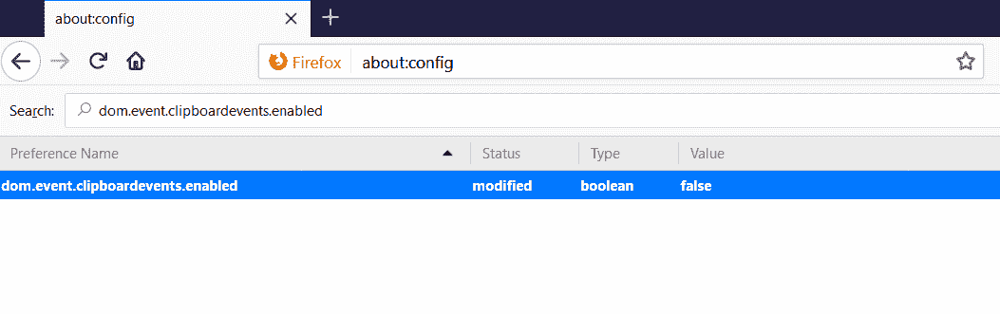
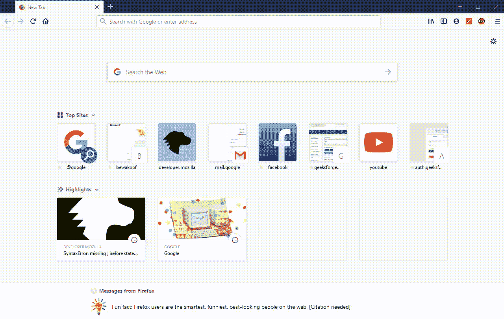

# 如何在 Mozilla Firefox 开发者控制台中禁用粘贴保护？

> 原文：[https://www.geeksforgeeks.org/how-to-disable-paste-protection-in-mozilla-firefox-developer-console/](https://www.geeksforgeeks.org/how-to-disable-paste-protection-in-mozilla-firefox-developer-console/)

我们都非常熟悉名为“Mozilla Firefox”的浏览器。因此，您可能还遇到了一个恼人的 bug，它会禁用到开发人员控制台中的粘贴。我也面临同样的问题。你们中的大多数人可能认为解决这个问题最简单的方法是简单地切换到另一个浏览器，但是如果我们只能在 Mozilla Firefox 中解决这个问题呢？因此，这里有一个简单易行的方法，可以从 Mozilla Firefox 中禁用这个讨厌的 bug。

浏览器的用户可以在配置设置中更改浏览器的行为。要更改配置设置，用户需要遵循以下步骤：

## 操作步骤

第一步：你需要在浏览器地址栏中输入`about:config`，按回车键，会出现一个窗口，上面写着“这可能会使你的保修失效！”

第二步：你将在该窗口上找到一个复选框，显示为`Show this warning next time`，点击该复选框，然后按下按钮`I accept the risk!`以继续。

第三步：完成第二步后，你将获得一个首选项列表，你必须在搜索框中搜索：`dom.event.clipboardevents.enabled`。

第四步：双击搜索后出现的首选项，将其值从`true`更改为`false`。

双击时，状态从“默认”变为“已修改”。一旦您更改了该值，您就成功地在 Mozilla Firefox 开发人员控制台中禁用了粘贴保护，并摆脱了禁用粘贴选项的恼人的 bug。

