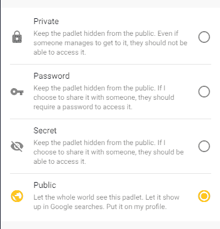
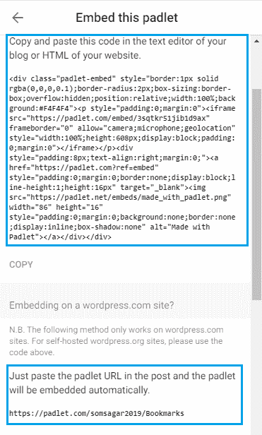

# 如何在新的谷歌网站中嵌入 Padlet？

> 原文: [https://www.geeksforgeeks.org/how-to-embed-padlet-in-new-google-sites/](https://www.geeksforgeeks.org/how-to-embed-padlet-in-new-google-sites/)

## 简介:
Padlet 帮助用户在数字世界中张贴笔记。有时在小组项目中，组长必须分配工作或显示时间表，所有这些都可以通过 Padlet 来实现。要嵌入挂板，你必须先创建一个。

## 官方链接:
[https://padlet.com/](https://padlet.com/)

## 按照下面提到的步骤在你的谷歌网页中嵌入一个 Padlet:
1.  前往 [https://padlet.com/](https://padlet.com/)。
2.  在创建你的 Padlet 之后。
3.  在右上角点击`共享`。

    

4.  确保隐私设置为`公开`，这样每个人都可以看到。

    

5.  点击`嵌入你的博客或网站`选项。
6.  这里有两个选项可以嵌入您的 Padlet –
    *   `完全嵌入的 HTML 代码`: 在博客的文本编辑器或网站的 HTML 中复制并粘贴这些代码。
    *   这个代码用于嵌入到一个 WordPress 网站中。

    

7.  粘贴此代码后，Padlet 将被嵌入。