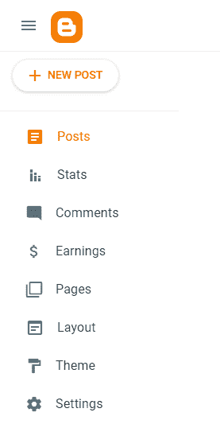
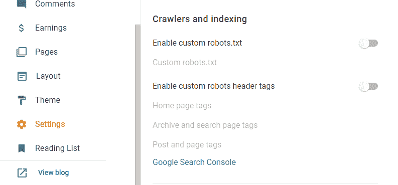
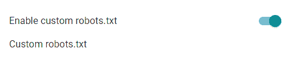
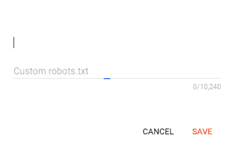
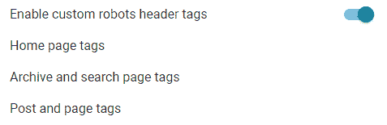
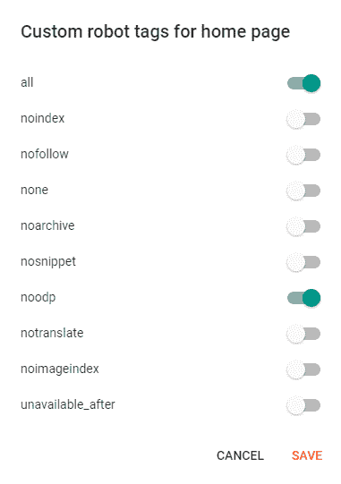
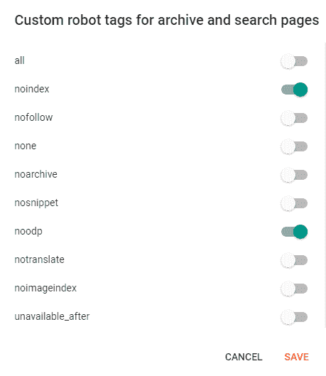
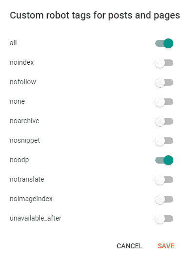

# 如何在 Blogger 中启用自定义 robots.txt 文件？

> 原文：[https://www.geeksforgeeks.org/how-to-enable-custom-robots-txt-file-in-blogger/](https://www.geeksforgeeks.org/how-to-enable-custom-robots-txt-file-in-blogger/)

## 什么是 robots.txt？

`robots.txt` 是一个示例 txt 文件，我们在其中放置一小段代码，告诉搜索引擎爬虫在搜索引擎上抓取和索引您的网站页面。添加 `robots.txt` 将有助于网站处理哪些页面应该抓取和索引，以及哪些页面不应该抓取和索引。

按照以下步骤在 Blogger 中启用自定义 `robots.txt`。

### 第一步：登录 Blogger

用你的 Gmail 账号登录你的博主账号。

### 第二步：进入设置

从左侧菜单点击“**设置**”。



现在，导航到**爬虫和索引**部分。



### 第三步：启用自定义机器人.txt

启用切换按钮>>后，点击“**自定义机器人.txt**”。



将这段简单的代码添加到“**定制机器人.txt**”中，点击“**保存**”。

```html
User-agent: *
Allow: /
Sitemap: http://<subdomain_name>.<domain_name>.<tld>/sitemap.xml
```

**示例：**

```html
User-agent: *
Allow: /
Sitemap: http://www.example.com/sitemap.xml
```

**关于语法和添加更多高级功能，请参考以下链接：**

> https://developers.google.com/search/docs/advanced/robots/create-robots-txt



### 第四步：启用自定义机器人标题标签



### 第五步：配置首页标签

启用“**自定义机器人表头标签**”>>的切换按钮后，点击“**首页标签**”>>，启用“**全部**”和“**noodp**”切换并点击“**保存**”。



### 第六步：配置存档、搜索页面及帖子页面标签

然后，点击“**存档和搜索页面标签**”>>，启用“**noindex**”、“**noodp**”切换并点击“**保存**”。



然后，点击“**帖子和页面标签**”>>，启用“**全部**”和“**noodp**”切换并点击“**保存**”。



## 参考文献

*   [https://developers.google.com/search/docs/advanced/robots/intro](https://developers.google.com/search/docs/advanced/robots/intro)
*   [https://developers.google.com/search/docs/advanced/robots/create-robots-txt](https://developers.google.com/search/docs/advanced/robots/create-robots-txt)