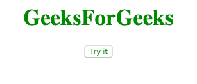
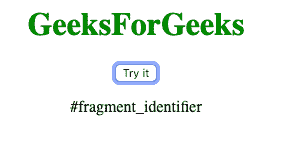
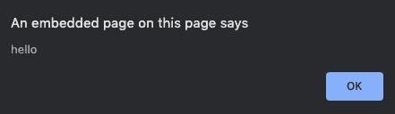

# 如何从一个 URL 获取片段标识符？

> 原文: [https://www.geeksforgeeks.org/how-to-get-the-fragment-identifier-from-a-url/](https://www.geeksforgeeks.org/how-to-get-the-fragment-identifier-from-a-url/)

片段标识符是指次于主资源的资源的字符串。

## 方法 1

我们可以通过定义一个新变量 `location.hash` 来打印片段标识符，然后使用 `document.getElementById()` 方法将其显示出来。

### 语法

```html
var x = location.hash;
document.getElementById("demo").innerHTML = x;
```

### 示例

在本例中，我们将使用 `location.hash` 属性。

```html
<!DOCTYPE html>
<html>
<head>
    <title>
        How to get the fragment
        identifier from a URL?
    </title>
</head>
<body style="text-align:center;">
    <h1 style="color:green;">
        GeeksForGeeks
    </h1>
    <button onclick="GFG()">
        Try it
    </button>
    <p id="demo"></p>
    <script>
        function GFG() {
            location.hash = "#fragment_identifier";
            var x = location.hash;
            document.getElementById("demo").innerHTML = x;
        }
    </script>
</body>
</html>
```

### 输出

*   **点击按钮前:**
    
*   **点击按钮后:**
    

## 方法 2

我们定义了一个变量 `hash`，它存储 URL 中 `#` 之后的内容，即片段标识符，然后我们将其显示为警告框。这是通过将子字符串存储在变量中实现的。

### 语法

```html
var hash = url.substring(url.indexOf('#') + 1);
alert(hash);
```

### 示例 2

本示例使用 `substring()` 方法显示片段标识符。

```html
<!DOCTYPE html>
<html>
<head>
    <title>
        How to get the fragment
        identifier from a URL?
    </title>
</head>
<body style="text-align:center;">
    <h1 style="color:green;">
        GeeksForGeeks
    </h1>
    <p id="demo"></p>
    <script>
        var url = "www.geeksforgeeks.com/article.php#hello";
        var hash = url.substring(url.indexOf('#') + 1);
        alert(hash);
    </script>
</body>
</html>
```

### 输出

