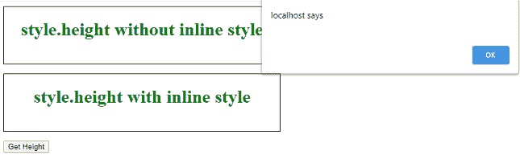
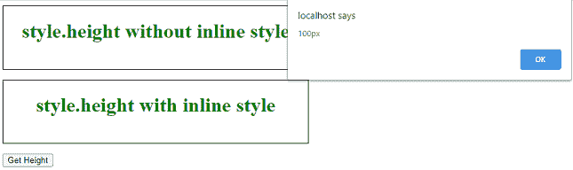
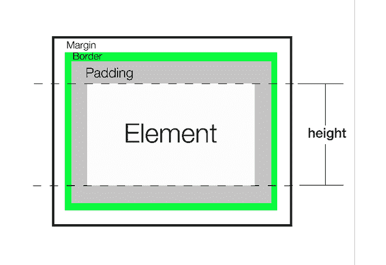
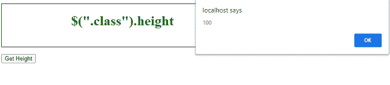
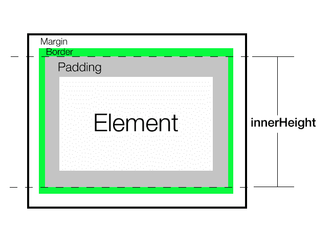

# 如何获取一个元素的渲染高度？

> 原文：[https://www.geeksforgeeks.org/how-to-get-the-rendered-height-of-an-element/](https://www.geeksforgeeks.org/how-to-get-the-rendered-height-of-an-element/)

要获取元素的高度，在 JavaScript 中有五种常见的方法。让我们看看它们之间的区别以及何时应该使用它们。只有最后一种方法给出了正确的渲染高度，而不是布局高度。

*   `style.height`
*   jQuery (`height`、`innerHeight`、`outerHeight`)
*   `clientHeight`、`offsetHeight`、`scrollHeight`
*   `getComputedStyle`
*   `getBoundingClientRect().height`

渲染高度是在对元素应用所有样式和变换后，元素最终获得的高度。例如，一个元素的高度为 100px，然后得到一个`transform: scale(0.5)`。其渲染高度为 50px（转换后），布局高度为 100px。

## `style.height`

我们可以在任何选定的元素上使用`style.height`，它将返回其高度。不包括`padding`、`border`或`margin`。它总是返回高度以及具体的单位。

**注意：** 只有当我们在 HTML 中使用`style`属性将高度显式设置为`inline`时才有效。

**语法：**

```html
let height = document.getElementById("someId").style.height;
```

**示例：**

```html
<!DOCTYPE html>
<html>
<head>
    <meta charset="UTF-8" />
    <style>
        div {
            border: 1px solid black;
            text-align: center;
            margin-bottom: 16px;
            color: green;
        }
        #div1 {
            height: 100px;
        }
    </style>
</head>
<body>
    <div id="div1">
        <h1>style.height without inline style</h1>
    </div>
    <div id="div2" style="height: 100px;">
        <h1>style.height with inline style</h1>
    </div>
    <button onclick="alertHeight()">Get Height</button>
    <script>
        function alertHeight() {
            alert(document.getElementById("div1").style.height);
            alert(document.getElementById("div2").style.height);
        }
    </script>
</body>
</html>
```

**输出：**
为`div1`返回空字符串，为`div2`返回`100px`。

*   **为`div1`:** 
*   **为`div2`:** 

**结论：** 它只返回`inline`样式属性中指定的任何高度。它不考虑任何转换，比如缩放。不可靠，不宜用，因为`inline`样式不理想。

## jQuery (`height`，`innerHeight`，`outerHeight`)

**`height()`** 它返回元素的当前高度。不包括`padding`、`border`或`margin`。它总是返回一个无单位的像素值。

**注意：** `height()`将始终返回内容高度，而不考虑 CSS `box-sizing`属性的值。

**语法：**

```html
let height = $("#div1").height();
```



**例 2：**

```html
<!DOCTYPE html>
<html>
<head>
    <meta charset="UTF-8" />
    <style>
        div {
            border: 1px solid black;
            text-align: center;
            margin-bottom: 16px;
            color: green;
        }
        #div1 {
            height: 100px;
        }
    </style>
    <script src="https://code.jquery.com/jquery-3.5.0.js"></script>
</head>
<body>
    <div id="div1">
        <h1>$(".class").height</h1>
    </div>
    <button onclick="alertHeight()">Get Height</button>
    <script>
        function alertHeight() {
            alert($("#div1").height());
        }
    </script>
</body>
</html>
```

**输出：**
返回无单位像素值 100。



**`innerHeight()`** 返回元素的当前高度，包括`top`和`bottom`填充，但不包括`border`。总是返回无单位像素值。

**语法：**

```html
let height = $("#div1").innerHeight();
```



**例 3：**

```html
<!DOCTYPE html>
<html>
<head>
    <meta charset="UTF-8" />
    <style>
        div {
            border: 1px solid black;
            text-align: center;
            margin-bottom: 16px;
            color: green;
        }
        #div1 {
            height: 100px;
            padding: 10px;
            margin: 5px;
        }
    </style>
    <script src="https://code.jquery.com/jquery-3.5.0.js"></script>
</head>
<body>
    <div id="div1">
        <h1>$(".class").innerHeight</h1>
    </div>
    <button onclick="alertHeight()">Get Height</button>
    <script>
        function alertHeight() {
            alert($("#div1").innerHeight());
        }
    </script>
</body>
</html>
```