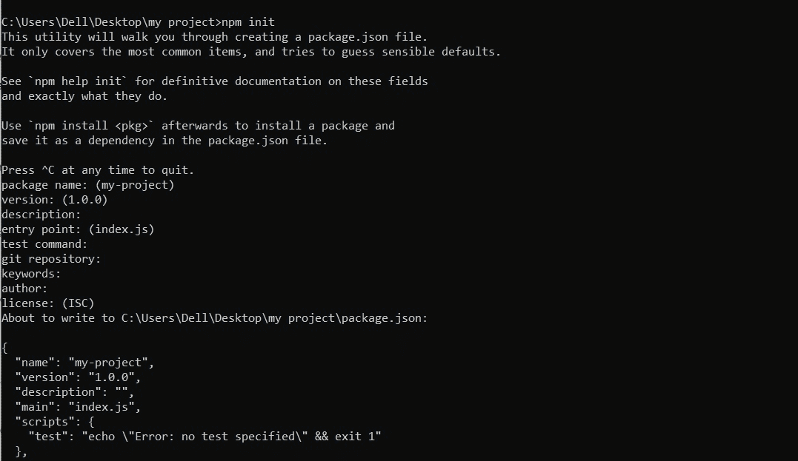
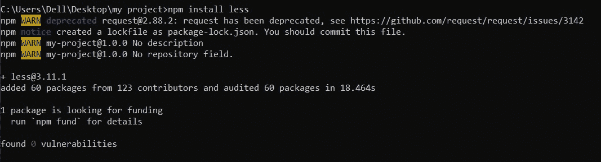

# 如何通过 npm 导入 LESS？

> 原文：[https://www.geeksforgeeks.org/how-to-import-less-through-npm/](https://www.geeksforgeeks.org/how-to-import-less-through-npm/)

LESS 代表更精简的样式表。它是 CSS 向后兼容的语言扩展。网页可以通过在带有`.less`扩展名的文件中写入适当的代码来设计风格，然后将其转换成一个 CSS 文件。

## 安装 LESS 的步骤

### 步骤 1
要安装 LESS，首先确保系统中已经安装了节点和 npm。如果没有，则使用下面给出的说明安装它们。

*   在系统中下载节点的最新版本并安装。
*   现在打开命令提示符并移动到项目文件夹。
*   现在你需要创建一个`package.json`文件来管理依赖项。为此，请使用下面给出的命令。

```bash
npm init
```

之后，您将被询问用户选择的软件包名称和描述。其他手续，只需按回车键，就会创建您的`package.json`文件。



### 步骤 2
现在使用以下命令安装 LESS：

```bash
npm install less
```



**注意：** 全局安装 LESS npm 模块，使其可以被任何项目使用，使用`npm install less -g`命令。如果您在 Mac 或 Linux 机器上执行此命令，您可能需要在此命令的开头添加“sudo”。

### 步骤 3
编译`.less`文件，使用命令：

```bash
lessc input.less output.css
```

**注意：** 确保在包含`input.less`文件的同一文件夹中运行该命令。这就完成了 LESS 文件到 CSS 文件的编译，现在可以将其添加到 HTML 文件中。