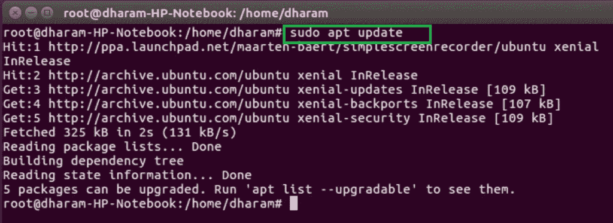
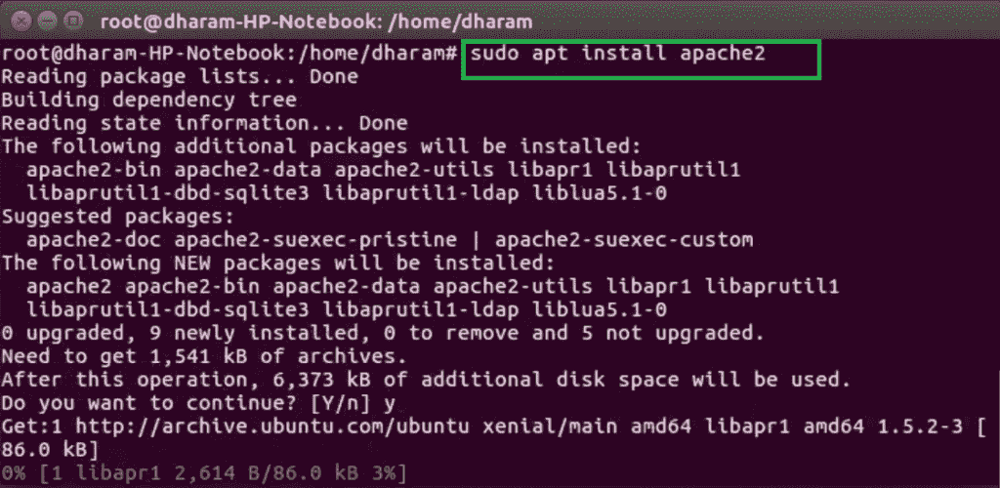
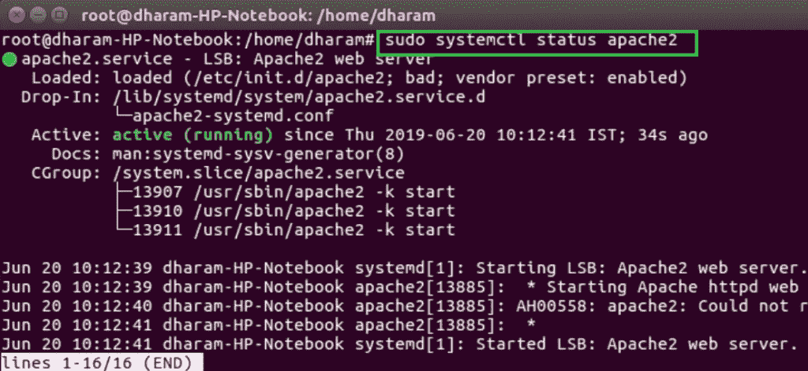
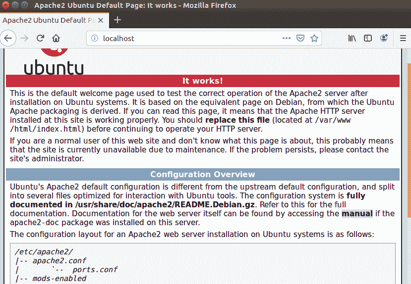

# 如何在 Ubuntu 中安装 Apache 服务器？

> 原文: [https://www.geeksforgeeks.org/how-to-install-apache-server-in-ubuntu/](https://www.geeksforgeeks.org/how-to-install-apache-server-in-ubuntu/)

Apache 是由 Apache 软件基金会创建和维护的开源 web 服务器软件。因为它是开源的，所以可以自由使用。它是一个网络服务器，用于一个或多个基于 HTTP 的网站。它被网络托管公司广泛用于提供共享和虚拟托管。

## 安装 Apache 服务器的步骤

### 1. 成为超级用户
打开终端并使用以下命令使自己成为超级用户。
```bash
sudo su
```


### 2. 更新 Ubuntu 软件包列表
使用以下命令更新 Ubuntu 软件包列表。
```bash
sudo apt update
```


### 3. 安装 Apache
更新软件包列表后，使用以下命令安装 Apache 服务器。
```bash
sudo apt install apache2
```


### 4. 检查 Apache 服务器状态
安装过程完成后，Apache 服务器会自动启动。可以使用以下命令检查 Apache 服务器的状态。
```bash
sudo systemctl status apache2
```


### 5. 验证安装
打开浏览器，在地址栏中键入`localhost`或`127.0.0.1`。它将显示 Apache 服务器的默认页面。
