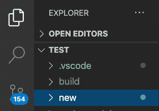
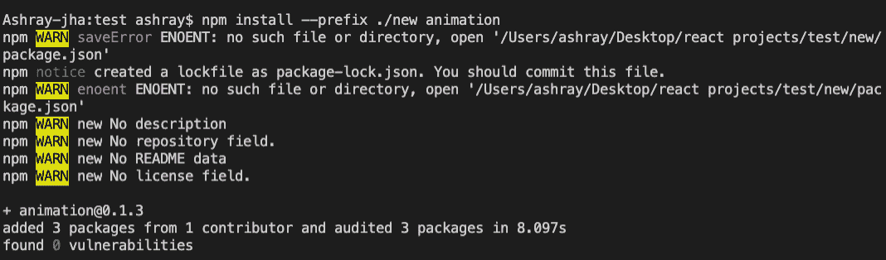
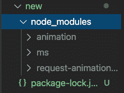

# 如何使用 npm 安装指定目录？

> 原文: [https://www.geeksforgeeks.org/how-to-install-specified-directory-using-npm/](https://www.geeksforgeeks.org/how-to-install-specified-directory-using-npm/)

[Node.js](https://www.geeksforgeeks.org/nodejs-tutorials/) 是一个基于 Chrome 的 JavaScript V8 引擎构建的平台，用于轻松构建快速且可扩展的网络应用程序。JavaScript 使用事件驱动的非阻塞 I/O 模型，使其轻量级且高效，非常适合跨分布式设备运行的数据密集型实时应用程序。也非常适合使用 Node.js 中的工具（或包），我们需要能够将它们安装在我们的机器中，并以一种有用的方式管理它们。这就是 npm，也就是 Node 包管理器发挥作用的地方。它包含默认包，还允许我们在项目中安装外部包。我们希望使用它们并提供一个用户界面与它们一起工作。

## 使用按照以下简单步骤将 npm 安装到特定目录

1.  首先，检查 Node 是否安装在您的电脑或笔记本电脑上。要检查 Node 是否已预安装，请在 Mac 中打开终端或在 Windows 中打开命令提示符，并键入以下命令：

    ```
    node -v
    ```

    现在，如果 Node 版本显示类似 `v12.18.3` 的内容，那么您可能会得出结论，Node 是预装在 PC 或笔记本电脑上的。如果不是，那么请参考[这篇](https://www.geeksforgeeks.org/installation-of-node-js-on-windows/)文章，根据您的 PC 需求和版本安装 Node。

2.  在编辑器中打开一个 JavaScript 项目并决定要安装 npm 包的目录。我们也可以创建一个目录并安装我们的 npm 包。在项目目录中创建一个目录 `CD`（变更目录），并使用 `mkdir` 命令。要创建一个新的文件夹/目录，我们可以使用 `mkdir <文件夹名称>` 并在目录/文件夹中使用命令 `mkdir` 来创建一个目录或子文件夹。在这里，我将在我的 `TEST` 项目文件夹下创建一个名为 `new` 的目录，我将在其中安装 npm 包。因此，一旦我们在终端中的目录被设置为我们的项目目录 `TEST`，并且我们可以在 `TEST` 主目录下看到我们的项目文件以这种方式被结构化，我将使用终端中的命令 `mkdir -p new`。

    

3.  现在，我们安装到特定目录的最后一步是使用 `--prefix` 选项。这里我们将使用以下命令将我们的 npm 包安装到特定目录。

    ```
    npm install --prefix ./(folder/sub_folder_name) <package name>
    ```

    正在当前目录下安装 npm 包 `animation`，并使用以下命令：

    ```
    npm install --prefix ./new animation
    ```

    **控制台输出:**

    

    现在，由于我们已经将所需的 npm 包安装到了我们想要的子目录中，即 `new` 中，我们可以通过打开它来检查我们的 `new` 目录，我们可以看到以下包已成功安装到该目录中。

    **更新项目结构**:

    