# 如何使用亚马逊 EC2 服务器推出 WordPress 网站？

> 原文: [https://www.geeksforgeeks.org/how-to-launch-a-wordpress-website-using-amazon-ec2-server/](https://www.geeksforgeeks.org/how-to-launch-a-wordpress-website-using-amazon-ec2-server/)

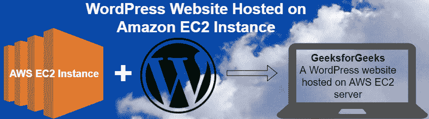

## 什么是亚马逊网络服务(AWS)？
它是一个安全的云服务平台。它提供计算能力、数据库存储、内容交付和其他功能等服务，帮助企业扩展和增长。

## 什么是亚马逊 EC2？
亚马逊弹性计算云(EC2)是一种[基于云的服务](https://www.geeksforgeeks.org/cloud-based-services/) IaaS(基础设施即服务)类型的云服务，可在云中提供安全、可调整大小的计算能力。

## 使用 EC2 实例建立 WordPress 网站

### 1. 启动 EC2 实例
*   转到您的 [AWS 控制台](https://console.aws.amazon.com/console/home)并使用您的凭据登录。
*   登录 AWS 账户后，从所有服务列表中选择 EC2 服务。

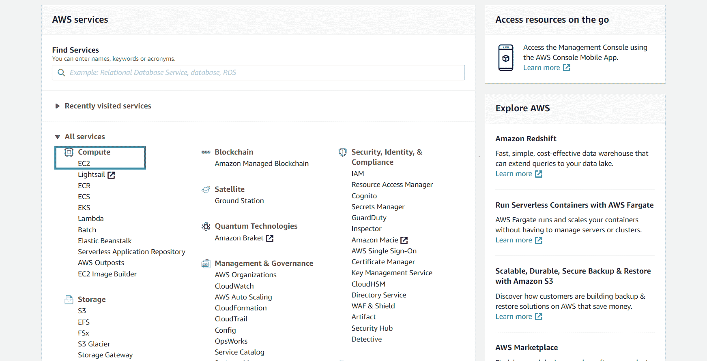

*   单击**启动实例**按钮创建实例。

### 2. 配置 EC2 实例
*   在仪表板的**市场**选项卡（左侧）中搜索 **WordPress**，并选择名为 `WordPress Certified by Bitnami and Automattic` 的实例。

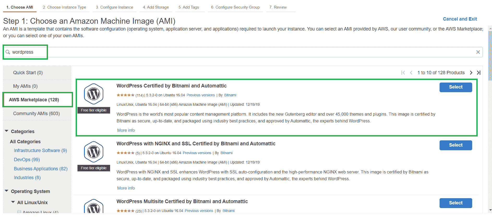

*   现在，您将看到定价详细信息，您必须单击继续。
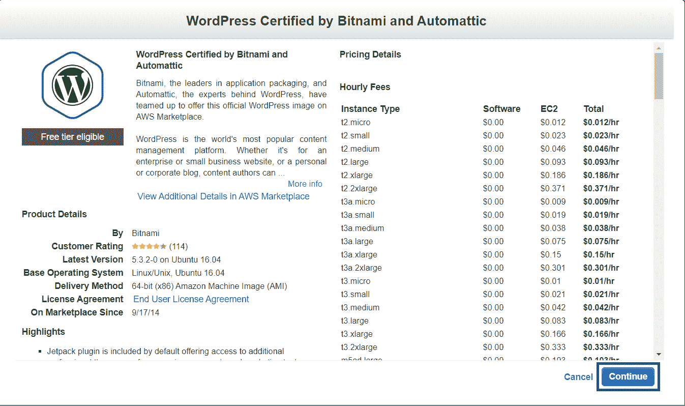
*   现在您将被重定向到选择实例配置，我们将使用符合免费套餐资格的 `t2.micro instance`。在“类型”列中单击 `t2.micro`，然后单击**审阅并启动**。由于我们使用的是免费套餐，我们将只使用存储的默认免费配置，并跳过**添加存储**步骤。

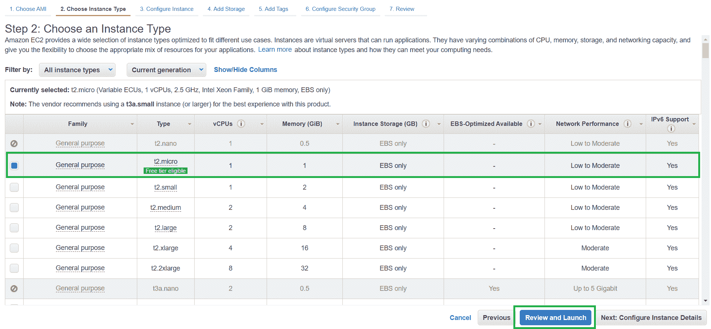

*   您现在可以审阅实例的配置。审阅后，您可以单击右下角的**启动**按钮。

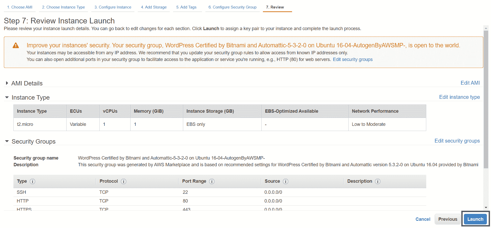

*   下一个屏幕将允许您生成**密钥对**，用于通过 **SSH** 连接到您的实例。由于我们正在开发 WordPress 网站，我们实际上不需要关心通过 SSH 连接，因此我们可以跳过生成密钥对。从选项中选择**不使用密钥对继续**，并勾选复选框以确认您知道需要此密钥来访问您的 EC2 实例。单击**启动实例**按钮。

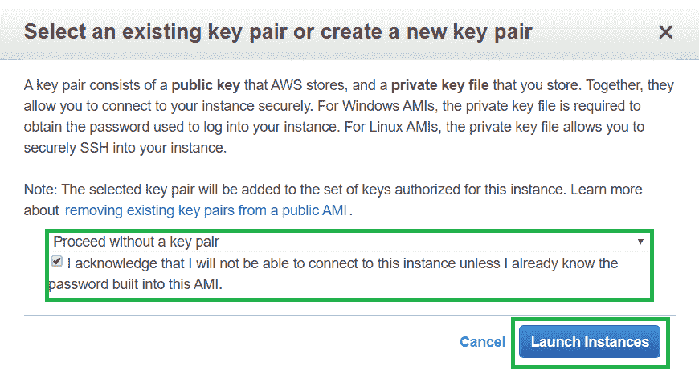

*   单击页面右下角的**查看实例**。
*   现在，从实例列表中单击我们刚刚创建的 WordPress 实例，并复制列中显示的**公共 IPv4 地址**。

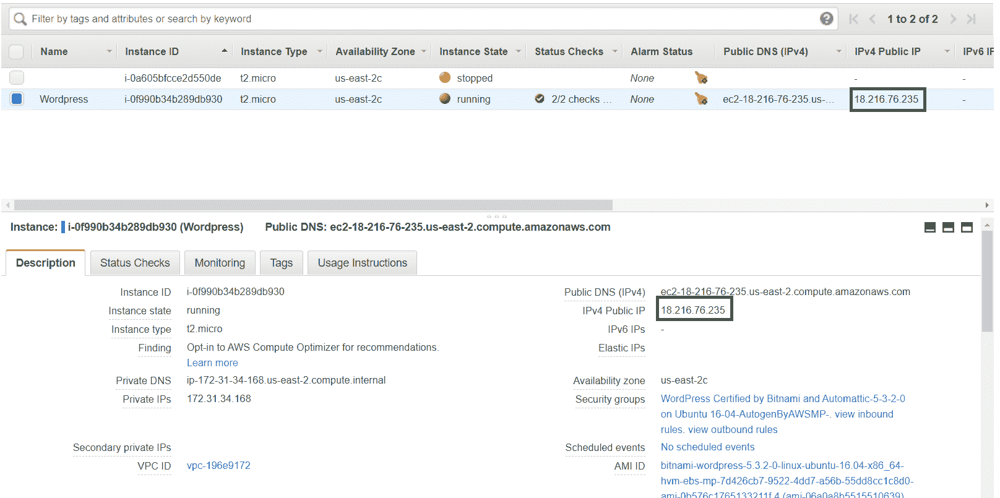

将复制的 IPv4 粘贴到浏览器中，您将在那里看到如下所示的 WordPress 主页:

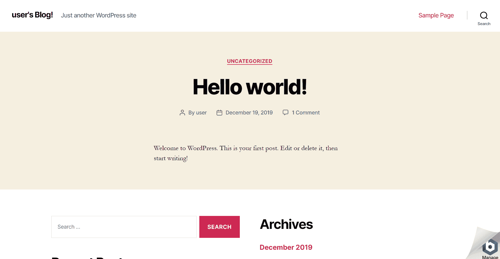

WordPress 主页可以根据 WordPress 的版本而有所不同。

### 3. 编辑网站(访问 WordPress 后端/仪表板)
*   为了获取管理员面板的密码，请转到您的实例仪表板，右键单击实例并选择**实例设置**，然后选择**获取系统日志**。

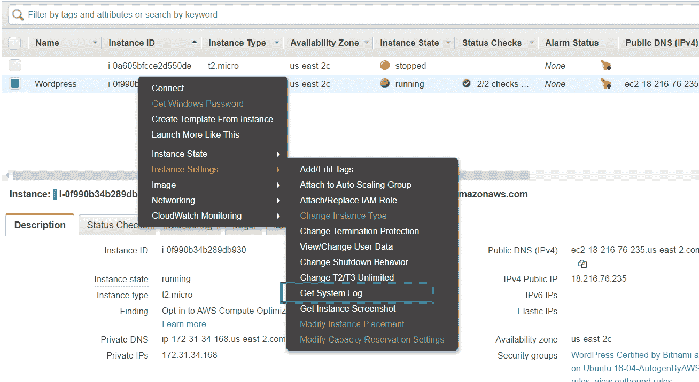

*   滚动到底部，找到被哈希值包围的密码。

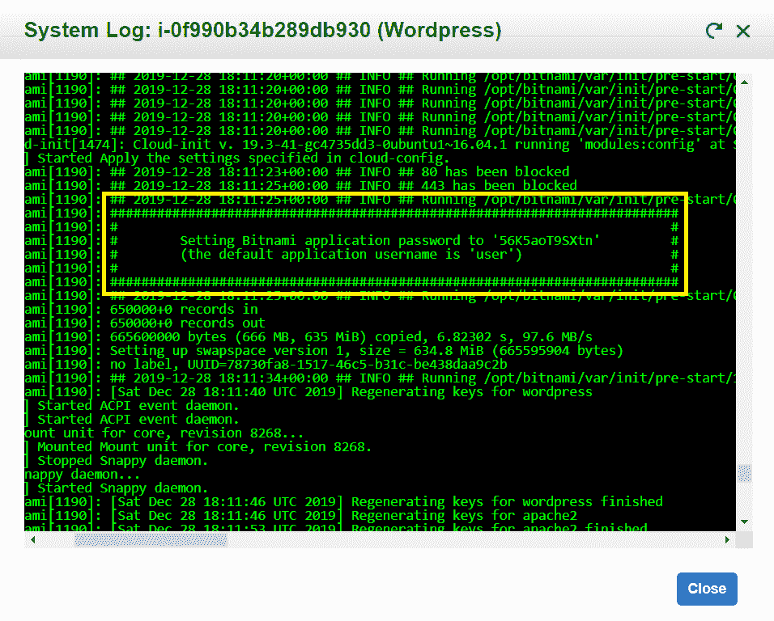

*   现在转到 `{your-public-IPv4}/admin`（例如 `52.214.23.123/admin`），输入用户名为 **user**，密码为您在系统日志中找到的密码。

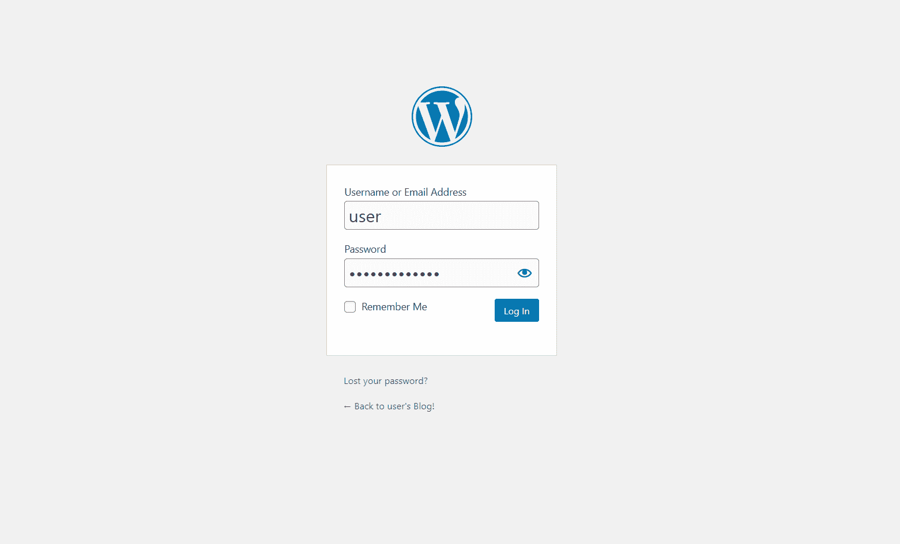

现在你可以进入管理面板，并可以改变你的 WordPress 网站的外观。

**参考:** [https://aws.amazon.com/getting-started/tutorials/launch-a-wordpress-website/](https://aws.amazon.com/getting-started/tutorials/launch-a-wordpress-website/)